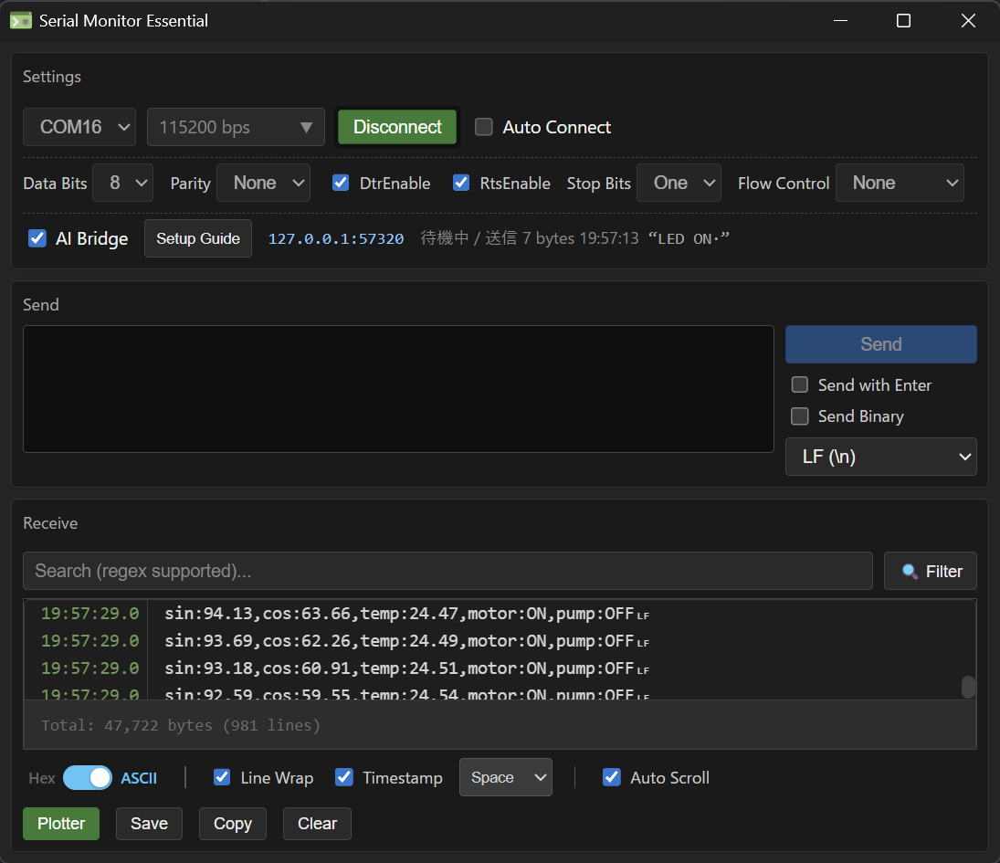
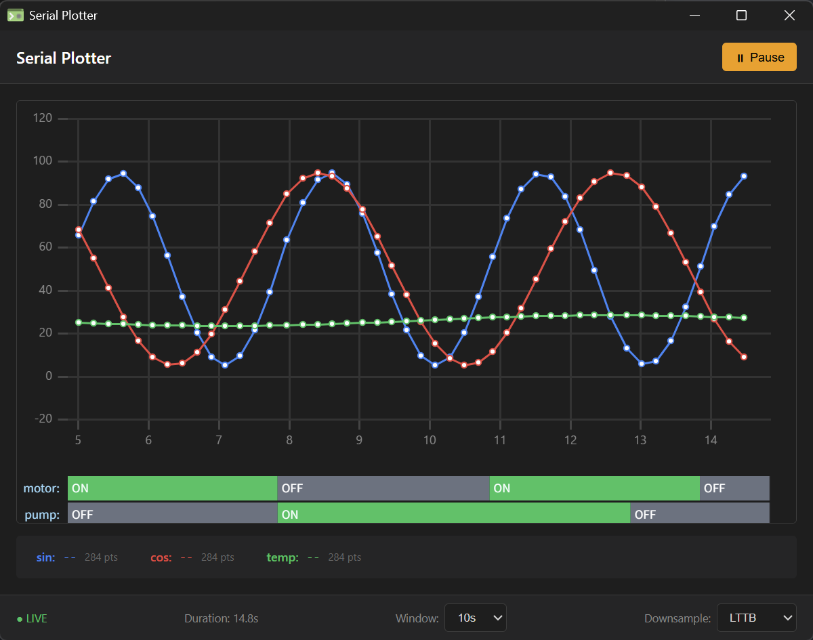
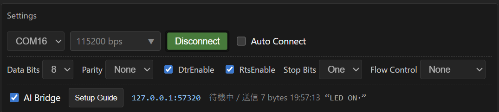

# Serial Monitor Essential

A serial monitor and real-time plotter for high-speed serial communication (up to ~12 Mbps),
with built-in MCP integration so an AI agent can read and write the same serial session you
are watching in the GUI.

Existing tools each do part of this well, but none of them did all of it, so I built one.
(Rewritten in Tauri/Rust from an earlier C# version.)

| | Reconnect | TX | Data rate | Plotter | AI integration |
| ---- | ---- | ---- | ---- | ---- | ---- |
| Arduino IDE | ✗ | ✓ | ✓ | ✓ | ✗ |
| Tera Term | ✓ | ✗ | ✓ | ✗ | ✗ |
| Serial Monitor (VS Code extension) | ✓ | ✓ | ✗ | ✗ | ✗ |
| **Serial Monitor Essential** | ✓ | ✓ | ✓ (~12 Mbps) | ✓ (lines + states) | ✓ (MCP) |





## ✨ Features

### Monitor

- High-speed RX up to ~12 Mbps with no data loss (chunk-based memory management with disk spill)
- Hex / ASCII views with virtual scrolling; toggle timestamps, line wrap, and control-character rendering
- TX as text or hex, selectable line ending (None/CR/LF/CRLF), input history on arrow keys
- Export received data to a binary file; copy as hex or ASCII
- DTR/RTS control; port reconnects and re-opens don't corrupt state

### Plotter

- Oscilloscope-style roll mode: a fixed-width sliding window (1 s – 300 s) with
  absolute-time-aligned downsampling (LTTB, or average with min/max bands), so already-drawn
  history does not reflow as new data arrives
- State timeline: discrete values like `motor:ON` rendered as colored bars on the same time axis
  as the numeric channels
- LIVE / Inspect / Paused view states: zooming switches to Inspect automatically; pan back
  through history and click LIVE to resume following
- Arduino-compatible input: CSV (`25.5,60,RUNNING`), labeled (`temp:25.5,state:RUNNING`),
  optional header row

### AI integration (MCP)

- COM ports are exclusive, so the app acts as a multiplexer: an AI agent shares the port you
  already have open instead of competing for it
- `serial_wait_for` covers "send a command, wait for a matching reply" in a single tool call
- Everything the agent sends is shown in the GUI (byte count, time, content preview)
- Off by default; listens on 127.0.0.1 only

Supported platforms: **Windows 10/11 (x64)** and **Ubuntu 22.04+ (x64)**.
macOS is build-tested in CI only; no binaries are published
(see [docs/20_user_needs.md](docs/20_user_needs.md), Japanese).

## 📦 Installation

### Windows

1. Download `serial-monitor-essential_<VERSION>_x64-setup.exe` from
   [Releases](https://github.com/771-8bit/SerialMonitorEssential/releases) and run it.
   No admin rights required (per-user install).
2. The installer is not code-signed, so SmartScreen may warn.
   Click "More info" → "Run anyway". SHA-256 checksums are listed in the release notes.

> **Upgrading from the C# version (Serial Monitor Essential 0.0.9 or earlier):**
> the two apps install side by side and the old one is not modified.
> Uninstalling the old version from "Apps & features" is recommended to avoid confusion.

winget support is planned: `winget install 771-8bit.serial-monitor-essential` after the
first release.

### Linux (Ubuntu 22.04+)

Download from [Releases](https://github.com/771-8bit/SerialMonitorEssential/releases).

```sh
# .deb (recommended; apt resolves webkit2gtk-4.1 and the other dependencies)
sudo apt install ./serial-monitor-essential_<VERSION>_amd64.deb

# or AppImage
chmod +x serial-monitor-essential_<VERSION>_amd64.AppImage
./serial-monitor-essential_<VERSION>_amd64.AppImage
```

Serial port permissions (required): `/dev/ttyUSB*` / `/dev/ttyACM*` belong to the
`dialout` group.

```sh
sudo usermod -aG dialout $USER   # then log out and back in
```

Known limitations: performance acceptance (12 Mbps zero-loss, memory soak) and the E2E suite
currently run on Windows only; Wayland/HiDPI rendering is untested.

## 📈 Using the plotter

1. Select a port and click **Connect**.
2. Click **Plotter** to open the plotter window.
3. Send data in any of these formats; channels are created automatically:

```text
25.5,60,RUNNING                        # CSV (auto-named ch0, ch1, ...)
temp:25.5,humidity:60,state:RUNNING    # labeled
temp,humidity,state                    # send a header row first to name the columns
```

Numeric values go to the line chart; non-numeric values go to the state timeline.

## 🤖 AI integration (MCP)

COM ports are exclusive: while the app has a port open, no other process can open it.
Instead of competing for the port, the app exposes a local bridge, so an AI agent
(e.g. Claude Code) can read the same capture and send to the same port while you watch
in the GUI.



Enabling it takes two steps (the app's **Settings → Setup Guide** button opens a window with
these instructions and the exact command for your install path):

1. Turn on **AI Bridge** in the settings panel (off by default; listens on `127.0.0.1:57320`).
2. Register the app itself as an MCP server — the adapter is built into the executable, so no
   Node.js or other runtime is required:

```bash
claude mcp add serial-monitor -- "<path-to>/serial-monitor-essential.exe" --mcp
```

(For development from a repo checkout, `node mcp/server.mjs` is an equivalent
reference implementation.)

Then ask for what you need:

```text
You    : Send AT+GMR to the board and tell me the firmware version.
Claude : serial_send("AT+GMR") → serial_wait_for("OK|ERROR")
         → response "AT version:2.1.0.0 ... OK". The firmware version is 2.1.0.0.
You    : Check the recent log for CRC errors.
Claude : serial_read_tail(16384) → 3 lines contain "CRC mismatch" (offsets 12034–...)
```

Every send from the agent appears in the GUI's AI Bridge row (byte count, time, preview),
so you can always see what the agent did.

Available tools: `serial_status`, `serial_ports`, `serial_read_tail`, `serial_read_range`,
`serial_send`, `serial_send_hex`, `serial_wait_for`.
See [`mcp/README.md`](mcp/README.md) for setup details, environment variables,
and the tool reference.

Agents that don't speak MCP can use the bridge directly: connect to `127.0.0.1:57320`
(one JSON object per line) and send `{"id":1,"method":"help"}` to get the machine-readable
protocol spec. Details in [docs/04_api.md](docs/04_api.md) (Japanese).

> **Security:** the bridge listens on `127.0.0.1` only and is off by default.
> Agent sends are always visible in the GUI — there is no invisible TX path by design
> (ADR-12 in [docs/22_architecture_description.md](docs/22_architecture_description.md), Japanese).

## 🛠️ Development

Prerequisites: Node.js 22+, stable Rust.

```bash
npm install
npm run tauri dev            # dev mode (RUST_LOG=debug for verbose logs)
npm run tauri build          # build installers

# quality gates (same as CI)
npm run type-check && npm run lint && npm run format:check && npm test
cd src-tauri && cargo fmt -- --check && cargo clippy --all-targets -- -D warnings && cargo test
```

Design and test documentation lives in `docs/` (Japanese):
[requirements](docs/21_system_requirements.md) /
[architecture (state machines, ADRs)](docs/22_architecture_description.md) /
[traceability](docs/23_traceability.md) /
[V&V plan](docs/24_vv_plan.md) /
[release strategy](docs/25_release_strategy.md) /
[AI API design](docs/26_ai_api_design.md).
The E2E harness (com0com + UI Automation) is in [`test_tools/e2e/`](test_tools/e2e/README.md).

Recommended IDE setup: [VS Code](https://code.visualstudio.com/) +
[Tauri](https://marketplace.visualstudio.com/items?itemName=tauri-apps.tauri-vscode) +
[rust-analyzer](https://marketplace.visualstudio.com/items?itemName=rust-lang.rust-analyzer)

## 📄 License

[MIT](LICENSE)
