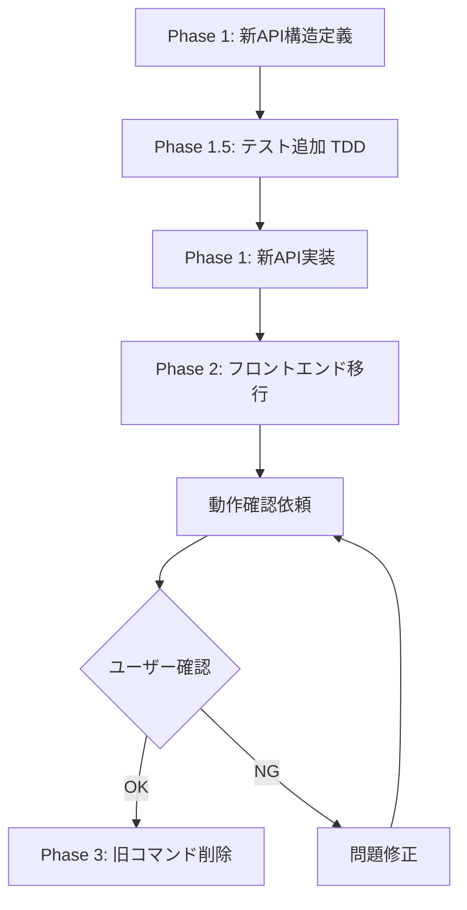

# フロントエンドメモリリーク問題と修正計画

## 1. 背景

シリアルプロッタは大量のリアルタイムデータを可視化するコンポーネントです。長時間稼働時にフロントエンドのメモリ使用量が継続的に増加する問題が発見されました。

### 観測されたメモリ増加

| 経過時間 | Frontend Renderer | Backend (Main) | 増加率 |
|----------|-------------------|----------------|--------|
| 0:00 | 90 MB | 33 MB | - |
| 0:50 | 769 MB | 44 MB | +13.6 MB/秒 |

バックエンドは安定 (~40MB) ですが、**フロントエンドが50秒で約680MB増加**しています。

---

## 2. 現在の実装

### データフロー

```
Backend (Rust)                    Frontend (TypeScript)
┌──────────────────┐             ┌────────────────────────────────┐
│ PlotterAggregator│             │ PlotterWindow                  │
│                  │  IPC/Tauri  │   │                            │
│ get_ranged_data()├────────────►│   ▼ setData(payload)           │
│                  │             │   │                            │
│ AggregatedPoint[]│             │   ▼ convertAggregatedData()    │
│ (タイムスタンプ  │             │   │   └─ 毎フレーム変換処理    │
│  + 値)           │             │   ▼                            │
└──────────────────┘             │ LineChart                      │
                                 │   │                            │
                                 │   ▼ buildChartData() ← 問題箇所│
                                 │   │   └─ 毎フレーム再構築      │
                                 │   ▼                            │
                                 │ uPlot.setData()                │
                                 └────────────────────────────────┘
```

### 問題のあるコード

#### PlotterWindow.tsx (convertAggregatedData)

```typescript
// 毎フレーム呼び出される
function convertAggregatedData(data: Record<string, AggregatedPoint[]>) {
  const lineData: Record<string, [number, number][]> = {};  // 新規作成
  const bandData: Record<string, MinMaxBandData> = {};      // 新規作成
  
  for (const [channel, points] of Object.entries(data)) {
    const timestamps: number[] = [];  // 新規作成
    const mins: number[] = [];        // 新規作成
    const maxs: number[] = [];        // 新規作成
    // ...
  }
  return { lineData, bandData };
}
```

#### LineChart.tsx (buildChartData)

```typescript
// 毎フレーム呼び出される
const buildChartData = useCallback(() => {
  const timestampSet = new Set<number>();        // 🔴 毎回新規
  // ...
  for (const channel of visibleChannels) {
    const valueMap = new Map<number, number>();  // 🔴 毎回新規
    // ...
  }
  const chartData = [timestamps.map(...)];       // 🔴 毎回新規
  return { data: chartData, ... };
}, [data, hiddenChannels]);
```

---

## 3. 問題の原因

### 根本原因

1. **毎フレームの大量オブジェクト生成**: `Set`, `Map`, `Array` が60fpsで生成
2. **データの二重変換**: バックエンド形式 → 中間形式 → uPlot形式
3. **useCallbackの誤用**: `data`が毎フレーム変わるため、メモ化が効かない

### 計算量

```
10万ポイント × 60fps = 毎秒600万オブジェクト生成
  × オブジェクトサイズ(数十バイト)
  = 毎秒数百MB のメモリ確保
```

JavaScriptのGCはこの速度に追いつけず、メモリが蓄積。

---

## 4. 修正方針

### Option A: バックエンド側で uPlot 形式に変換 (推奨)

フロントエンドでの変換を完全に排除。

**変更内容**:

1. **バックエンド**: `PlotterRangedPayload` を uPlot 形式で直接返却
2. **フロントエンド**: 変換処理を削除、受け取ったデータをそのまま使用

**メリット**: 変換処理がゼロになる、Rustは効率的なメモリ管理
**デメリット**: API変更、既存コードの大幅修正

### Option B: フロントエンドでの差分更新

新しいデータのみを既存配列に追加。

**変更内容**:

1. uPlot データを `useRef` で保持
2. 新しいポイントのみを配列末尾に追加
3. 古いデータは配列先頭から削除（ウィンドウ方式）

**メリット**: バックエンドAPI変更不要
**デメリット**: フロントエンド側の複雑化

### 推奨: Option A

バックエンドで変換することで:
- フロントエンドのコード量削減
- Rustの効率的なメモリ管理を活用
- 将来の拡張性向上

---

## 5. 実装手順

### Phase 1: バックエンドAPI変更

#### 5.1 新しいPayload構造定義

```rust
// data_store.rs

/// MinMax band series data for a channel
#[derive(Debug, Clone, Serialize)]
pub struct BandSeriesData {
    pub min: Vec<Option<f64>>,
    pub max: Vec<Option<f64>>,
}

#[derive(Debug, Clone, Serialize)]
pub struct PlotterChartPayload {
    /// uPlot aligned data: [timestamps, ch0_values, ch1_values, ...]
    /// Note: hidden channels are included with values; frontend uses uPlot's series.show for hiding
    /// Option<f64> serializes to JSON null for missing values (uPlot compatible)
    pub aligned_data: Vec<Vec<Option<f64>>>,
    /// Channel names in order (matches aligned_data columns)
    pub channel_names: Vec<String>,
    /// MinMax band data (if Average mode): channel_name -> BandSeriesData
    pub band_data: Option<HashMap<String, BandSeriesData>>,
    /// State timeline data (既存形式のまま変更なし - 問題なし)
    pub state_data: HashMap<String, Vec<StateChange>>,
    /// Metadata
    pub start_ms: u64,
    pub end_ms: u64,
}
```

> **Note**: `Option<f64>` を使用する理由:
> - メモリサイズは `f64` の2倍 (16バイト vs 8バイト) だが、JSON シリアライズで自然に `null` に変換される
> - `f64::NAN` は serde デフォルト設定でエラーになるため、`Option<f64>` が安全
> - Rust 的に型安全で明示的

#### 5.2 変換関数実装 (aggregator.rs)

```rust
impl PlotterAggregator {
    pub fn get_chart_data(&self, req: &PlotterDataRequest) -> PlotterChartPayload {
        // 既存のget_ranged_dataロジックを活用
        // 結果をuPlot形式に変換して返却
    }
}
```

#### 5.3 Tauriコマンド追加 (lib.rs)

```rust
#[tauri::command]
fn get_plotter_chart_data(request: PlotterDataRequest, ...) -> PlotterChartPayload {
    aggregator.get_chart_data(&request)
}
```

#### 5.4 hiddenChannels の扱い

バックエンドは**全チャンネルのデータを返却**し、フロントエンドで `series.show` を制御する方式を採用:

- バックエンドは常に全チャンネルを含む `aligned_data` を返却
- フロントエンドは `hiddenChannels` に基づいて uPlot の `series[i].show = false` を設定
- **現状からの移行**: 既存の `visibleChannels.filter()` によるデータフィルタリングから、`series.show` によるUI非表示への変更が必要
- この方式により、チャンネル表示/非表示の切り替えが即座に反映される（データ再取得不要）

#### 5.5 state_data の扱い

`state_data` は既にフロントエンドでそのまま使用されており（PlotterWindow.tsx:246-259）、変換処理は不要。**現状のまま維持で問題なし**。

---

### Phase 2: フロントエンド簡素化

#### 5.6 PlotterWindow.tsx 修正

```typescript
// Before: convertAggregatedData() で変換
// After: バックエンドからのデータをそのまま使用

const { alignedData, channelNames, bandData } = payload;
// hiddenChannelsはuPlotのseries.show設定で制御（データ自体は全チャンネル含む）
```

#### 5.7 LineChart.tsx 修正

```typescript
// Before: buildChartData() で毎回変換
// After: propsで受け取ったalignedDataをそのまま使用

interface LineChartProps {
  alignedData: (number | null)[][];  // uPlot形式 (null = 欠損値)
  channelNames: string[];
  bandData?: Record<string, { min: (number | null)[]; max: (number | null)[] }>;
  hiddenChannels?: Set<string>;  // series.show制御用
}

// hiddenChannels移行: データフィルタリング → series.show制御
// Before: const visibleChannels = allChannels.filter(ch => !hiddenChannels.has(ch));
// After: series設定で show: !hiddenChannels.has(channel) を使用
```

---

### Phase 1.5: テスト追加（TDD）

> [!IMPORTANT]
> Phase 1 のAPI実装**前**にテストを追加し、テスト駆動で安全性を確保します。

#### 5.8 バックエンドテスト追加

- `test_get_chart_data_format`: 返却データがuPlot形式であること
- `test_chart_data_null_handling`: `Option<f64>` が `null` として正しくシリアライズされること
- `test_chart_data_timestamps_aligned`: タイムスタンプが全チャンネルで一致

---

### Phase 4: 動作確認と旧コマンド削除

#### 5.9 動作確認 (ユーザー実施)

新しいAPIへの移行後、以下を確認:

1. プロッター表示が正常に動作すること
2. リアルタイムデータ受信時のメモリ使用量が安定していること
3. ズーム/パン/モード切替が正常に動作すること
4. チャンネル表示/非表示が `series.show` で正しく動作すること

#### 5.10 旧コマンド削除

動作確認完了後、以下を削除:

- `get_plotter_data_ranged` コマンド (lib.rs)
- `PlotterRangedPayload` 構造体
- `convertAggregatedData` 関数 (PlotterWindow.tsx)
- `buildChartData` 関数 (LineChart.tsx)

---

## 6. 必要なテスト

### バックエンド (Rust)

| テスト名 | 内容 |
|----------|------|
| `test_get_chart_data_format` | 返却データがuPlot形式であること |
| `test_chart_data_timestamps_aligned` | タイムスタンプが全チャンネルで一致 |
| `test_chart_data_values_correct` | 値が正しくマッピング |
| `test_chart_data_band_data` | Averageモードでband_dataが正しい |
| `test_chart_data_empty` | 空データの処理 |
| `test_chart_data_large_dataset` | 10万ポイントでのパフォーマンス確認 |
| `test_chart_data_null_handling` | 欠損値の正しい処理（nullとして返却） |
| `test_chart_data_mode_switch` | Averageモード切替時のband_data生成確認 |

### フロントエンド (Vitest)

| テスト名 | 内容 |
|----------|------|
| `PlotterWindow renders with aligned data` | 新形式でレンダリング |
| `LineChart accepts aligned data` | propsの型チェック |
| `Memory usage stable over time` | メモリリークがないこと (手動確認) |
| `Hidden channels use series.show` | hiddenChannelsで`series.show`が非表示になること |

---

## 7. リスクと緩和策

| リスク | 緩和策 |
|--------|--------|
| API互換性の破壊 | 新しいコマンド追加、旧コマンドは一時保持 |
| 既存テストの破損 | 段階的移行、テスト追加後に実装 |
| パフォーマンス悪化 | ベンチマーク実施、メモリモニタリング |

---

## 8. 作業見積もり

| Phase | 作業内容 | 見積もり |
|-------|----------|----------|
| Phase 1 | バックエンドAPI変更 | 中規模 |
| Phase 1.5 | テスト追加（TDD） | 小規模 |
| Phase 2 | フロントエンド修正 (series.show移行含む) | 中規模 |
| Phase 3 | 動作確認・旧コマンド削除 | 小規模 |
| 検証 | メモリモニタリング | 小規模 |

**合計**: 中〜大規模の修正

---

## 9. 移行戦略



### 並行運用期間

- 新コマンド `get_plotter_chart_data` と旧コマンド `get_plotter_data_ranged` を並行運用
- フロントエンドを新コマンドに切り替え後、ユーザーが動作確認
- 確認完了後に旧コマンドを削除
