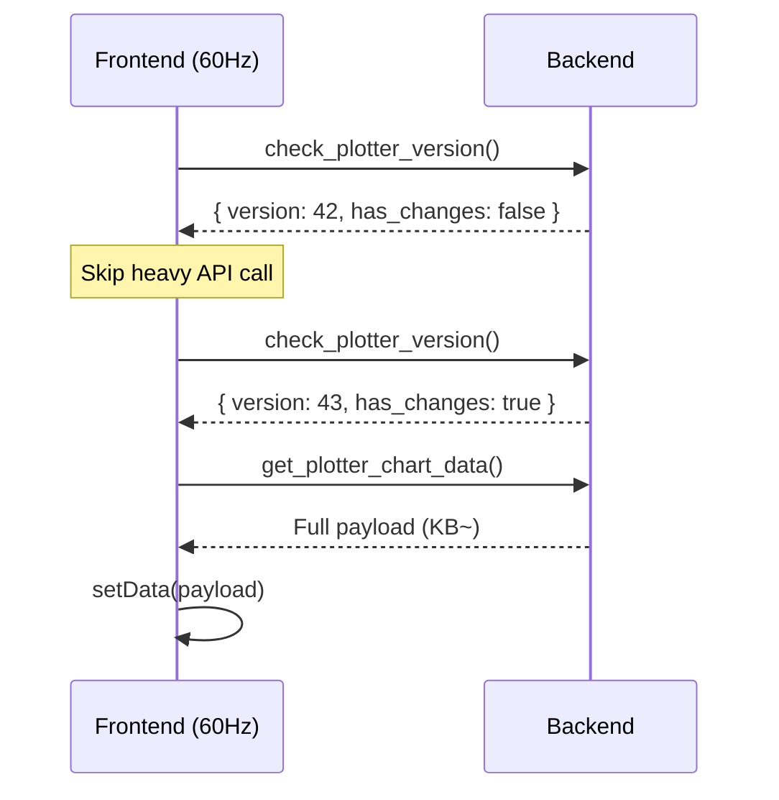

# Plotter Refactoring 1: Version Counter-Based Smart Polling

## 概要

フロントエンドの 60Hz ポーリングによる CPU オーバーヘッドを削減するため、軽量なバージョンチェック API を導入する。

---

## 現在の実装と問題点

### 現在のフロントエンド実装

**ファイル**: [PlotterWindow.tsx:128-160](file:///c:/Users/kazuki/Documents/SerialMonitorEssential/src/components/plotter/PlotterWindow.tsx#L128-L160)

```typescript
// Frame-based update loop using requestAnimationFrame
useEffect(() => {
  if (!isRunning) return;

  let rafId: number;
  let isActive = true;

  const updateLoop = async () => {
    if (!isActive) return;

    // Skip if previous fetch is still in progress
    if (!isFetchingRef.current) {
      isFetchingRef.current = true;
      try {
        await fetchData();  // ← 毎フレームで IPC 呼び出し
      } finally {
        isFetchingRef.current = false;
      }
    }

    // Schedule next frame
    if (isActive) {
      rafId = requestAnimationFrame(updateLoop);  // ← 60Hz ループ
    }
  };

  rafId = requestAnimationFrame(updateLoop);
  // ...
}, [fetchData, isRunning]);
```

### fetchData の実装

```typescript
const fetchData = useCallback(async (forceUpdate = false): Promise<boolean> => {
  const pixelWidth = chartContainerRef.current?.clientWidth ?? 800;

  const request: PlotterDataRequest = {
    time_min_ms: null,
    time_max_ms: null,
    pixel_width: pixelWidth,
    is_realtime: true,
  };

  try {
    // invoke は Tauri IPC 呼び出し（JSON シリアライズ発生）
    const payload = await invoke<PlotterChartPayload>('get_plotter_chart_data', { request });

    // 早期リターン: end_ms が変わらなければ setState をスキップ
    if (forceUpdate || payload.end_ms > lastEndMsRef.current) {
      lastEndMsRef.current = payload.end_ms;
      setData(payload);
    }
    // ...
  }
}, []);
```

### 問題点

| 問題 | 影響 |
|------|------|
| 毎フレーム（~16ms）で `get_plotter_chart_data` IPC が発生 | バックエンドで毎回データ処理 |
| IPC は JSON シリアライズ/デシリアライズを伴う | 数 KB～数百 KB のペイロードを毎回処理 |
| 早期リターンは React 状態更新のみスキップ | IPC 自体はスキップできない |
| データレートが低い場合でも 60Hz で呼び出し | 無駄な CPU サイクル消費 |

### CPU 影響の推定

- **データなし時**: 60 IPC/秒 × JSON デシリアライズ ≈ 中程度の CPU 使用
- **高データレート時**: 60 IPC/秒 × 大きなペイロード ≈ 高い CPU 使用

---

## リファクタリング方針

### アプローチ: Generation Counter + Lightweight Check API

1. バックエンドに `data_version: AtomicU64` を追加
2. データ追加時にバージョンをインクリメント
3. 軽量な `check_plotter_version()` API を追加（戻り値: 8 バイト程度）
4. フロントエンドは毎フレームでバージョンをチェック
5. バージョンが変わった場合のみ `get_plotter_chart_data()` を呼び出し

### シーケンス図



### 期待効果

| シナリオ | 現在 | リファクタリング後 |
|----------|------|-------------------|
| アイドル時 | 60 heavy IPC/秒 | 60 light IPC/秒 |
| 10Hz データ | 60 heavy IPC/秒 | 10 heavy + 50 light IPC/秒 |
| 60Hz データ | 60 heavy IPC/秒 | 60 heavy IPC/秒（変化なし） |

**CPU 削減**: データレート < 60Hz の場合、70-80% 削減

---

## 具体的な実装手順

### Step 1: バックエンド - PlotterAggregatorInner に version フィールド追加

**ファイル**: `src-tauri/src/plotter/aggregator.rs`

```rust
use std::sync::atomic::{AtomicU64, Ordering};

#[derive(Debug)]
struct PlotterAggregatorInner {
    // ... 既存フィールド ...
    
    /// Data version counter (incremented on every data change)
    data_version: u64,
}
```

### Step 2: データ追加時にバージョンをインクリメント

**ファイル**: `src-tauri/src/plotter/aggregator.rs`

```rust
impl PlotterAggregator {
    fn maybe_aggregate(inner: &mut PlotterAggregatorInner) {
        // 既存の集約処理...
        
        // バージョンをインクリメント
        inner.data_version = inner.data_version.wrapping_add(1);
    }
    
    // clear() でもバージョンをインクリメント
    pub fn clear(&self) {
        if let Ok(mut inner) = self.inner.write() {
            // 既存のクリア処理...
            inner.data_version = inner.data_version.wrapping_add(1);
        }
    }
}
```

### Step 3: 軽量チェック API を追加

**ファイル**: `src-tauri/src/plotter/aggregator.rs`

```rust
/// Version info for lightweight polling
#[derive(Debug, Clone, serde::Serialize)]
pub struct PlotterVersionInfo {
    pub version: u64,
    pub has_data: bool,
}

impl PlotterAggregator {
    /// Lightweight check: returns version and whether data exists
    /// This is O(1) and doesn't require any data processing
    pub fn check_version(&self) -> PlotterVersionInfo {
        let inner = self.inner.read().unwrap();
        PlotterVersionInfo {
            version: inner.data_version,
            has_data: !inner.channel_names.is_empty(),
        }
    }
}
```

### Step 4: Tauri コマンドを追加

**ファイル**: `src-tauri/src/lib.rs`

```rust
use plotter::PlotterVersionInfo;

/// Lightweight version check for smart polling
#[tauri::command]
fn check_plotter_version(
    plotter_state: tauri::State<'_, PlotterState>,
) -> PlotterVersionInfo {
    plotter_state.aggregator.check_version()
}

// invoke_handler に追加
.invoke_handler(tauri::generate_handler![
    // ... 既存コマンド ...
    check_plotter_version,
])
```

### Step 5: フロントエンドの更新ループを修正

**ファイル**: `src/components/plotter/PlotterWindow.tsx`

```typescript
// 新しい型定義
interface PlotterVersionInfo {
  version: number;
  has_data: boolean;
}

// 最後に取得したバージョンを追跡
const lastVersionRef = useRef<number>(0);

const updateLoop = async () => {
  if (!isActive) return;

  // Step 1: 軽量チェック（8バイト程度のペイロード）
  try {
    const versionInfo = await invoke<PlotterVersionInfo>('check_plotter_version');
    
    // バージョンが変わった場合のみデータ取得
    if (versionInfo.has_data && versionInfo.version !== lastVersionRef.current) {
      if (!isFetchingRef.current) {
        isFetchingRef.current = true;
        try {
          const payload = await invoke<PlotterChartPayload>('get_plotter_chart_data', { request });
          lastVersionRef.current = versionInfo.version;
          lastEndMsRef.current = payload.end_ms;
          setData(payload);
        } finally {
          isFetchingRef.current = false;
        }
      }
    }
  } catch (e) {
    setError(String(e));
  }

  // 次フレームをスケジュール
  if (isActive) {
    rafId = requestAnimationFrame(updateLoop);
  }
};
```

### Step 6: テストを追加

**ファイル**: `src-tauri/src/plotter/aggregator.rs` (tests モジュール)

```rust
#[test]
fn test_version_increments_on_data_add() {
    let agg = PlotterAggregator::new();
    agg.set_enabled(true);
    
    let v1 = agg.check_version();
    assert_eq!(v1.version, 0);
    assert!(!v1.has_data);
    
    agg.add_data_point("ch0", 1000, ChannelValue::Numeric(10.0));
    
    let v2 = agg.check_version();
    assert!(v2.version > v1.version);
    assert!(v2.has_data);
}

#[test]
fn test_version_increments_on_clear() {
    let agg = PlotterAggregator::new();
    agg.set_enabled(true);
    
    agg.add_data_point("ch0", 1000, ChannelValue::Numeric(10.0));
    let v1 = agg.check_version();
    
    agg.clear();
    let v2 = agg.check_version();
    
    assert!(v2.version > v1.version);
    assert!(!v2.has_data);
}

#[test]
fn test_check_version_is_lightweight() {
    use std::time::Instant;
    
    let agg = PlotterAggregator::new();
    agg.set_enabled(true);
    
    // 100K points を追加
    for i in 0..100_000 {
        agg.add_data_point("ch0", i, ChannelValue::Numeric(i as f64));
    }
    
    // check_version は O(1) であるべき
    let start = Instant::now();
    for _ in 0..10_000 {
        let _ = agg.check_version();
    }
    let elapsed = start.elapsed();
    
    // 10K 呼び出しが 10ms 未満であるべき
    assert!(elapsed < std::time::Duration::from_millis(10), 
        "check_version too slow: {:?}", elapsed);
}
```

---

## 検証方法

### 1. ユニットテスト

```bash
cd src-tauri && cargo test plotter::aggregator::tests::test_version
```

### 2. パフォーマンス検証

1. プロッタウィンドウを開く
2. データを送信しない状態で 10 秒待機
3. タスクマネージャーで CPU 使用率を確認
4. **期待**: リファクタリング後、アイドル時の CPU 使用率が大幅に低下

### 3. 機能検証

1. シリアルデータを送信
2. プロッタがリアルタイムで更新されることを確認
3. pause/resume が正常に動作することを確認

---

## リスクと対策

| リスク | 対策 |
|--------|------|
| バージョンチェックと実データ取得の間にデータが変わる | 許容範囲（次フレームで反映される） |
| check_version の IPC オーバーヘッドが想定より大きい | ベンチマークで検証、問題があれば Throttled Events に切り替え |
| wrapping_add でバージョンがオーバーフロー | u64 なので実質発生しない（584 年で 1 周） |

---

## 完了条件

- [ ] `PlotterAggregatorInner` に `data_version` フィールドを追加
- [ ] `check_version()` メソッドを実装
- [ ] `check_plotter_version` Tauri コマンドを追加
- [ ] フロントエンドの更新ループを修正
- [ ] ユニットテストを追加
- [ ] 既存テストがパス
- [ ] パフォーマンス検証を実施
