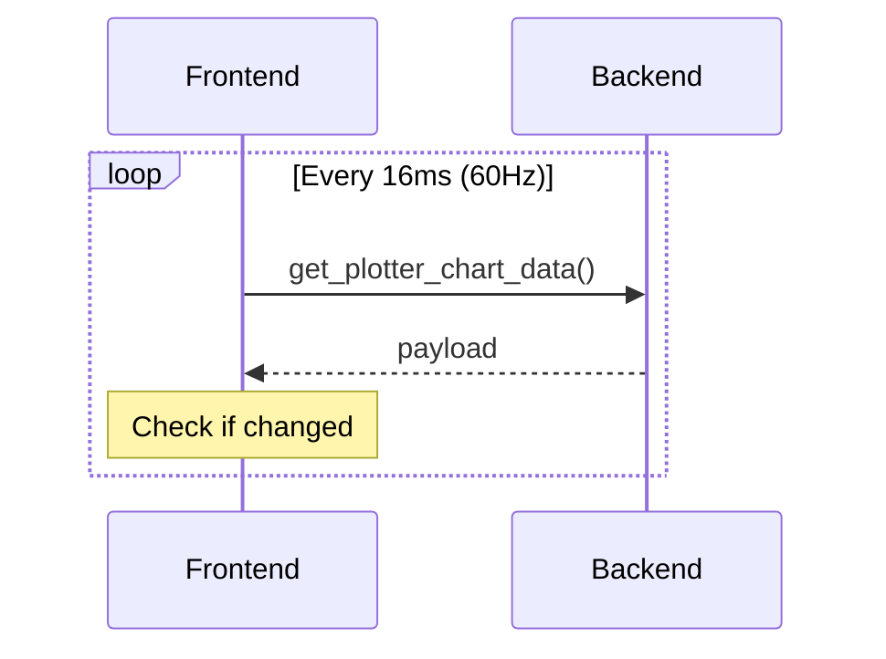
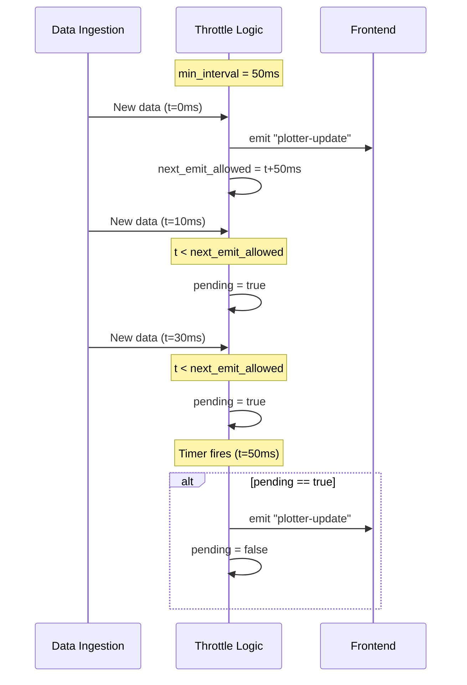

# Plotter Refactoring 2: Throttled Event-Based Updates

## 概要

ポーリングベースの更新を、スロットル付きイベントベースの更新に変更し、アイドル時の CPU 使用率をゼロに近づける。

---

## 現在の実装と問題点

### 現在のアーキテクチャ



### 問題点

| 問題 | 影響 |
|------|------|
| フロントエンドがバックエンドをポーリング | アイドル時でも CPU 消費 |
| データがなくても 60 IPC/秒 | 無駄なリソース消費 |
| バックエンドは「いつ更新があったか」を知っている | この情報を活用できていない |

### なぜ単純なイベントベースではダメか

単純にデータ追加ごとにイベントを発火すると：

```
1000 Hz データ → 1000 events/秒 → フロントエンドがパンク
```

**必要なのは: スロットル付きイベント**

---

## リファクタリング方針

### アプローチ: Coalesced Event with Minimum Interval



### 設計ポイント

1. **最小間隔 (50ms)**: 最大 20 events/秒に制限
2. **Dirty flag**: 間隔内の更新を合体
3. **タイマー**: 間隔経過後に pending をフラッシュ
4. **アイドル時**: イベント発火なし（CPU 0%）

---

## 具体的な実装手順

### Step 1: PlotterState にスロットル状態を追加

**ファイル**: `src-tauri/src/lib.rs`

```rust
use std::sync::atomic::{AtomicBool, Ordering};
use std::time::Instant;

/// Plotter state accessible across the application
pub struct PlotterState {
    /// Data aggregator for plotter
    pub aggregator: PlotterAggregator,
    /// Background thread handle
    pub thread: Mutex<Option<PlotterThread>>,
    
    // === 新規追加: スロットル状態 ===
    /// Last time an event was emitted
    last_emit_time: Mutex<Option<Instant>>,
    /// Whether there's pending data that needs to be notified
    pending_update: AtomicBool,
}

impl Default for PlotterState {
    fn default() -> Self {
        Self {
            aggregator: PlotterAggregator::new(),
            thread: Mutex::new(None),
            last_emit_time: Mutex::new(None),
            pending_update: AtomicBool::new(false),
        }
    }
}
```

### Step 2: スロットル付きイベント発火ロジック

**ファイル**: `src-tauri/src/lib.rs`

```rust
/// Minimum interval between events (milliseconds)
const MIN_EMIT_INTERVAL_MS: u64 = 50;

impl PlotterState {
    /// Notify that new data is available (called by PlotterThread)
    /// This implements throttled event emission
    pub fn notify_data_changed(&self, app: &tauri::AppHandle) {
        let now = Instant::now();
        
        let should_emit = {
            let mut last_emit = self.last_emit_time.lock().unwrap();
            
            match *last_emit {
                Some(last) if now.duration_since(last) < Duration::from_millis(MIN_EMIT_INTERVAL_MS) => {
                    // Too soon, mark as pending
                    self.pending_update.store(true, Ordering::Relaxed);
                    false
                }
                _ => {
                    // Enough time passed, emit now
                    *last_emit = Some(now);
                    self.pending_update.store(false, Ordering::Relaxed);
                    true
                }
            }
        };
        
        if should_emit {
            // Emit event to frontend
            let _ = app.emit("plotter-update", ());
        }
    }
    
    /// Flush pending update (called by timer)
    pub fn flush_pending(&self, app: &tauri::AppHandle) {
        if self.pending_update.swap(false, Ordering::Relaxed) {
            let mut last_emit = self.last_emit_time.lock().unwrap();
            *last_emit = Some(Instant::now());
            let _ = app.emit("plotter-update", ());
        }
    }
}
```

### Step 3: PlotterThread からイベントを発火

**ファイル**: `src-tauri/src/plotter/thread.rs`

現在の実装では `PlotterThread` は `PlotterAggregator` への参照しか持っていない。
`tauri::AppHandle` を渡す必要がある。

```rust
pub struct PlotterThread {
    handle: Option<JoinHandle<()>>,
    stop_flag: Arc<AtomicBool>,
}

impl PlotterThread {
    /// Start a new plotter thread with event notification
    pub fn start_with_events(
        data_store: Arc<DataStore>, 
        aggregator: PlotterAggregator,
        app: tauri::AppHandle,
        notify_callback: Arc<dyn Fn() + Send + Sync>,
    ) -> Self {
        let stop_flag = Arc::new(AtomicBool::new(false));
        let stop_flag_clone = Arc::clone(&stop_flag);

        let handle = thread::spawn(move || {
            Self::run_with_events(data_store, aggregator, stop_flag_clone, notify_callback);
        });

        Self {
            handle: Some(handle),
            stop_flag,
        }
    }
    
    fn run_with_events(
        data_store: Arc<DataStore>, 
        aggregator: PlotterAggregator, 
        stop_flag: Arc<AtomicBool>,
        notify_callback: Arc<dyn Fn() + Send + Sync>,
    ) {
        let mut parser = PlotterParser::new();
        let mut last_processed_offset: u64 = 0;
        let start_time = Instant::now();

        const MAX_READ_SIZE: u64 = 1024 * 1024;

        loop {
            if stop_flag.load(Ordering::SeqCst) {
                break;
            }

            let total_bytes = data_store.total_bytes();

            if total_bytes > last_processed_offset {
                let bytes_to_read = (total_bytes - last_processed_offset).min(MAX_READ_SIZE) as u32;

                if let Ok(data) = data_store.get_data(last_processed_offset, bytes_to_read) {
                    if !data.is_empty() {
                        let timestamp_ms = start_time.elapsed().as_millis() as u64;
                        let data_points = parser.parse(&data, timestamp_ms);

                        if !data_points.is_empty() {
                            aggregator.add_data_points_batch(data_points);
                            
                            // === 新規追加: イベント通知 ===
                            notify_callback();
                        }

                        last_processed_offset += data.len() as u64;
                    }
                }
            }

            thread::sleep(Duration::from_millis(10));
        }
    }
}
```

### Step 4: start_plotter_thread を更新

**ファイル**: `src-tauri/src/lib.rs`

```rust
#[tauri::command]
fn start_plotter_thread(
    app: tauri::AppHandle,  // AppHandle を追加
    serial_state: tauri::State<'_, SerialState>,
    plotter_state: tauri::State<'_, PlotterState>,
) -> Result<(), String> {
    let store_guard = serial_state.data_store.lock().map_err(|e| e.to_string())?;
    let data_store = store_guard.as_ref().ok_or("Serial port not open")?;

    // Stop existing thread
    {
        let mut thread_guard = plotter_state.thread.lock().map_err(|e| e.to_string())?;
        if let Some(mut thread) = thread_guard.take() {
            thread.stop();
        }
    }

    plotter_state.aggregator.clear();
    plotter_state.aggregator.set_enabled(true);

    // Create notify callback that captures PlotterState and AppHandle
    let app_clone = app.clone();
    let plotter_state_ref = plotter_state.inner().clone(); // Arc clone
    let notify_callback = Arc::new(move || {
        plotter_state_ref.notify_data_changed(&app_clone);
    });

    // Start thread with event notification
    let thread = PlotterThread::start_with_events(
        data_store.clone(), 
        plotter_state.aggregator.clone(),
        app.clone(),
        notify_callback,
    );

    // ... 残りは同じ
}
```

**注意**: `PlotterState` を `Arc` でラップする必要がある場合がある。

### Step 5: フロントエンドをイベントベースに変更

**ファイル**: `src/components/plotter/PlotterWindow.tsx`

```typescript
import { listen } from '@tauri-apps/api/event';

// requestAnimationFrame ループを削除し、イベントリスナーに置き換え

useEffect(() => {
  if (!isRunning) return;
  
  let isActive = true;
  
  // イベントリスナーを設定
  const setupListener = async () => {
    const unlisten = await listen('plotter-update', async () => {
      if (!isActive || isFetchingRef.current) return;
      
      isFetchingRef.current = true;
      try {
        await fetchData();
      } finally {
        isFetchingRef.current = false;
      }
    });
    
    return unlisten;
  };
  
  const unlistenPromise = setupListener();
  
  // 初回データ取得
  fetchData();
  
  return () => {
    isActive = false;
    unlistenPromise.then(unlisten => unlisten());
  };
}, [fetchData, isRunning]);
```

### Step 6: Pending flush タイマーを追加

バックエンドで定期的に pending をチェック。

**ファイル**: `src-tauri/src/lib.rs` (または専用スレッド)

```rust
// アプリ起動時にタイマースレッドを開始
fn start_pending_flush_timer(app: tauri::AppHandle, plotter_state: Arc<PlotterState>) {
    std::thread::spawn(move || {
        loop {
            std::thread::sleep(Duration::from_millis(MIN_EMIT_INTERVAL_MS));
            plotter_state.flush_pending(&app);
        }
    });
}
```

---

## 代替案: フロントエンド側タイマー

バックエンドのタイマーが複雑な場合、フロントエンドでタイマーを使う：

```typescript
useEffect(() => {
  if (!isRunning) return;
  
  let isActive = true;
  let updatePending = false;
  
  // イベントを受信したらフラグを立てる
  const unlistenPromise = listen('plotter-update', () => {
    updatePending = true;
  });
  
  // 50ms ごとにチェック
  const intervalId = setInterval(async () => {
    if (!isActive || !updatePending || isFetchingRef.current) return;
    
    updatePending = false;
    isFetchingRef.current = true;
    try {
      await fetchData();
    } finally {
      isFetchingRef.current = false;
    }
  }, 50);
  
  // 初回データ取得
  fetchData();
  
  return () => {
    isActive = false;
    clearInterval(intervalId);
    unlistenPromise.then(unlisten => unlisten());
  };
}, [fetchData, isRunning]);
```

この方式のほうがシンプルで、バックエンドの変更が少ない。

---

## テスト

### ユニットテスト（バックエンド）

```rust
#[test]
fn test_throttle_coalesces_rapid_updates() {
    use std::sync::Arc;
    use std::sync::atomic::{AtomicUsize, Ordering};
    
    let emit_count = Arc::new(AtomicUsize::new(0));
    let emit_count_clone = Arc::clone(&emit_count);
    
    // Mock AppHandle (テスト用)
    // 実際の実装では AppHandle のモックが必要
    
    let plotter_state = PlotterState::default();
    
    // 10ms 間隔で 10 回更新
    for _ in 0..10 {
        plotter_state.notify_data_changed(&mock_app);
        std::thread::sleep(Duration::from_millis(10));
    }
    
    // 50ms 間隔なので、最大 2-3 回のイベントが発火するはず
    assert!(emit_count.load(Ordering::Relaxed) <= 3);
}
```

### 統合テスト

1. シリアルポートを開く
2. 高頻度データ（1000 Hz）を送信
3. イベント発火回数をカウント
4. **期待**: 最大 20 events/秒

---

## リスクと対策

| リスク | 対策 |
|--------|------|
| AppHandle を PlotterThread に渡すのが複雑 | 代替案（フロントエンド側タイマー）を使用 |
| イベントリスナーのリーク | cleanup 関数で確実に unlisten |
| 最初のデータ表示が遅れる | 初回は即座に fetchData() を呼び出し |

---

## Version Counter との比較

| 項目 | Version Counter | Throttled Events |
|------|----------------|------------------|
| アイドル時 CPU | 60 light IPC/秒 | 0 |
| 実装複雑度 | 低 | 中 |
| バックエンド変更 | 少 | 多 |
| 最大レイテンシ | 16ms | 50ms |

**推奨**: まず Version Counter を実装し、さらに最適化が必要なら Throttled Events を追加。

---

## 完了条件

- [ ] `PlotterState` にスロットル状態を追加
- [ ] `notify_data_changed()` を実装
- [ ] `PlotterThread` からイベントを発火
- [ ] フロントエンドをイベントベースに変更
- [ ] テストを追加
- [ ] アイドル時の CPU 使用率がほぼ 0 であることを確認
