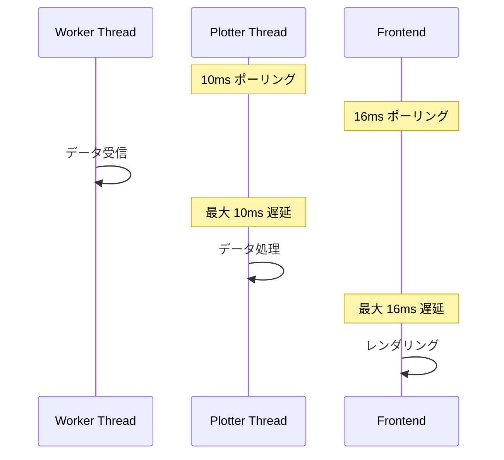
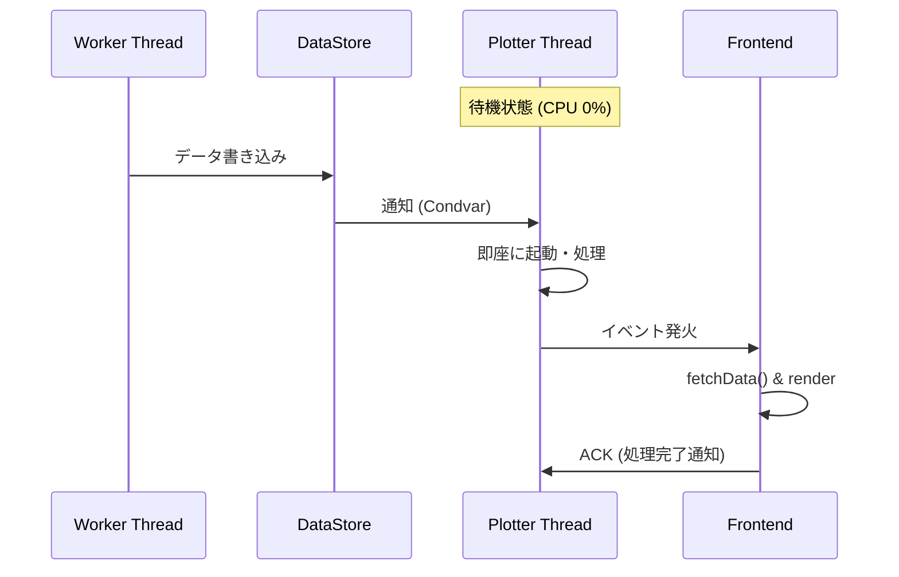
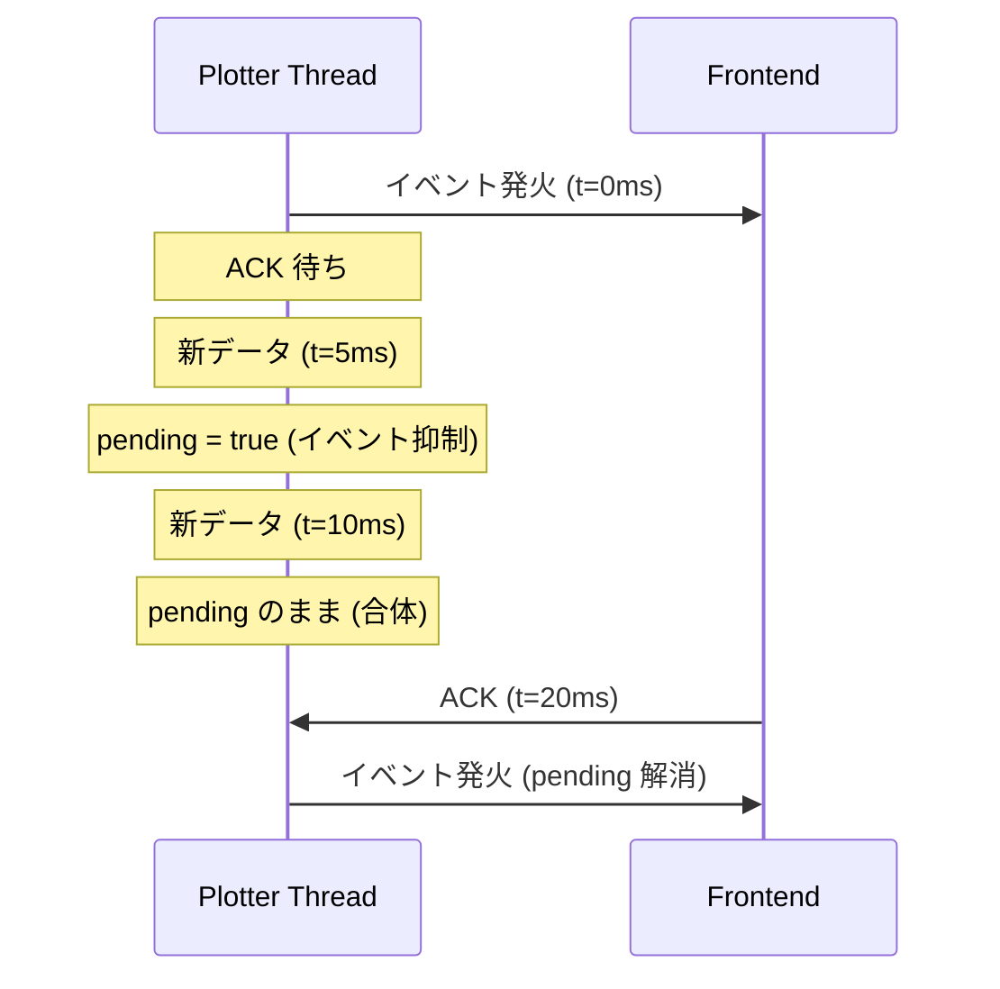
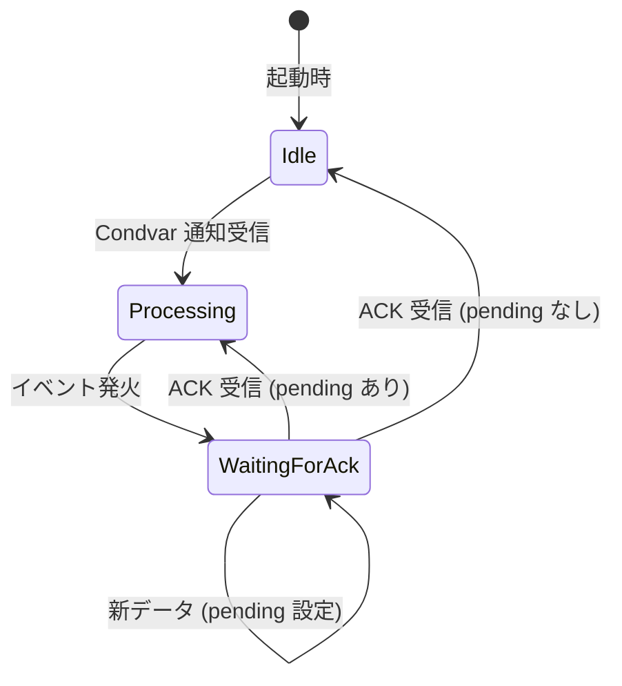

# Plotter Refactoring 2: Event-Driven Updates with Backpressure

## 概要

ポーリングベースの更新を、イベントドリブン + バックプレッシャー（ACK）方式に変更し、アイドル時の CPU 使用率をゼロにする。

---

## 現在の問題点

### 問題 1: PlotterThread のポーリング

現在の `PlotterThread` は 10ms 間隔で `DataStore` をポーリングし、新しいデータがあるかをチェックしている。

```
loop {
    total_bytes = data_store.total_bytes();
    if total_bytes > last_processed_offset {
        // 処理
    }
    sleep(10ms);  // ← 常に CPU を消費
}
```

**問題点**:
- データが来なくても 10ms ごとに CPU が起きる
- 1 秒間に 100 回の無駄なチェック
- アイドル時でも CPU 使用率が 0% にならない

### 問題 2: フロントエンドのポーリング

フロントエンドは `requestAnimationFrame` ループ（約 16ms 間隔）でバックエンドの `get_plotter_chart_data()` を呼び出している。

**問題点**:
- データがなくても 60 IPC/秒
- 毎回データを取得してレンダリングを試みる
- CPU とメモリの無駄

### 問題 3: データフローの非同期性

現在のアーキテクチャでは、データ到着からレンダリングまでのタイミングが非同期で管理されていない。



**結果**: データ到着からレンダリングまで最大 26ms の遅延が発生。

---

## なぜポーリングが使われているのか

### DataStore の設計

`DataStore` は Worker Thread が書き込み、他のスレッド（Plotter Thread、Logger Thread など）が読み取るデータストアである。

現状、`DataStore` はデータ追加を外部に通知する仕組みを持っていない。そのため、消費者側（Plotter Thread）は「データがあるかどうか」を定期的に確認するしかない。

### フロントエンドの設計

Tauri のフロントエンドからバックエンドへの通信は「リクエスト-レスポンス」型が基本である。バックエンドからフロントエンドへのプッシュ通知（イベント）は可能だが、現在は使用していない。

---

## 新アーキテクチャ: Event-Driven with Backpressure

### 基本方針

1. **データ到着をイベントで通知**: Worker Thread がデータを書き込んだら、Plotter Thread に通知
2. **Plotter Thread は待機状態**: ポーリングではなく、通知が来るまでブロック（CPU 消費なし）
3. **フロントエンドにプッシュ通知**: Plotter Thread がデータ処理後、フロントエンドにイベント発火
4. **ACK による同期**: フロントエンドが「処理完了」をバックエンドに通知

### データフロー



### Condvar (Condition Variable) とは

Condvar はスレッド間の同期プリミティブで、「ある条件が満たされるまでスレッドをブロック」する機能を提供する。

- **待機側**: `condvar.wait()` でスリープ状態に入る（CPU 消費なし）
- **通知側**: `condvar.notify_all()` で待機中のスレッドを起こす

これにより、ポーリングのような「定期的なチェック」が不要になる。

### ACK (Acknowledgement) によるバックプレッシャー

高頻度データ（例: 1000 Hz）が来た場合、フロントエンドが追いつけないとイベントが蓄積してパンクする。

これを防ぐため、**バックプレッシャー**を導入する:

1. Plotter Thread がイベントを発火したら「ACK 待ち」状態に入る
2. フロントエンドは処理完了後に `plotter_ack` コマンドを呼び出す
3. ACK を受信するまで、新しいイベントは発火しない
4. ACK 待ち中に新しいデータが来たら、`pending_update` フラグを立てる
5. ACK 受信後、pending があれば即座に次のイベントを発火



**効果**: どれだけ高速にデータが来ても、フロントエンドの処理能力を超えない。

---

## 状態遷移



---

## 実装方針

### Step 1: DataStore に通知機構を追加

`DataStore` に `Condvar` と `Mutex` を追加し、データ書き込み時に `notify_all()` を呼び出す。

**変更ファイル**: `src-tauri/src/serial/data_store.rs`

**追加するメソッド**:
- `signal_data_available()`: Worker Thread から呼び出し、待機中のスレッドを起こす
- `wait_for_data(timeout)`: Plotter Thread から呼び出し、データが来るまでブロック

### Step 2: Worker Thread から通知を発火

`WorkerThread` がデータを `DataStore` に書き込んだ後、`signal_data_available()` を呼び出す。

**変更ファイル**: `src-tauri/src/serial/worker_thread.rs`

### Step 3: PlotterThread を待機ベースに変更

現在の 10ms ポーリングループを、`wait_for_data()` ベースに変更する。

**変更ファイル**: `src-tauri/src/plotter/thread.rs`

**変更内容**:
- `start()` メソッドに `AppHandle` を追加（イベント発火用）
- メインループを `wait_for_data()` ベースに変更
- ACK フラグ（`AtomicBool`）を追加
- `acknowledge()` メソッドを追加

### Step 4: Tauri コマンドを追加

フロントエンドから ACK を送信するためのコマンドを追加する。

**変更ファイル**: `src-tauri/src/lib.rs`

**追加するコマンド**: `plotter_ack`

### Step 5: フロントエンドをイベントベースに変更

`requestAnimationFrame` ループを削除し、`listen('plotter-update')` でイベントを受信する方式に変更する。

**変更ファイル**: `src/components/plotter/PlotterWindow.tsx`

**変更内容**:
- `listen()` でバックエンドからのイベントを購読
- `fetchData()` 完了後に `invoke('plotter_ack')` を呼び出し
- cleanup で `unlisten()` を確実に呼び出し

---

## 利点

| 項目 | 現在 (ポーリング) | 変更後 (Event-Driven + ACK) |
|------|------------------|----------------------------|
| アイドル時 CPU | > 0% | 0% |
| データ到着 → レンダリング | 最大 26ms | 即時 |
| フロントエンド過負荷保護 | なし | ACK によるバックプレッシャー |
| IPC 回数/秒 (アイドル時) | 60 | 0 |

---

## リスクと対策

| リスク | 対策 |
|--------|------|
| ACK が来ない場合の停止 | `pending_update` フラグで更新を蓄積し、ACK 受信時に即発火 |
| Condvar タイムアウト | 100ms タイムアウトで `stop_flag` をチェック |
| 既存テストへの影響 | 既存の `start()` メソッドを維持しつつ、新しい `start_event_driven()` を追加 |

---

## 完了条件

- [ ] `DataStore` に `Condvar` と通知メソッドを追加
- [ ] Worker Thread から `signal_data_available()` を呼び出し
- [ ] `PlotterThread` を `wait_for_data()` ベースに変更
- [ ] `PlotterThread` に ACK 機構を追加
- [ ] `plotter_ack` Tauri コマンドを追加
- [ ] フロントエンドをイベントベース + ACK に変更
- [ ] 既存テストが通ることを確認
- [ ] 新しいテストを追加
- [ ] アイドル時の CPU 使用率がほぼ 0% であることを確認
