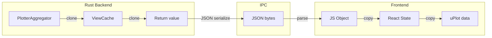
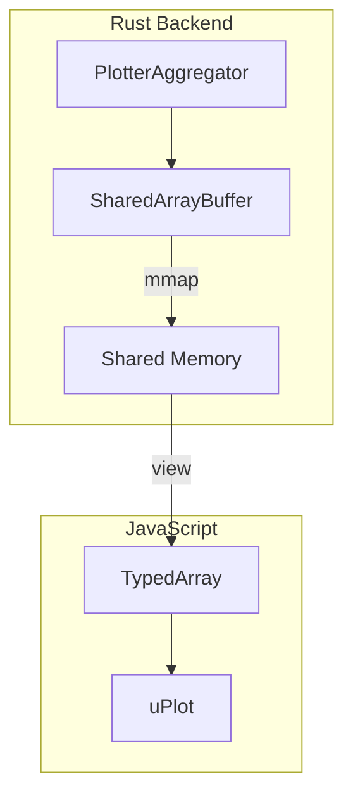

# Plotter Refactoring 3: Zero-Copy Architecture

## 概要

Rust 内でのデータクローンを削減し、将来的な SharedArrayBuffer による完全ゼロコピーへの道筋を示す。

---

## 現在の実装と問題点

### 現在のデータフロー



### 問題のあるコード

**ファイル**: [aggregator.rs:724, 772](file:///c:/Users/kazuki/Documents/SerialMonitorEssential/src-tauri/src/plotter/aggregator.rs#L724)

```rust
// キャッシュヒット時
if cache_valid {
    let line_data = cache.data.clone();  // ← Full HashMap clone
    // ...
}
```

**ファイル**: [aggregator.rs:904](file:///c:/Users/kazuki/Documents/SerialMonitorEssential/src-tauri/src/plotter/aggregator.rs#L904)

```rust
// キャッシュ更新時
let cache_data = aggregated_data.clone();  // ← Full HashMap clone
inner.view_cache = Some(ViewCache {
    data: cache_data,
    // ...
});
```

### 影響

- **データサイズ**: 4000 points × 8 channels = 32K データポイント
- **クローン頻度**: 60 Hz (現在) または更新ごと
- **メモリ**: 各クローンで約 256 KB 以上のアロケーション
- **CPU**: アロケータとmemcpy のオーバーヘッド

---

## ゼロコピーの制約

### Tauri IPC の制約

```rust
// Tauri のコマンドは serde による JSON シリアライズを使用
#[tauri::command]
fn get_plotter_chart_data(...) -> Result<PlotterChartPayload, String> {
    //                               ^^^^^^^^^^^^^^^^^^^^^^
    //                               これは JSON にシリアライズされる
}
```

**結論**: Rust → JavaScript 間の**完全なゼロコピーは不可能**。

### 可能な最適化

| レイヤー | 最適化 | 効果 |
|----------|--------|------|
| Rust 内 | Arc でクローン回避 | ○ 中程度 |
| IPC | MessagePack 使用 | △ 若干改善 |
| JS 内 | TypedArray 直接渡し | △ 若干改善 |
| 全体 | SharedArrayBuffer | ◎ 完全ゼロコピー（複雑） |

---

## リファクタリング方針

### Phase 1: Arc-Based Cache (推奨・即座に実装可能)

キャッシュを `Arc<HashMap<...>>` でラップし、クローンをリファレンスカウントのインクリメントに置き換える。

### Phase 2: SharedArrayBuffer (将来検討)

Rust と JavaScript 間で共有メモリを使用。

---

## Phase 1: Arc-Based Cache 実装

### Step 1: ViewCache の data を Arc でラップ

**ファイル**: `src-tauri/src/plotter/aggregator.rs`

```rust
use std::sync::Arc;

#[derive(Debug, Clone)]
struct ViewCache {
    time_range: (u64, u64),
    pixel_width: u32,
    data: Arc<HashMap<String, Vec<AggregatedPoint>>>,  // ← Arc でラップ
    was_realtime: bool,
}
```

### Step 2: キャッシュ更新ロジックを修正

```rust
// 現在
let cache_data = aggregated_data.clone();
inner.view_cache = Some(ViewCache {
    data: cache_data,
    // ...
});

// 修正後
inner.view_cache = Some(ViewCache {
    data: Arc::new(aggregated_data),  // ← 新しい Arc を作成
    // ...
});
```

### Step 3: キャッシュヒット時のクローンを Arc::clone に変更

```rust
// 現在
let line_data = cache.data.clone();  // Full clone

// 修正後
let line_data = Arc::clone(&cache.data);  // Reference count increment only
```

### Step 4: get_ranged_data の戻り値型を調整

**問題**: `PlotterRangedPayload` は `HashMap<String, Vec<AggregatedPoint>>` を直接持っている。

```rust
pub struct PlotterRangedPayload {
    pub line_data: HashMap<String, Vec<AggregatedPoint>>,  // ← 所有権
    // ...
}
```

**選択肢**:

#### A. 戻り値を Arc でラップ

```rust
pub struct PlotterRangedPayload {
    pub line_data: Arc<HashMap<String, Vec<AggregatedPoint>>>,
    // ...
}
```

**デメリット**: serde でシリアライズ時に Arc 内をイテレートするため、IPC のメリットなし。

#### B. 内部でのみ Arc を使用（推奨）

キャッシュ内部では Arc を使用し、戻り値にはクローンを返す。

```rust
// キャッシュヒット時
if cache_valid {
    // Arc から clone() - ここでクローンが発生
    return PlotterRangedPayload {
        line_data: (*cache.data).clone(),
        // ...
    };
}

// キャッシュミス時
let aggregated_data = /* 計算 */;
let data_arc = Arc::new(aggregated_data.clone());
inner.view_cache = Some(ViewCache {
    data: Arc::clone(&data_arc),
    // ...
});
return PlotterRangedPayload {
    line_data: (*data_arc).clone(),  // ← ここでクローン
    // ...
};
```

**この方式のメリット**:
- キャッシュの更新と返却で **1 回** のクローンに削減
- 現在は **2 回** クローン（キャッシュ保存用 + 返却用）

**デメリット**:
- まだクローンが発生する
- IPC 前に必ず 1 回はクローンが必要

### Step 5: 実際の効果を測定

```rust
#[test]
fn bench_clone_vs_arc_clone() {
    use std::time::Instant;
    
    // 大きな HashMap を作成
    let mut map: HashMap<String, Vec<AggregatedPoint>> = HashMap::new();
    for i in 0..8 {
        let channel = format!("ch{}", i);
        let points: Vec<AggregatedPoint> = (0..4000)
            .map(|j| AggregatedPoint::Single { ts: j as u64, value: j as f64 })
            .collect();
        map.insert(channel, points);
    }
    
    // HashMap clone のベンチマーク
    let start = Instant::now();
    for _ in 0..1000 {
        let _ = map.clone();
    }
    let clone_time = start.elapsed();
    
    // Arc clone のベンチマーク
    let arc_map = Arc::new(map.clone());
    let start = Instant::now();
    for _ in 0..1000 {
        let _ = Arc::clone(&arc_map);
    }
    let arc_clone_time = start.elapsed();
    
    println!("HashMap clone: {:?}", clone_time);     // 数百 ms
    println!("Arc clone: {:?}", arc_clone_time);     // 数 μs
    
    assert!(arc_clone_time < clone_time / 100);
}
```

---

## Phase 2: SharedArrayBuffer (将来検討)

### アーキテクチャ



### データレイアウト

```rust
// 固定サイズの共有バッファ
const MAX_CHANNELS: usize = 16;
const MAX_POINTS: usize = 8000;

#[repr(C)]
struct SharedPlotterBuffer {
    // === ヘッダー (64 bytes) ===
    version: AtomicU64,          // 8 bytes - データバージョン
    num_channels: AtomicU32,     // 4 bytes - アクティブチャンネル数
    num_points: AtomicU32,       // 4 bytes - ポイント数
    start_ms: AtomicU64,         // 8 bytes - 開始時刻
    end_ms: AtomicU64,           // 8 bytes - 終了時刻
    _padding: [u8; 32],          // 32 bytes - アライメント用
    
    // === タイムスタンプ配列 (64 KB) ===
    timestamps: [f64; MAX_POINTS],  // 8 * 8000 = 64 KB
    
    // === チャンネルデータ (1 MB) ===
    channel_data: [[f64; MAX_POINTS]; MAX_CHANNELS],  // 8 * 8000 * 16 = 1 MB
    
    // === チャンネル名 (オフセット情報) ===
    channel_names: [[u8; 32]; MAX_CHANNELS],  // 32 * 16 = 512 bytes
}

// 合計: ~1.1 MB の固定サイズバッファ
```

### Tauri での SharedArrayBuffer

**問題**: Tauri は標準では SharedArrayBuffer をサポートしていない。

**ワークアラウンド**:

1. **COOP/COEP ヘッダーを設定**
   ```rust
   // tauri.conf.json または Rust 側で設定
   // Cross-Origin-Opener-Policy: same-origin
   // Cross-Origin-Embedder-Policy: require-corp
   ```

2. **共有メモリを作成し、ハンドルを渡す**
   ```rust
   // mmap でファイルバックの共有メモリを作成
   // そのファイルパスをフロントエンドに渡す
   // フロントエンドは SharedArrayBuffer として読み込む
   ```

3. **WebView2/WebKitGTK の制限を調査**
   - Windows: WebView2 は SharedArrayBuffer をサポート（COOP/COEP 必要）
   - Linux: WebKitGTK のサポート状況を確認
   - macOS: WKWebView のサポート状況を確認

### 課題

| 課題 | 難易度 |
|------|--------|
| COOP/COEP ヘッダー設定 | 中 |
| 共有メモリの作成と橋渡し | 高 |
| 固定サイズバッファ（動的チャンネル数は困難） | 中 |
| クロスプラットフォーム対応 | 高 |
| データレースの防止（Atomics 使用） | 中 |

### 実装しない理由

現時点では以下の理由で SharedArrayBuffer を実装しない：

1. **実装コストが高い**: COOP/COEP 設定、共有メモリ管理
2. **プラットフォーム差異**: WebView の実装が異なる
3. **動的チャンネル数の制約**: 固定レイアウトが必要
4. **他の最適化で十分**: Version Counter + Throttled Events で大幅改善

**将来の検討条件**:
- 大量データ（100K+ points）のリアルタイム表示が必要
- 他の最適化で十分なパフォーマンスが得られない
- Tauri が SharedArrayBuffer をネイティブサポート

---

## 推奨実装

### 即座に実装

1. **Version Counter** (doc 10) - 最も効果的
2. **Arc-Based Cache** (Step 1-4 of this doc) - 中程度の効果

### 将来検討

3. **Throttled Events** (doc 11) - アイドル時の CPU ゼロ化
4. **SharedArrayBuffer** (this doc Phase 2) - 完全ゼロコピー

---

## 完了条件 (Phase 1)

- [ ] `ViewCache.data` を `Arc<HashMap<...>>` に変更
- [ ] キャッシュ更新ロジックを修正
- [ ] キャッシュヒット時のクローンを削減
- [ ] ベンチマークでクローン削減を確認
- [ ] 既存テストがパス

---

## 備考

### なぜ serde と Arc の相性が悪いか

```rust
#[derive(Serialize)]
struct Payload {
    data: Arc<HashMap<String, Vec<Point>>>,
}
```

serde は `Arc` をシリアライズする際、内部データを完全にイテレートする。
つまり、**IPC 前に必ずデータを読み取る**必要があり、メモリコピーは避けられない。

Arc の効果は **Rust 内での中間コピー削減** に限定される。
