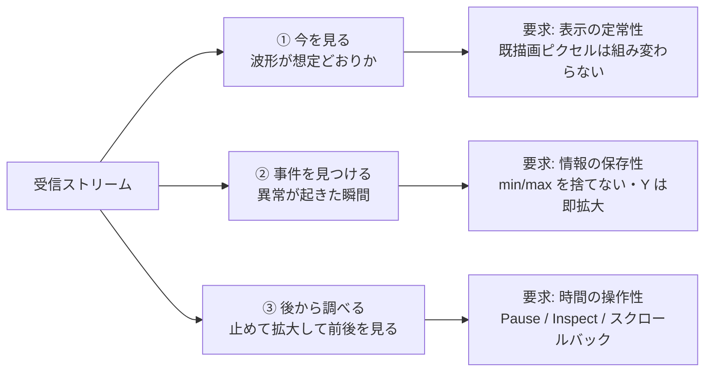

# ステークホルダーニーズ定義 (Stakeholder Needs)

## 目的

本書は SerialMonitorEssential が「誰の、どの困りごとを、なぜ解くのか」を定義する。
実装方法は書かない。実装可能な言い方に翻訳したものは [21_system_requirements.md](21_system_requirements.md) に置く。

ISO/IEC/IEEE 15288 の Stakeholder Needs and Requirements Definition プロセスに相当する層だが、
1人開発のデスクトップツールとして保守できる分量に絞っている。

## スコープ

| 含む | 含まない |
|------|----------|
| シリアル受信・表示・送信・プロット・ログ保存に対する利用者の意図 | 実装技術の選定理由（→ [22_architecture_description.md](22_architecture_description.md)） |
| 利用シナリオと、そこから導かれるニーズ (UN-xx) | 具体的な数値の受入基準（→ [21_system_requirements.md](21_system_requirements.md)） |
| ニーズ間の優先度・トレードオフ | UI の見た目・配色 |

## 関連文書

- [01_overview.md](01_overview.md) — プロジェクト概要（既存の要求メモ）
- [07_plotter_spec.md](07_plotter_spec.md) — プロッタの詳細仕様と変更履歴
- [21_system_requirements.md](21_system_requirements.md) — 本書のニーズを要求へ変換したもの
- [23_traceability.md](23_traceability.md) — UN → SYS → 実装 → 検証の対応表

---

## 1. ステークホルダー

| ID | ステークホルダー | 立場 | 主な関心事 |
|----|------------------|------|------------|
| SH-1 | **組込み開発者（主）** | 本ツールの利用者。FPGA・マイコン・高速センサのファーム開発者 | 送ったつもりのデータが本当に出ているか / 波形が想定通りか / 異常が起きた瞬間を捉えられるか |
| SH-2 | **保守者（副＝本人）** | 単独の開発・保守担当 | 変更しても壊れないこと。テストとドキュメントで挙動が固定されていること |
| SH-3 | 実行環境（間接） | Windows 11 デスクトップ、USB-Serial ドライバ、com0com 仮想 COM | ディスク・メモリを食い潰さないこと。他アプリのポートを奪わないこと |

SH-1 と SH-2 は同一人物であり得るが、**関心事が異なるため分けて扱う**。
SH-1 は「今すぐ結果が欲しい」、SH-2 は「半年後の自分が読んで直せる」ことを求める。

---

## 2. 利用コンテキスト

| 項目 | 内容 |
|------|------|
| プラットフォーム | Windows 11（開発・検証の主対象）。コードはクロスプラットフォーム構成だが常時検証しているのは Windows のみ |
| 接続対象 | USB-Serial（Arduino / Raspberry Pi Pico 等）、FPGA ボード、com0com による仮想 COM ペア |
| ボーレート | 9600 〜 12 Mbps（非標準レート含む） |
| データ形式 | 行指向テキスト（CSV / `label:value`）と、任意のバイナリストリームの両方 |
| セッション長 | 数秒のスモークテストから、数十分〜数時間の連続ログ取得まで |
| 同時起動 | 複数インスタンスを起動し、別々の COM ポートを同時に監視することがある |

---

## 3. 利用シナリオ

シナリオはニーズの根拠であり、V&V（[24_vv_plan.md](24_vv_plan.md)）のシナリオテストの元ネタでもある。

### US-01: 接続してセンサ値を眺める

ポートを選び、ボーレートを設定し、接続する。数値が流れ始めたらプロッタを開き、
波形が想定どおりか（周期・振幅・オフセット）を**数秒眺めて**判断する。
判断の対象は「今の値」であって、履歴全体ではない。

### US-02: ファーム再書き込みを挟んで再接続する

書き込みツールが COM ポートを使うため、いったん切断する。書き込み後に再接続する。
このとき前セッションの表示が残っていると、新しいファームの出力と混ざって判断を誤る。
「切断→再接続でセッションが切り替わる」ことが自明に見えてほしい。

### US-03: 異常スパイクを調査する

「たまに値が飛ぶ」を追いかける。飛んだ瞬間を見逃すと再現待ちに数十分かかるため、
**スパイクが間引きで消えることは許容できない**。
飛んだのを見たら、そこで止めて（Pause）拡大し、前後を見る。

### US-04: バイナリプロトコルを Hex で確認する

テキストではないプロトコル（独自フレーム、チェックサム付き）のバイト列を、
オフセット付きの Hex ダンプで確認する。制御文字が可視化されている必要がある。
Hex と ASCII を行き来しても、見ていた位置を見失いたくない。

### US-05: コマンドを送信する

テキストまたは Hex でコマンドを打ち、デバイスの応答を同じ画面で見る。
改行コード（なし/CR/LF/CRLF）を選べる。直前に打ったコマンドを ↑ キーで呼び戻して繰り返す。

### US-06: 長時間ログを取得してエクスポートする

数十分〜数時間、取りこぼしなく受信し続ける。終わったらバイナリファイルとして保存し、
別のツール（Python 等）で解析する。途中でアプリが重くなったり落ちたりしてはならない。

---

## 4. 可視化の意図（3分類）

プロッタに対するニーズは、**利用者がその瞬間に何をしようとしているか**で 3 つに分かれる。
この分類が UN-01 / UN-02 / UN-03 の根拠であり、プロッタ設計全体の中心にある。

### ① 今を見る

利用者は「今の値が想定どおりか」を、波形の**形**で判断している。
このとき、データが変わっていないのに表示のほうが揺れる（間引き位置が毎フレーム組み変わる、
Y 軸が毎フレーム微調整される、X 軸の原点が動く）と、その揺れは**本物の変化を隠すノイズ**になる。

> 表示の揺れは、情報を増やさずに判断コストだけを上げる。

### ② 事件を見つける

異常は「1 点だけ 10 倍に飛ぶ」という形で現れることが多い。
平均化して描画するとその点は消える。レンジ外に飛んだときに Y 軸が追従しなければ、
グラフの上端に張り付いて「飛んだ量」が分からない。

> 見逃した異常は、再現待ちの数十分に化ける。だからスパイクは絶対に消してはならない。

### ③ 後から調べる

事件を見つけたら、時間を止めて、そこを拡大し、前後の文脈を読む。
このとき新しいデータが流れ込んで表示位置がずれると調査にならない。

---

## 5. ステークホルダーニーズ (UN)

各ニーズは「利用者が何を必要としているか」を書く。実現手段は書かない。
優先度は **必須 / 重要 / あれば良い** の 3 段階。

### 5.1 可視化

| ID | ニーズ | 根拠 (Rationale) | 由来 | 優先度 |
|----|--------|------------------|------|--------|
| **UN-01** | 利用者は、ライブ表示中に**表示そのものが揺れない**ことを必要とする。データが変わらない限り、既に描かれた部分は同じ位置に留まり続けてほしい | 可視化意図①。表示の揺れは本物の変化を隠すノイズであり、波形の形での判断を妨げる（本書 §4 ①） | US-01 | 必須 |
| **UN-02** | 利用者は、**ストリームが止まったことが表示から分かる**ことを必要とする | 「値が来ていない」も重要な観測結果。X 軸が止まると「止まった」のか「同じ値が続いている」のか区別できない | US-01, US-03 | 必須 |
| **UN-03** | 利用者は、**異常なスパイクが間引きによって消えない**ことを必要とする。また、レンジ外に飛んだ値がすぐ見えることを必要とする | 可視化意図②。見逃したスパイクは再現待ちのコストになる（本書 §4 ②） | US-03 | 必須 |
| **UN-04** | 利用者は、**時間を止めて過去を調べられる**ことを必要とする。止めた後、拡大・移動しても新しいデータで表示位置がずれないこと | 可視化意図③。調査中に視点が動くと調査にならない（本書 §4 ③） | US-03 | 必須 |
| **UN-05** | 利用者は、**今どのモードで見ているか**が常に分かることを必要とする（追従中か、止まっているか、過去を見ているか） | 「止めたつもりが止まっていない」「追従しているつもりが過去を見ている」は誤った判断に直結する | US-01, US-03 | 重要 |
| **UN-06** | 利用者は、離散的な状態（ON/OFF、エラーコード等）を、数値波形と**同じ時間軸上で**見られることを必要とする | 「モータが ON になった瞬間に電流が跳ねた」のような因果は、時間軸が揃っていないと読めない | US-01, US-03 | 重要 |

### 5.2 生データの確認と送信

| ID | ニーズ | 根拠 | 由来 | 優先度 |
|----|--------|------|------|--------|
| **UN-07** | 利用者は、受信バイト列を**加工されていない形**（オフセット付き Hex / 制御文字を可視化した ASCII）で確認できることを必要とする | プロトコルのデバッグでは「何バイト目に何が来たか」が唯一の手がかりになる。テキスト整形は情報を落とす | US-04 | 必須 |
| **UN-08** | 利用者は、Hex と ASCII を切り替えても**見ていた位置を失わない**ことを必要とする | 同じバイトを 2 つの視点で見るのが目的であり、切り替えのたびに探し直すのは目的に反する | US-04 | 重要 |
| **UN-09** | 利用者は、テキストまたは Hex でデータを送信し、改行コードを選び、直前の入力を呼び戻せることを必要とする | 同じコマンドを条件を変えて繰り返すのがデバッグの基本動作 | US-05 | 必須 |

### 5.3 データ保全

| ID | ニーズ | 根拠 | 由来 | 優先度 |
|----|--------|------|------|--------|
| **UN-10** | 利用者は、受信データが**1 バイトも失われない**ことを必要とする。UI の描画遅延が受信に影響してはならない | 取りこぼしがあると、そのログで何かを結論づけることができなくなる（ツールとしての存在意義） | US-06 | 必須 |
| **UN-11** | 利用者は、`Clear` を押したとき、**メインビューもプロッタも同時に空になる**ことを必要とする | 片方だけ残ると、どのセッションのデータを見ているのか分からなくなる。2026-09-03 の修正で挙動を統一済み（[07 変更履歴](07_plotter_spec.md#挙動変更)） | US-02 | 必須 |
| **UN-12** | 利用者は、**切断→再接続でセッションが切り替わる**ことを必要とする。新セッションの表示に旧セッションのチャンネルや波形が混ざってはならない | US-02。ファーム更新の前後を混同すると、直っていないものを直ったと誤認する | US-02 | 必須 |
| **UN-13** | 利用者は、受信データをファイルに**バイナリのままエクスポート**できることを必要とする | 本ツールで完結しない解析（FFT、統計）は外部ツールに渡す。加工されたテキストでは渡せない | US-06 | 必須 |
| **UN-14** | 利用者は、ツールが**ユーザーのディスクを汚さない**ことを必要とする。一時ファイルは自動で片付くこと | 数十分のログは GB 級になる。放置された一時ファイルは後で必ず問題になる | US-06 | 重要 |

### 5.4 応答性・堅牢性

| ID | ニーズ | 根拠 | 由来 | 優先度 |
|----|--------|------|------|--------|
| **UN-15** | 利用者は、**12 Mbps の連続受信中でも UI が固まらない**ことを必要とする。スクロール、モード切替、送信がその間も動くこと | 高速受信中こそ操作したい（止めたい、拡大したい）。そのときに固まるツールは使えない | US-01, US-06 | 必須 |
| **UN-16** | 利用者は、**長時間動かしてもメモリが増え続けない**ことを必要とする | 2026-01-03 に +13.6 MB/秒 のフロントエンドリークで実際に破綻した経緯がある（[07 変更履歴](07_plotter_spec.md#2026-01-03-フロントエンドメモリリーク修正)） | US-06 | 必須 |
| **UN-17** | 利用者は、**任意のタイミングで任意のモードを切り替えても壊れない**ことを必要とする。受信中の Clear、一時停止中のモード切替、プロッタを先に開いてからの接続、連打などを含む | 実際の操作は仕様書の順序どおりには行われない。2026-09-03 に「プロッタを先に開くと動かない」「Clear 後に永久フリーズ」が実在した | US-01〜US-06 | 必須 |
| **UN-18** | 利用者は、**ウィンドウを閉じたらプロセスが終わる**ことを必要とする。裏でスレッドが残り続けてはならない | 残留プロセスは次回の接続を妨げ（ポート占有）、原因の分かりにくい不具合になる | US-02, US-06 | 必須 |
| **UN-19** | 利用者は、デバイスが**物理的に外れたことを検知**して、UI がその旨を示すことを必要とする | USB は抜ける。抜けたのに「接続中」と表示され続けると、来ないデータを待ち続けることになる | US-02 | 重要 |

### 5.5 環境・保守

| ID | ニーズ | 根拠 | 由来 | 優先度 |
|----|--------|------|------|--------|
| **UN-20** | 利用者は、**Windows 11 上で、実機と com0com 仮想 COM ペアの双方**で同じように動くことを必要とする | 実機なしで回帰試験をするには仮想ペアが要る。2026-09-03 の E2E は COM15⇔COM16 で実施 | 全般 | 必須 |
| **UN-21** | 利用者は、複数インスタンスを起動して**別々のポートを同時に監視**できることを必要とする | 送信側と受信側を同時に見る、2 台のデバイスを比べる、といった使い方をする | US-01 | あれば良い |
| **UN-22** | 保守者は、**変更が既存の挙動を壊していないことを自動で確認**できることを必要とする。回帰は人手のクリックではなくテストで守られること | 1人開発では、手動確認の網羅は続かない。壊れたことに気づくのが数週間後になる | 全般 | 必須 |
| **UN-23** | 保守者は、**なぜその設計になっているか**が文書に残っていることを必要とする | 「イベント push ではなくポーリング」等の非自明な選択は、理由を忘れると善意で元に戻される | 全般 | 重要 |

---

## 6. ニーズ間のトレードオフ

明示しておかないと、後から片方だけを最適化して他方を壊す組み合わせ。

| 対立するニーズ | 緊張関係 | 本プロジェクトの立場 |
|----------------|----------|----------------------|
| UN-01（表示の定常性）↔ UN-03（スパイクを消さない） | 「揺れない」を素朴に追うと平滑化したくなるが、平滑化はスパイクを消す | **両立させる**。間引きは「位置が動かないバケット」で行い、バケットは min/max を保持する。定常性はバケット境界の安定性で、スパイク保存は統計量の保持で、別々に達成する |
| UN-01（表示の定常性）↔ UN-03（Y 軸の即時追従） | Y 軸が動けば表示は揺れる。動かなければ飛んだ値が見えない | **非対称にする**。拡大は即時、縮小は遅延（ヒステリシス）。異常の見逃しは許容せず、平常時の揺れは許容しない |
| UN-10（取りこぼしゼロ）↔ UN-15（UI が固まらない） | 受信スレッドが UI と同じ責務を持つと、どちらかが犠牲になる | **責務を分離する**。受信は UI の完了を待たない（[22 §3](22_architecture_description.md)） |
| UN-16（メモリ一定）↔ UN-10（全データ保持） | 全データをメモリに置けば必ず溢れる | **ディスクへ退避する**。メモリ上は追従中の数 MB のみ |
| UN-22（自動テストで守る）↔ 実装速度 | テストのない機能は速く書けるが、次の変更で壊れる | **挙動変更を伴う修正には回帰テストを付ける**。ただし網羅の完成は段階的（[24_vv_plan.md](24_vv_plan.md)） |

---

## 7. 前提と制約

| ID | 内容 | 種別 |
|----|------|------|
| AS-1 | シリアルデータの意味（何 Hz で来るか、どのチャンネルが何か）はアプリ側では既知でない。データ形式から推論する | 前提 |
| AS-2 | 受信データはディスクの空き容量まで保持できる。ディスクフルは利用者に通知する | 前提 |
| CO-1 | Tauri 2（Rust バックエンド + React 19 フロントエンド）を採用済み。IPC は Tauri の invoke / event に限られる | 制約 |
| CO-2 | 開発・保守は 1 人。導入するテスト・ツールは 1 人で維持できる量に留める | 制約 |
| CO-3 | チャート描画は uPlot に依存する。uPlot の座標系・スケール API の制約内で設計する | 制約 |

---

## 8. TBD

| # | 未確定事項 | 影響するニーズ |
|---|------------|----------------|
| ~~TBD-N1~~ | ~~Linux / macOS を「動く」と主張する範囲~~ **決定済（2026-09-03）**: 下表のとおり正式対応 OS を確定した | UN-20 |
| TBD-N2 | 複数インスタンス起動時に、同一 COM ポートを 2 つのインスタンスが開こうとした場合の期待挙動（OS のエラーをそのまま見せるかどうか） | UN-21 |
| TBD-N3 | 検索・フィルタに対するニーズの具体化。UI は存在するが機能は未実装であり、利用者が正規表現を求めているのか単純部分一致で足りるのかが未確認 | （未採番） |
| TBD-N4 | プロッタ設定（表示幅、間引きモード、チャンネル表示/非表示）をアプリ再起動後も保持すべきか | UN-05 |

### 8.1 正式対応 OS

**TBD-N1 の決定（2026-09-03）。**
「動く」と主張してよい範囲を、**検証の裏付けがある段階**で 3 つに分ける。
主張の強さは検証の強さを超えない。

| 段階 | 対象 | 裏付け | 利用者に対する約束 |
|------|------|--------|-------------------|
| **正式対応** | Windows 10 / 11 x64 | 実機 + com0com による E2E、実機 Pico での性能受入（[25 §3.3](25_release_strategy.md) Tier 2） | 不具合は修正対象。リリースごとにインストーラで検証する |
| **正式対応** | Ubuntu 22.04+ x64 | **WSL2 での実証 + Linux CI ジョブ**（ビルド・テスト） | 不具合は修正対象。ただし Tier 2（E2E・実機性能）は Windows でのみ実施する |
| **ベストエフォート** | macOS | **週次 `rust-ci.yml` によるコンパイル監視のみ** | **動作は保証しない。** 壊れていれば直すが、優先度は低い。配布物も出さない |

- 32 bit 版・ARM 版は**対象外**。要望が出るまで作らない。
- Linux で `.deb` / AppImage を配布する（[25 §5.6](25_release_strategy.md)）。macOS のバンドルは配布しない。
- 「コンパイルが通る」ことは「動く」ことではない。macOS をベストエフォートに留めるのは、
  **`serialport` クレートの挙動を実機で確認していない**ためであり、
  実機で検証できるようになるまで格上げしない。

---

## 関連ドキュメント

- [21_system_requirements.md](21_system_requirements.md)
- [22_architecture_description.md](22_architecture_description.md)
- [23_traceability.md](23_traceability.md)
- [24_vv_plan.md](24_vv_plan.md)
