# アーキテクチャ記述 (Architecture Description)

## 目的

[21_system_requirements.md](21_system_requirements.md) の要求を、**どの構造で、なぜその構造で満たすのか**を記述する。
ISO/IEC/IEEE 42010 の考え方（利害関係者の関心事 → ビュー → 決定の根拠）に arc42 の章立てを合わせ、
1人開発で維持できるところまで軽量化した。

本書の中核は **§5 状態機械**である。本システムの不具合の大半は、
「ポートの状態」「データストアの世代」「スレッドの生死」「ウィンドウの生死」「ビューの表示モード」という
5〜6 個の独立した状態機械の**組み合わせ**で発生してきた。個々の状態は自明でも、組み合わせは自明ではない。

## スコープ

| 含む | 含まない |
|------|----------|
| コンポーネント分割と責務 | UI の見た目、CSS |
| 状態機械と遷移イベント、複合状態での不変条件 | 個々の関数の実装詳細 |
| 主要なデータフローのシーケンス | ライブラリ内部の動作 |
| アーキテクチャ決定記録 (ADR) | 却下した機能案（→ [06_roadmap.md](06_roadmap.md)） |

## 関連文書

- [02_architecture.md](02_architecture.md) — スレッド設計の原典
- [03_data_structures.md](03_data_structures.md) — チャンク／索引のデータ構造
- [04_api.md](04_api.md) — IPC の一覧
- [07_plotter_spec.md](07_plotter_spec.md) — プロッタの仕様と修正履歴
- [21_system_requirements.md](21_system_requirements.md) / [23_traceability.md](23_traceability.md)

---

## 1. 利害関係者と関心事（42010 の視点選択）

| 関心事 | 主な関係者 | 本書で応える章 |
|--------|-----------|----------------|
| データが失われないのはなぜか | SH-1 利用者 | §3 コンポーネント, §6.1 受信データパス |
| 高速受信中に UI が固まらないのはなぜか | SH-1 | §3, §7 横断的関心事 |
| Clear / 再接続で何が起きるのか | SH-1, SH-2 | §5 状態機械, §6.3 |
| 表示が揺れない仕組みは何か | SH-1 | ADR-06, ADR-07 |
| 変更してよい／いけない不変条件は何か | SH-2 保守者 | §5.8 不変条件 |
| なぜこの技術選択なのか | SH-2 | §8 ADR |

---

## 2. コンテキスト

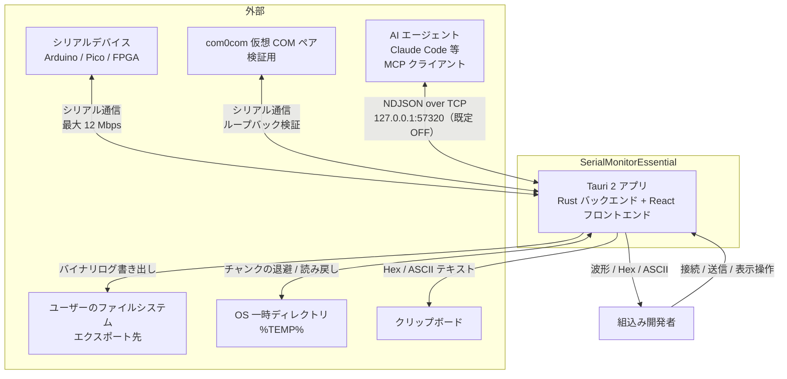

### 外部インターフェース

| 相手 | 方向 | 内容 |
|------|------|------|
| シリアルデバイス | 双方向 | 生バイト列。プロトコルは規定しない |
| OS 一時ディレクトリ | 双方向 | `%TEMP%/SerialMonitorEssential/<PID>/<instance>/data.bin` |
| ファイルシステム | 出力 | エクスポートされたバイナリログ |
| クリップボード | 出力 | Hex 文字列 / ASCII 文字列 |
| AI エージェント（別プロセス） | 双方向 | AI Bridge プロトコル v1（NDJSON / TCP、`127.0.0.1` 限定・既定 OFF）。仕様の正は `src-tauri/src/bridge.rs` のモジュールヘッダ（SYS-F-1101〜1106 / ADR-12） |

---

## 3. コンテナ / コンポーネントビュー

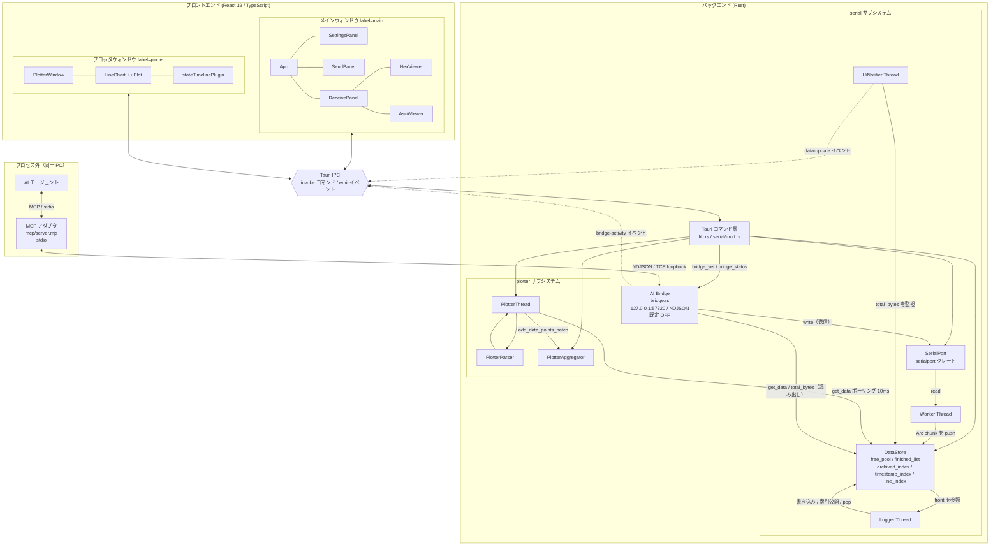

### 3.1 責務表

| ID | コンポーネント | 実装 | 責務 | 責務でないこと |
|----|----------------|------|------|----------------|
| **C-CMD** | Tauri コマンド層 | `src-tauri/src/lib.rs`, `src-tauri/src/serial/mod.rs` | IPC 境界。状態オブジェクトの取得、引数検証、表示用データへの変換 | 長時間ブロックする処理（60 Hz で呼ばれるものは `async`） |
| **C-PORT** | SerialPort | `serial/port.rs` | OS ポートの開閉・読み書き、DTR/RTS、タイムアウト管理 | データの蓄積・解釈 |
| **C-STORE** | DataStore | `serial/data_store.rs` | 受信データの保持（メモリ + ディスク）、索引（時刻・行）、3 スレッドのライフサイクル管理 | データの意味解釈 |
| **C-WORKER** | Worker Thread | `serial/worker_thread.rs` | ポートからの読み出し、チャンクへの詰め込み、64 KB 満杯 or 16 ms でのスワップ、行索引の記録、致命的エラー時の切断通知 | ディスク I/O、UI 通知 |
| **C-LOGGER** | Logger Thread | `serial/logger_thread.rs` | 確定チャンクのディスク退避、`archived_index` の公開、`finished_list` からの除去 | 受信、読み出し |
| **C-NOTIF** | UiNotifier Thread | `serial/ui_notifier.rs` | `total_bytes` の監視と 16 ms 間隔の `data-update` 発火、約 100 ms 間隔の時刻記録 | データ本体の転送 |
| **C-PTHREAD** | PlotterThread | `plotter/thread.rs` | 現行 DataStore の毎ポーリング解決、差し替え検知、新規バイトの読み出し、バッチ内タイムスタンプ分散 | パース規則そのもの、集約アルゴリズム |
| **C-PARSER** | PlotterParser | `plotter/parser.rs` | 行分割、区切り推定、ラベル/ヘッダー解釈、数値/状態の型推論、部分行の持ち越し | 蓄積、間引き |
| **C-AGG** | PlotterAggregator | `plotter/aggregator.rs` | 3 バッファ集約、レベルアップ、絶対時刻整列グリッド、LTTB、uPlot 形式ペイロード生成、バージョンカウンタ | 描画、時間軸の決定 |
| **C-MAIN** | メインウィンドウ | `src/App.tsx` ほか | 接続操作、受信ビューア、送信、Clear / Save / Copy | プロット描画 |
| **C-PLOTW** | プロッタウィンドウ | `src/components/plotter/PlotterWindow.tsx` | 表示状態（LIVE/Inspect/Paused）の管理、更新ループ、凡例 | データの解釈・間引き（ADR-08） |
| **C-CHART** | LineChart / uPlot | `src/components/plotter/LineChart.tsx` | 座標変換と描画、ズーム/パンの入力処理、Y レンジ計算 | データ取得 |
| **C-STL** | State Timeline プラグイン | `src/components/plotter/stateTimelinePlugin.ts` | 状態バーの Canvas 矩形描画、DPI スケーリング | 時間軸の管理（uPlot に委ねる） |
| **C-BRIDGE** | AI Bridge | `src-tauri/src/bridge.rs` | `127.0.0.1` 限定の NDJSON/TCP 待ち受け（既定 OFF）、プロトコル v1 の解釈、キャプチャのオフセット読み出しと push 配信、アプリ経由の送信と `bridge-activity` の emit、接続数制限（4）とトークン検証 | シリアルデータの意味解釈、MCP プロトコル、ポートの所有（`Arc` ハンドル経由で借りるだけ） |
| **C-MCP** | MCP アダプタ（**プロセス外**） | `mcp/server.mjs`（Node.js。アプリのバンドルに含めない） | ブリッジ protocol v1 を MCP の 7 ツール（`serial_status` / `serial_ports` / `serial_read_tail` / `serial_read_range` / `serial_send` / `serial_send_hex` / `serial_wait_for`）へ変換、AI 向けの整形（テキスト/hex 判定、待ち受けポーリング）、未起動時の対処メッセージ | 状態の保持、ポートのオープン、ファイル I/O |

### 3.2 スレッド構成

| スレッド | 生存期間 | 周期 | 生成元 |
|----------|----------|------|--------|
| Worker | DataStore の受信期間 | ポーリング（データなし時 1 ms sleep） | `DataStore::start_reception` |
| Logger | 同上 | 50 ms、または閾値（1 MB / 100 チャンク）到達時 | 同上 |
| UiNotifier | 同上 | 16 ms | 同上 |
| PlotterThread | プロッタウィンドウの生存期間 | 10 ms（ストア不在時 50 ms） | `start_plotter_thread` |
| Bridge listener | ブリッジ有効化 (`bridge_set(true)`) から無効化 / アプリ終了まで | `accept` を 100 ms タイムアウトで回し、停止フラグを確認 | `bridge_set` |
| Bridge connection | 1 接続の生存期間（最大 4 本同時） | 要求駆動。`subscribe` 後は 50 ms 間隔で `total_bytes` を監視して push（1 フレーム最大 256 KiB） | Bridge listener（接続ごとに 1 本） |

---

## 4. データ構造の要点

詳細は [03_data_structures.md](03_data_structures.md)。アーキテクチャ上重要な点のみ。

| 構造 | 役割 | 重要な性質 |
|------|------|-----------|
| `Chunk` (64 KB) | 受信の単位 | 所有権移動のみで受け渡す。データコピーなし |
| `free_pool: SegQueue<Chunk>` | 空きチャンク（初期 100 個 = 6.4 MB） | 枯渇時は新規確保。返却しない（ADR-11） |
| `finished_list: RwLock<VecDeque<Arc<Chunk>>>` | 確定済み・未退避のチャンク | UI が読める。Logger が front から順に退避 |
| `archived_index: RwLock<Vec<PageMetadata>>` | ディスク上のデータ位置 | `global_offset` 昇順。二分探索で検索 |
| `timestamp_index` / `line_index` | 時刻・行の索引 | 単調増加。二分探索 |
| `PlotterAggregator` の 3 バッファ | `history` / `buffer` / `raw_buffer` | mode 非依存（min/max/avg/count を全部持つ） |
| `data_version: u64` | 変更検知 | 軽量ポーリングの根拠（ADR-01） |

---

## 5. 状態機械

本システムの状態は、**独立して遷移する 6 つの状態機械の直積**として理解するのが正しい。
以下、個別に定義したうえで、§5.7 の遷移イベント表と §5.8 の不変条件で結合する。

### 5.1 SM-1: ポート

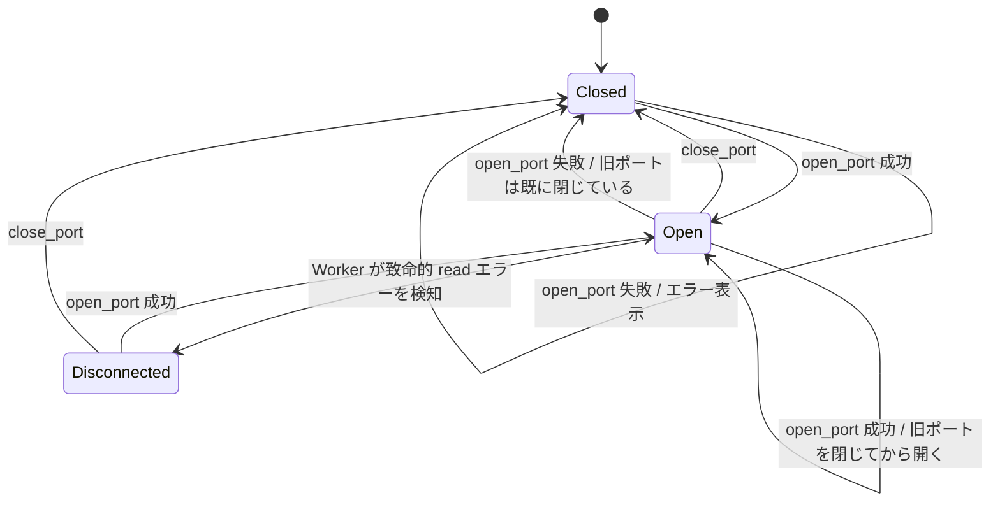

| 状態 | 意味 |
|------|------|
| `Closed` | ポートハンドルなし。送信不可 |
| `Open` | ハンドルあり。Worker が読み出し中 |
| `Disconnected` | フロントエンドは切断表示だが、バックエンドはハンドルを保持している中間状態。**設計上の負債**（§5.9 参照） |

> `open_port` は旧ポートの停止 → 新ポートのオープンの順で行う。オープンに失敗した場合、
> ポートは `Closed` になるが**旧セッションのデータストアは残る**（SYS-F-106）。

### 5.2 SM-2: DataStore（世代）

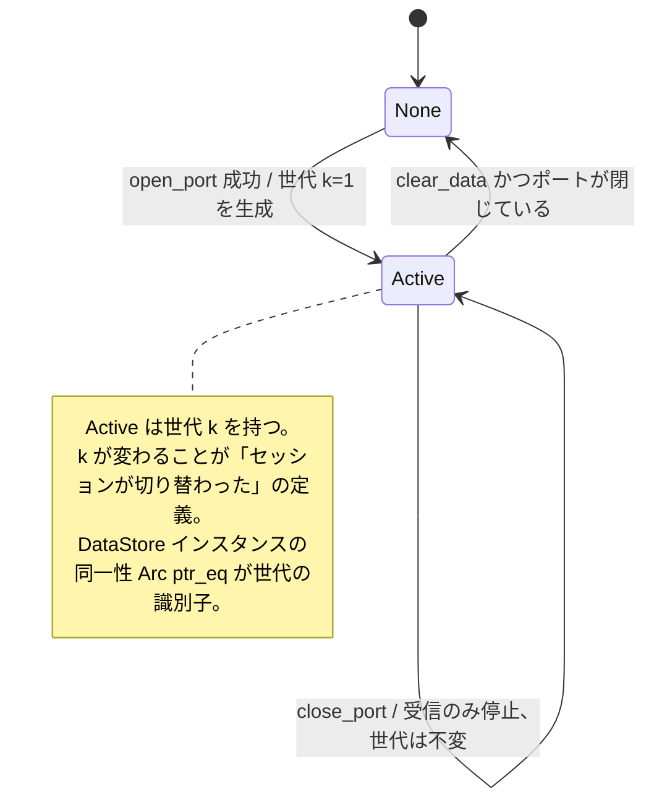

| 状態 | 意味 |
|------|------|
| `None` | 受信データなし。表示 API は空を返す（エラーではない） |
| `Active(k)` | 世代 k のストアが存在する。受信中とは限らない（`close_port` 後も閲覧可能） |

**重要**: 「クリア」は要素の削除ではなく**インスタンスの差し替え**である（ADR-03）。
これにより索引（archived / timestamp / line）の整合性を部分削除で壊す問題が原理的に発生しない。

### 5.3 SM-3: PlotterThread

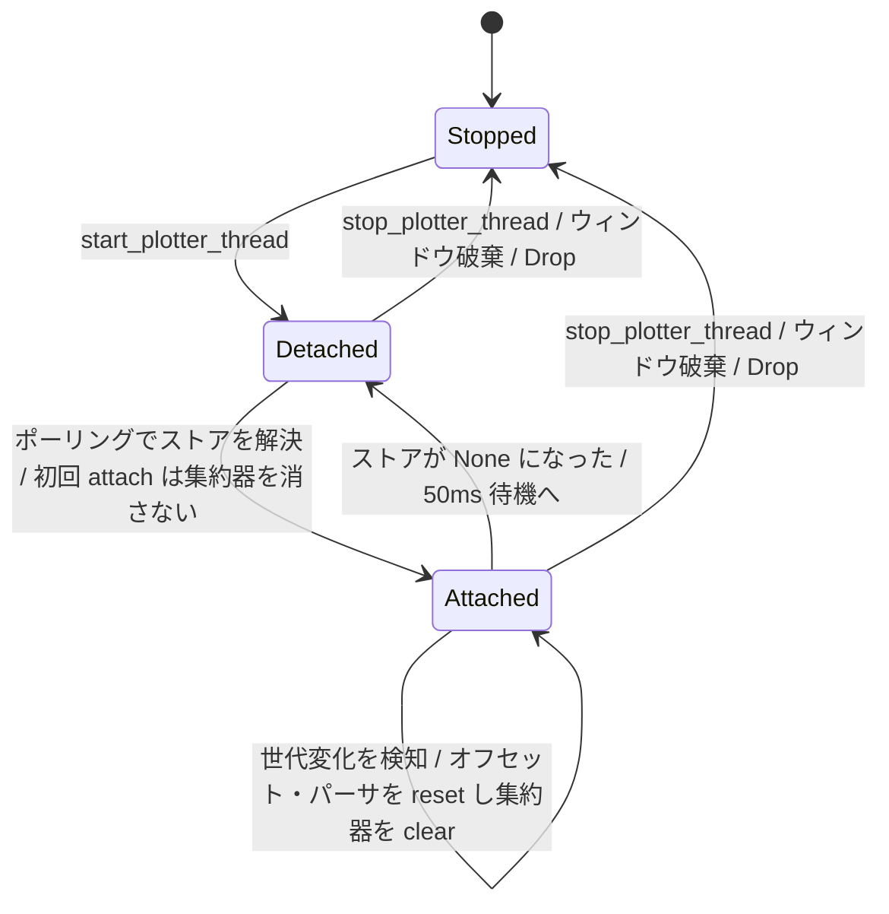

| 状態 | 意味 |
|------|------|
| `Stopped` | スレッドが存在しない |
| `Detached` | 起動しているが接続先ストアがない。50 ms ごとに再解決を試みる |
| `Attached(k)` | 世代 k のストアを読み出し中。10 ms ごとにポーリング |

**初回 attach と世代変化の非対称性**（コード上の重要点）:

- `Detached → Attached`（初回）: 集約器を **clear しない**。
  プロッタウィンドウを先に開いてから接続した場合に、既に溜まったデータを捨てないため。
- `Attached(k) → Attached(k+1)`（差し替え）: 集約器を **clear する**。
  メインビューが空になるのにプロッタだけ旧チャンネルが残る不整合を防ぐため（SYS-F-802）。

### 5.4 SM-4: プロッタウィンドウ

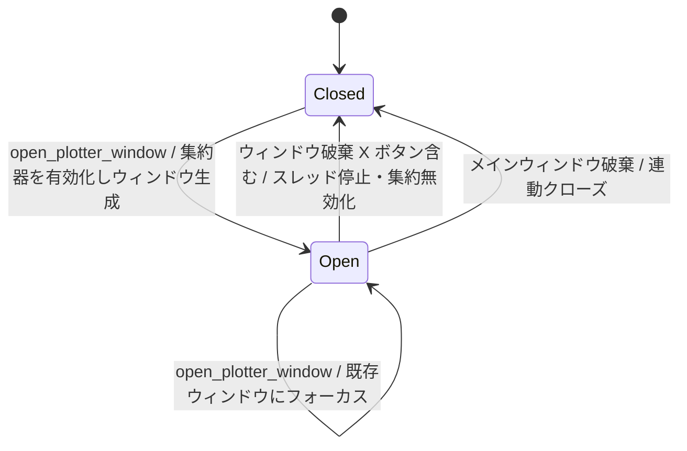

`Open → Closed` はフロントエンドの unmount 処理に依存しない。
バックエンドが `WindowEvent::Destroyed` を受けて確実に後始末する（SYS-F-902 / ADR-10）。

### 5.5 SM-5: プロッタのビュー状態（新仕様）

実装上の内部状態は `isRunning × isFollowing` の直積で、`Paused` は
「LIVE から停止（Paused-from-LIVE）」と「Inspect から停止（Paused-from-Inspect）」の
2 種類がある。フッターのラベルはどちらも `⏸ Paused` だが、
`▶ LIVE` ボタンは `!isFollowing` で表示されるため後者にのみ出る
（`src/test/PlotterViewFsm.test.tsx` の状態分析で確認済み）。

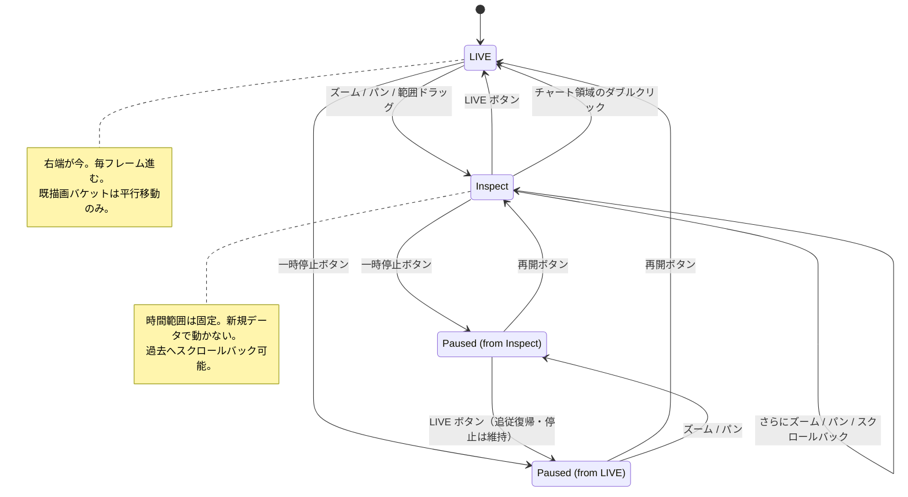

| 状態 | X 軸 | データ取得 | 間引き |
|------|------|-----------|--------|
| `LIVE` | 固定幅ウィンドウ、右端 = 今、毎フレーム前進 | 毎フレーム（version 変化時のみ本体取得） | 絶対時刻整列バケット（1-2-5 量子化） |
| `Inspect` | 利用者が指定した静的範囲 | 範囲変更時のみ | LTTB または Average |
| `Paused`（両種） | 停止時点の範囲 | 停止（Window 幅変更も記録のみで、要求は再開後に反映 = SYS-F-606） | 停止時点の結果を保持 |

### 5.6 SM-6: ビューア表示モード

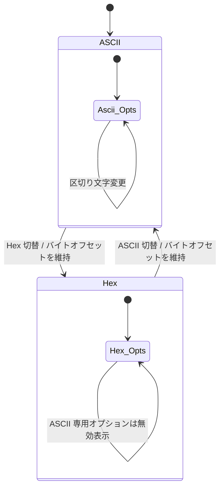

これに直交する軸として **AutoScroll {ON, OFF}** がある（両モードで有効）。
`ON` は下端固定、`OFF` はバイト位置固定。`OFF → ON` は次のデータ到着時に下端へ移動する。

### 5.7 遷移イベント表（横断）

各イベントが 6 つの状態機械へ与える影響。空欄は「変化なし」。

| イベント | SM-1 ポート | SM-2 ストア | SM-3 Pスレッド | SM-4 Pウィンドウ | SM-5 ビュー | SM-6 ビューア |
|----------|-------------|-------------|----------------|------------------|-------------|---------------|
| **Connect** (`open_port` 成功) | →`Open` | →`Active(k+1)` | 次ポーリングで `Attached(k+1)`、集約器 clear | | LIVE を維持 | |
| **Connect 失敗** | →`Closed` | 変化なし（旧世代維持） | 旧世代のまま `Attached(k)` | | | |
| **Disconnect** (`close_port`) | →`Closed` | `Active(k)` 維持、受信停止 | `Attached(k)` 維持（新データが来ないだけ） | | LIVE のまま右端が空白へ | |
| **Reopen**（同一/別ポート再接続） | `Open`→`Open` | →`Active(k+1)` | `Attached(k+1)`、集約器 clear | | | |
| **Clear**（ポート開） | | →`Active(k+1)` | `Attached(k+1)`、集約器 clear | | 表示が空へ | 先頭へ |
| **Clear**（ポート閉） | | →`None` | →`Detached` | | 表示が空へ | 先頭へ |
| **DataArrival** | | 内部データ増加 | 読み出し → パース → 集約、`data_version` 増加 | | LIVE: 右端更新 / Inspect: 変化なし | AutoScroll ON なら下端追従 |
| **PlotterOpen** | | | `Stopped`→`Detached`→`Attached` | →`Open`、集約器を有効化 | →`LIVE` | |
| **PlotterClose**（X 含む） | | | →`Stopped` | →`Closed`、集約器を無効化 | 破棄 | |
| **MainClose** | ハンドル解放 | Drop で temp 削除 | →`Stopped` | →`Closed` | 破棄 | 破棄 |
| **Zoom / Pan** | | | | | `LIVE`→`Inspect` | |
| **LiveResume**（▶LIVE / ダブルクリック） | | | | | `Inspect`→`LIVE` | |
| **Pause / Resume** | | | 変化なし（収集は継続） | | `↔Paused` | |
| **ModeSwitch**（LTTB↔Average） | | | | | 状態不変、次フレームで再描画 | |
| **ViewerToggle**（Hex↔ASCII） | | | | | | 切替、オフセット維持 |
| **DeviceUnplug** | →`Disconnected` | `Active(k)` 維持 | `Attached(k)` 維持 | | 右端が空白へ | |

### 5.8 不変条件

これらは**壊してはいけない性質**である。変更時はここを最初に確認する。

| ID | 不変条件 | 根拠 / 保証手段 |
|----|----------|-----------------|
| **INV-1** | PlotterThread は、DataStore の差し替えを**1 ポーリング周期（10 ms）以内**に検知し、現行世代へ追従する | 起動時の `Arc` を掴まず、毎ポーリングで共有ハンドルから再解決する。`Arc::ptr_eq` で世代を識別（ADR-03） |
| **INV-2** | Clear / 再接続の後、プロッタには**新世代のデータのみ**が含まれる | 世代変化検知時に `aggregator.clear()` + `parser.reset()` + オフセット 0 リセット |
| **INV-3** | 受信済みのバイトは、常に `archived_index` と `finished_list` の**少なくとも一方に存在する** | Logger の順序を「書き込み → 索引公開 → pop」に固定（ADR-05）。逆順だと両方に存在しない瞬間ができる |
| **INV-4** | `total_bytes` は同一世代内で単調非減少である | Worker は push のみ、Logger は index 公開後に pop する |
| **INV-5** | プロッタウィンドウが `Closed` のとき、PlotterThread は `Stopped` かつ集約器は無効である | `WindowEvent::Destroyed` ハンドラで両方を実行（ADR-10） |
| **INV-6** | メインウィンドウの破棄はプロッタウィンドウの破棄を伴い、プロセスは終了する | `WindowEvent::Destroyed` で `plotter.close()` |
| **INV-7** | LIVE 表示において、ウィンドウ内に完全に含まれる集約セルの `(ts, min, max, avg)` は、ウィンドウ位置に依存せず一定である。変化してよいのは右端の未確定セルのみ | 絶対時刻整列グリッド + 1-2-5 量子化（ADR-06）。`test_aligned_buckets_are_stable_across_sliding_windows` で検証 |
| **INV-8** | 任意の集約バケットについて `min ≤ avg ≤ max`。再集約の前後で `count` の総和が保存される | 加重平均でのマージ。`test_aggregate_buckets_preserving_correctness` |
| **INV-9** | 集約器へ入力されるタイムスタンプ列は単調非減少である | 1 バッチ内で `prev = max(candidate, last_batch_ts)` を用いて分散（SYS-F-710） |
| **INV-10** | DataStore インスタンスは一意の一時ディレクトリを持ち、あるインスタンスの Drop が他インスタンスのファイルを削除しない | `%TEMP%/SerialMonitorEssential/<PID>/<instance>/`（ADR-04） |
| **INV-11** | 60 Hz で呼ばれる IPC コマンドは Tauri のメインスレッドをブロックしない | `get_plotter_chart_data` / `check_plotter_version` を `async` で定義 |
| **INV-12** | フロントエンドはシリアルデータの意味解釈（Hex/ASCII 変換、数値パース、間引き）を行わない | すべてバックエンドの責務（ADR-08 / SYS-NF-405） |
| **INV-13** | `get_data` の 2 記憶域は「archived_index が要求範囲の連続プレフィックス、finished_list が残りのサフィックス」の順序契約を持つ（読み手は各記憶域を前方 1 パスしか走査しない）。プロダクションでは logger が finished_list の**先頭から**アーカイブするため常に成立する。契約違反レイアウトの挙動は `test_get_data_ordering_contract_archived_must_precede_finished` が特性として固定済み | `PROP`: `prop_get_data_split_read_consistency` / `UT`: 順序契約テスト |

### 5.9 既知の状態不整合（負債）

| ID | 内容 | 影響 |
|----|------|------|
| ~~**DEBT-1**~~ | ~~Worker が致命的エラーで終了しても `SerialState.port` はハンドルを保持したまま~~ **解消済（2026-09-03）**: フロントエンドが `serial-status(connected=false)` を受けて `close_port` を呼び、SM-1 を `Disconnected` へ揃える（TBD-R4 決定済 / GAP-08） | — |
| ~~**DEBT-2**~~ | ~~ホットプラグの能動検知が未実装~~ **解消済（2026-09-03）**: 2 秒間隔のポート一覧ポーリングを実装（GAP-07）。ただし**切断の権威は read エラー経路のまま**であり、ポーリングは列挙の更新のみを担う | 読み出しが発生しない状況（送信専用など）で切断に気づくまでの遅延は残る。列挙からの消失を切断とみなす設計は、一覧の一時的な欠落で誤って切断する副作用があるため採らなかった |
| **DEBT-3** | 一時停止中の手動スクロールとアンカー再計算が競合し得る（100 ms スロットル分のラグ） | Inspect 実装時に併せて解消予定 |
| **DEBT-4** | ストアの Detach→Attach が PlotterThread の 1 ポーリング（10 ms）以内に起きると、スレッドが中間の None を観測するかどうかで「初回アタッチ（データ保持）」か「世代交代（クリア）」かが変わり、観測的に非決定的。UI 操作では到達不能な速さだが、状態遷移テスト（`state_transition_tests.rs`）のオラクルはこの非決定性を前提に書かれている | 決定的にするなら SharedDataStore に世代カウンタを持たせ、Arc の同一性でなく世代番号で判定する |
| **DEBT-5** | `get_data` は要求範囲の途中に欠落があると読める前半すら返さない（全体 Err）。PlotterThread はこの場合スキップアヘッドで**読めたはずのデータごと**失う。特性化テスト `test_partial_read_when_gap_ahead` が現状挙動として固定済み（望ましい挙動ではないと明記）。プロダクションでは INV-13 により欠落は発生しないため実害は低い | 改善案: `get_data` に「読めた分まで返す」部分読み出しモードを追加し、PlotterThread はページ単位でスキップする |

---

## 6. 主要シーケンス

### 6.1 受信データパス

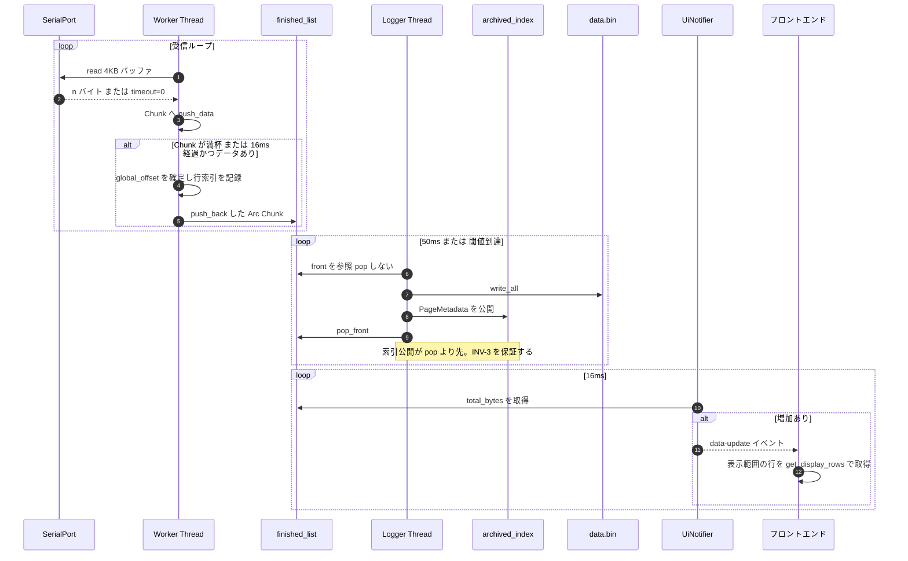

**設計の核心**: UI は Logger のディスク書き込み完了を待たない。
`finished_list` を直接読むため、受信からの表示遅延は最大 16 ms（スワップ間隔）に収まる。

### 6.2 プロッタ取得ループ

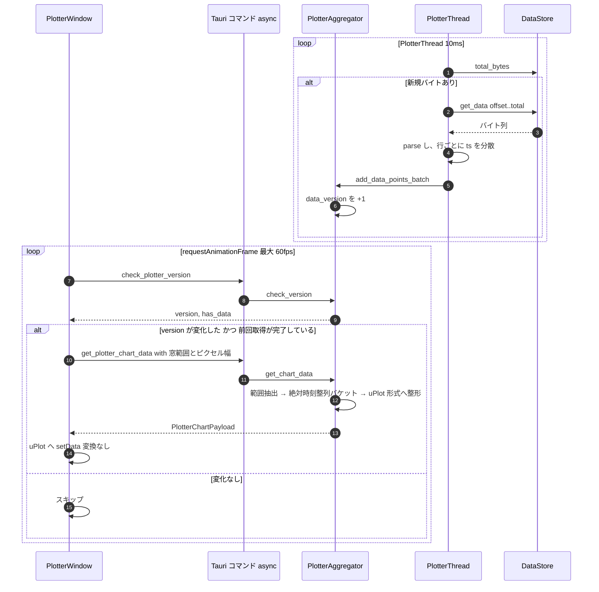

`version` が変化していれば `has_data` が false でも取得する。
そうしないと Clear 後に古いグラフが残る（2026-09-03 修正）。

### 6.3 Clear / 再接続でのストア差し替えとスレッド追従

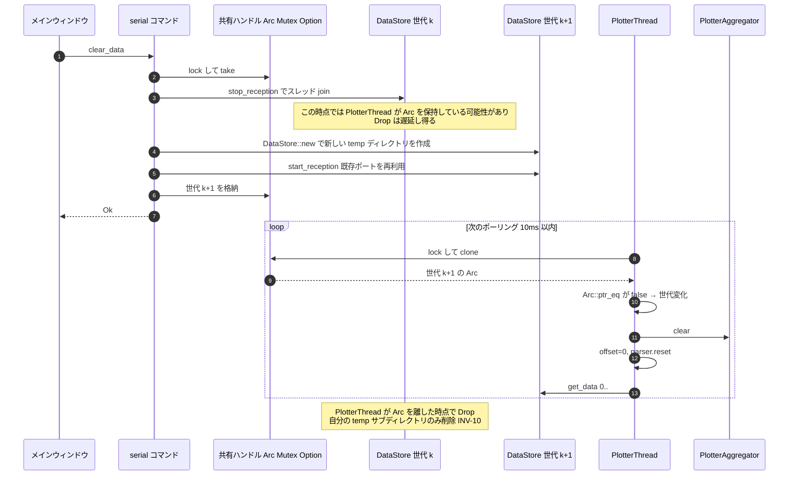

**なぜ順序が重要か**: 旧インスタンスの `Drop` は、PlotterThread が `Arc` を離すまで遅延する。
かつて全 DataStore が同一 temp ディレクトリを共有していたため、この遅延 Drop が
**新インスタンスのライブなデータファイルを削除**していた（2026-09-03 修正 / ADR-04）。

### 6.4 ウィンドウ破棄ハンドリング

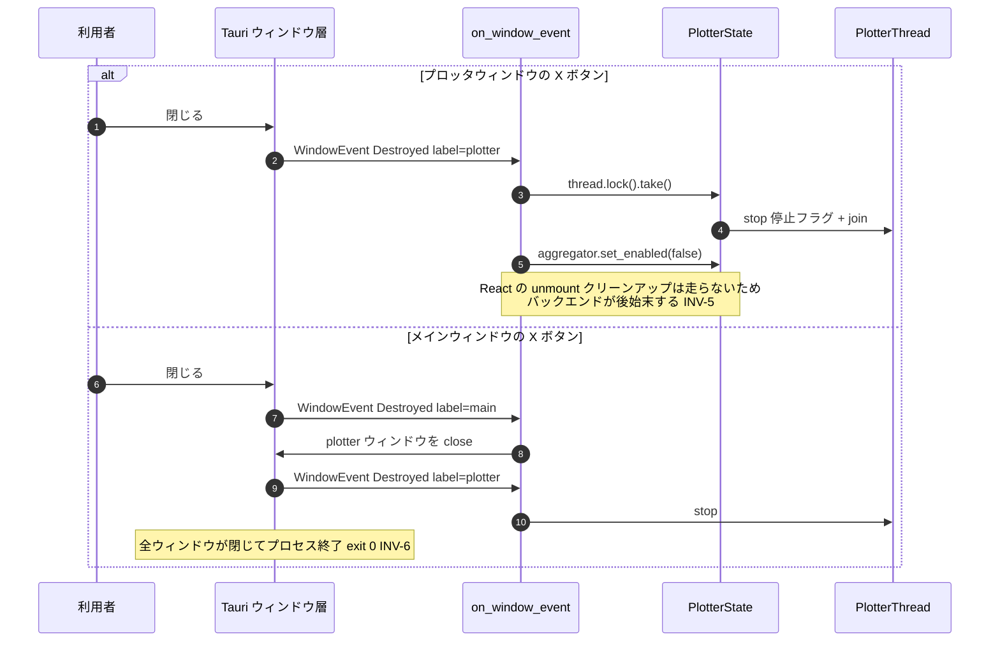

---

## 7. 横断的関心事

| 関心事 | 方針 |
|--------|------|
| **並行性** | 共有状態は `Arc<RwLock<_>>` / `Arc<Mutex<_>>`。ロックの poisoning では panic せず、`unwrap_or` 等で縮退動作する（SYS-NF-201）。ロック保持中に I/O を行わない（Logger の書き込みはチャンクの `Arc` を clone してから） |
| **メモリ** | ゼロコピー。チャンクは所有権移動と `Arc` 共有のみ。UI が参照中のチャンクは `Arc` の参照カウントで保護される（ADR-11） |
| **エラー処理** | 受信は「継続」を最優先。パース失敗・非致命的 I/O エラーはログに記録して次へ進む。致命的エラーのみ状態遷移を起こす |
| **ログ** | `env_logger`。ライフサイクル事象は `info`、異常は `warn`/`error`、高頻度の内部状態は `debug`（SYS-NF-403） |
| **時刻** | プロッタ側は `Instant::elapsed()` によるスレッド起動からの相対 ms（ADR-09）。ビューア側は `chrono` の実時刻（表示用） |
| **IPC 負荷** | 高頻度コマンドは `async`。データ本体はイベントに載せず、コマンドで必要範囲のみ取得 |

---

## 8. アーキテクチャ決定記録 (ADR)

### ADR-01: プロッタ更新をイベント push ではなく version + ポーリングで行う

| 項目 | 内容 |
|------|------|
| **決定** | バックエンドは `data_version: u64` を持ち、フロントエンドは毎フレーム軽量な `check_plotter_version` を呼ぶ。version が変化したフレームだけ `get_plotter_chart_data` で本体を取得する |
| **背景** | 60 Hz で毎フレーム全ペイロード（KB〜）を IPC 転送すると、データレートが低いときも CPU を消費する。一方、Tauri のイベント push は送信側が受信側の処理完了を知らないため、高速データ時にイベントが積み上がる |
| **検討した代替案** | (a) `data-update` と同様のイベント push。(b) Condvar による待機 + ACK バックプレッシャー（[11_refactor_throttled_events.md](11_refactor_throttled_events.md) で検討）。(c) 毎フレーム全取得 |
| **採用理由** | 取得の主導権をフロントエンド（描画側）が持つのが本質。`requestAnimationFrame` と結び付けることで、描画能力を超える取得が原理的に発生しない。バックプレッシャーを追加の機構なしに得られる。version 照会は O(1) で数十バイト |
| **帰結** | データレート < 60 Hz で重い IPC が 70〜80% 削減される。`version` が変化していれば `has_data=false` でも取得する必要がある（Clear 後の残像対策）。イベント駆動化（案 b）は将来の選択肢として残る |

### ADR-02: 3 バッファ + レベルアップ方式で集約する

| 項目 | 内容 |
|------|------|
| **決定** | `raw_buffer`（未集約）→ `buffer`（現レベルで集約済）→ `history`（確定）の 3 段構成。`history + buffer` が `max_points` を超えたら全体を再集約し、集約レベルを 2 倍にする。バケットは min/max/加重平均/count をすべて保持する |
| **背景** | 全生データを保持すればメモリが破綻し、固定間引きをすれば古いデータの解像度が過剰に落ちるか、新しいデータの解像度が足りなくなる。また間引きモード（LTTB / Average）は実行中に切り替えたい |
| **検討した代替案** | (a) 固定長リングバッファに生データ。(b) 表示のたびに全生データから集約。(c) モードごとに別々の蓄積を持つ |
| **採用理由** | レベルアップ方式なら、メモリは上限内に収まりつつ、解像度の低下が時間に対して均一になる。統計量を全部持つことで、モード切替がデータ再構築なしの表示時変換（`to_point(mode)`）で済む |
| **帰結** | 再集約は加重平均で行う必要がある（単純平均では精度が落ちる）。`min ≤ avg ≤ max` と count 保存が不変条件になる（INV-8）。古いデータほど時間解像度が粗い |

### ADR-03: Clear / 再接続はストアの差し替えとし、プロッタは動的に解決する

| 項目 | 内容 |
|------|------|
| **決定** | `clear_data` / `open_port` は `DataStore` を**新しいインスタンスに差し替える**。`SerialState.data_store` は `Arc<Mutex<Option<Arc<DataStore>>>>` として共有し、PlotterThread は毎ポーリングでこのハンドルから現在のストアを解決する。`Arc::ptr_eq` で世代変化を検知する |
| **背景** | 「データを消す」を要素削除として実装すると、`archived_index` / `timestamp_index` / `line_index` / ディスク上のオフセットをすべて整合的に巻き戻す必要があり、状態が増える。一方、PlotterThread が起動時の `Arc<DataStore>` を掴んだままだと、差し替え後に永久に古いストアをポーリングし続ける（実際に「Clear 後にプロットが永久フリーズ」した） |
| **検討した代替案** | (a) DataStore に `clear()` メソッドを持たせ、内部を空にする。(b) 差し替え時にプロッタスレッドを停止・再起動する。(c) 差し替えをイベントでプロッタへ通知する |
| **採用理由** | インスタンス差し替えなら「空の状態」はコンストラクタが 1 か所で保証する。ポーリングでの動的解決は、(b) のような停止/再起動の順序問題（誰が誰を先に止めるか）や、(c) のイベント取りこぼしの問題を持たない。副次的に、**ポートを開く前にプロッタウィンドウを開いても動く**（`Detached` 状態が自然に存在する） |
| **帰結** | 世代変化の検知タイミングが最大 10 ms 遅れる（INV-1 として許容）。旧インスタンスの `Drop` が PlotterThread の `Arc` 解放まで遅延する → ADR-04 が必須になる。初回 attach と世代変化で集約器の扱いを変える非対称性が生まれる（§5.3） |

### ADR-04: 一時ディレクトリを DataStore インスタンス単位にする

| 項目 | 内容 |
|------|------|
| **決定** | 一時領域を `%TEMP%/SerialMonitorEssential/<PID>/<instance>/` とし、`instance` はプロセス内の単調増加カウンタとする。`Drop` は自分のサブディレクトリのみ削除する |
| **背景** | ADR-03 により、同一プロセス内で DataStore が作り直される。旧インスタンスの `Drop` は他スレッドが `Arc` を離すまで遅延するため、**新インスタンスが稼働し始めた後に実行され得る**。全インスタンスが `<PID>` を共有していたため、この遅延 Drop が新インスタンスのライブな `data.bin` を削除していた |
| **検討した代替案** | (a) Drop でファイルを消さず、プロセス終了時にまとめて消す。(b) 参照カウントでディレクトリを保護する。(c) ファイル名にインスタンス番号を付ける（ディレクトリは共有） |
| **採用理由** | ディレクトリ単位で分離するのが最も単純で、削除の粒度と所有権の粒度が一致する。(a) は長時間セッションでディスクを浪費する。(c) はディレクトリ削除の実装を書き換える必要があり、消し忘れが起きやすい |
| **帰結** | PID フォルダの下に階層が 1 段増える。起動時のクリーンアップは PID 単位で行うため変更不要。複数インスタンス起動時の衝突回避（SYS-NF-503）も同時に満たす |

### ADR-05: Logger は「書き込み → 索引公開 → pop」の順序で処理する

| 項目 | 内容 |
|------|------|
| **決定** | チャンク単位で、(1) `finished_list` の front を **clone して参照**（pop しない）、(2) ディスクへ `write_all`、(3) `archived_index` へメタデータを公開、(4) `finished_list` から `pop_front`、の順に行う |
| **背景** | 修正前は「pop → 書き込み → 索引公開」の順だった。この場合、pop から索引公開までの間、そのデータは `finished_list` にも `archived_index` にも存在しない。`get_data` はこの瞬間に失敗し、プロッタの読み出しが止まり、表示が欠落した。さらに I/O エラーが起きると pop 済みチャンクが恒久的に失われた |
| **検討した代替案** | (a) 読み出し側でリトライする。(b) 読み書きを 1 つのロックで直列化する。(c) 書き込み中のチャンクを別の「in-flight」リストに置く |
| **採用理由** | 「データは常にどこかに存在する」という不変条件（INV-3）を、順序だけで保証できる。(a) は症状の緩和にすぎず、(b) は 12 Mbps の受信をディスク I/O で律速する。(c) は状態が 1 つ増える |
| **帰結** | 書き込み中は同じデータがメモリとディスクに二重に存在する（一時的なメモリ増は 1 チャンク分）。部分書き込みが起きた場合は `set_len` でファイルを索引済みオフセットまで巻き戻し、次回リトライでの重複を防ぐ |

### ADR-06: LIVE の間引きを絶対時刻整列バケットで行う（LTTB は静的範囲専用）

| 項目 | 内容 |
|------|------|
| **決定** | LIVE 表示では、セル番号 = `floor(絶対時刻 / 幅)` で定まる**絶対時刻に固定されたグリッド**に集約する。幅は `span / target_points` を 1-2-5 系列へ切り上げ量子化する。LTTB と「ウィンドウ相対バケット」は静的範囲（Inspect / Paused）でのみ使う |
| **背景** | ウィンドウ相対のバケット化（`bucket_idx = (ts - time_min) / width`）も LTTB も、**出力がウィンドウの位置に依存する**。スライディングウィンドウでは位置が毎フレーム変わるため、全バケットが毎フレーム再形成され、波形全体がちらつく。これは可視化意図①（UN-01）に真正面から反する |
| **検討した代替案** | (a) ウィンドウの前進を離散化して、バケット幅の倍数でだけ動かす。(b) フロントエンドで前フレームの結果をキャッシュして差分のみ更新する。(c) 平滑化フィルタで揺れを目立たなくする |
| **採用理由** | Grafana / RRDtool と同じ考え方。グリッドが絶対時刻にのみ依存するため、一度確定したセルは**以後どのフレームでもバイト等価**になる。1-2-5 量子化は、ウィンドウ span の数 ms のゆらぎでグリッド自体が動くのを防ぐ。(a) は X 軸の動きがカクつく。(b) はキャッシュ整合性の問題を持ち込む。(c) は UN-03（スパイクを消さない）に反する |
| **帰結** | LIVE と Inspect で間引きアルゴリズムが異なる（コード上も分岐する）。LIVE では閾値倍率を使わず、点数密度よりグリッドの安定性を優先する。検証は「異なる位置の 2 つのウィンドウで、両方に完全に含まれるセルが一致する」という性質テストで行う（INV-7） |

### ADR-07: スライディングウィンドウの決定をフロントエンド主導にする

| 項目 | 内容 |
|------|------|
| **決定** | ウィンドウの幅・右端位置（= 「今」）はフロントエンドが決め、`time_min_ms` / `time_max_ms` / `pixel_width` として要求に載せる。バックエンドは指定された範囲を集約して返すだけとする |
| **背景** | 現行実装は `time_min_ms = None, time_max_ms = None`（= データ全体）を渡し、バックエンドが範囲を決めていた。この方式では、ウィンドウ幅の変更、Inspect でのスクロールバック、無データ時のウィンドウ前進（SYS-F-503）を表現できない |
| **検討した代替案** | (a) バックエンドがウィンドウ状態（LIVE/Inspect、幅、位置）を保持する。(b) 双方が状態を持ち同期する |
| **採用理由** | ウィンドウは**表示の概念**であり、描画レートとピクセル幅を知っているのはフロントエンドだけである。ズーム/パンの入力も uPlot 側で受ける。状態の持ち主を 1 か所にすることで、(b) の同期ずれ（バックエンドは LIVE のつもり、フロントは Inspect）が原理的に起きない。バックエンドは「範囲 → 集約結果」の純粋な関数に近づき、テストしやすくなる |
| **帰結** | 「今」の時刻基準をフロントエンドが持つ必要がある。現在のバックエンドのタイムスタンプはプロッタスレッド起動からの相対時刻（ADR-09）であり、フロントの実時刻とは基準が違う → **TBD-R3**。無データ時もウィンドウが進む挙動が自然に実現できる（フロントが時刻を進めるだけで、バックエンドは空を返す） |

### ADR-08: uPlot を採用し、uPlot 形式のペイロードをバックエンドで生成する

| 項目 | 内容 |
|------|------|
| **決定** | チャートライブラリは uPlot。バックエンドは `PlotterChartPayload`（`aligned_data`: `[timestamps, ch0, ch1, ...]`、`Option<f64>` → JSON `null`）を直接返し、フロントエンドは変換なしで `setData` に渡す |
| **背景** | 修正前はフロントエンドが `AggregatedPoint[]` を毎フレーム uPlot 形式へ変換していた（`convertAggregatedData` / `buildChartData`）。60 fps で `HashMap` / `Array` / `Set` / `Map` を新規生成しており、**メモリが +13.6 MB/秒** で増加、50 秒で 90 MB → 769 MB に達した |
| **検討した代替案** | (a) フロントエンドでオブジェクトプールを使い配列を再利用する。(b) 変換頻度を落とす（間引く）。(c) 別のチャートライブラリへ移行する |
| **採用理由** | 変換を Rust 側で行えば、そもそも JS ヒープにゴミが生まれない。IPC ペイロードは uPlot 形式でも増えない（むしろ tagged enum より小さい）。(a) は GC 問題の根本解決にならず、uPlot の要求形式との整合維持が複雑。uPlot は大量点の描画性能が突出しており、(c) の理由がない |
| **帰結** | メモリ増加率 0 MB/秒、60 秒時点で約 210 MB 定常（実測）。フロントエンドは「取得して渡す」だけになり、チャンネル非表示は `series.show` で制御する（データのフィルタリングをしない）。バックエンドが uPlot の形式に依存する（uPlot 移行時はバックエンドも変わる） |

### ADR-09: プロッタのタイムスタンプをスレッド相対時刻にする

| 項目 | 内容 |
|------|------|
| **決定** | プロッタのデータ点の時刻は、PlotterThread 起動時からの経過ミリ秒（`Instant::elapsed()`）とする。Unix 時刻は用いない |
| **背景** | シリアルデータ自体には時刻が入っていないことが多い。受信側で時刻を付ける必要があるが、どの時計を使うかで性質が変わる |
| **検討した代替案** | (a) `SystemTime`（Unix 時刻）。(b) デバイスが送る `time` 列を X 軸に使う。(c) 受信バイトオフセットを X 軸に使う |
| **採用理由** | `Instant` は単調増加が保証され、NTP 同期や夏時間で巻き戻らない。時系列が逆行すると uPlot の描画とバケット化が破綻する（INV-9）。(b) はデータ形式への依存が強く、`time` 列がないストリームで使えない。(c) は「秒」の目盛りが作れない |
| **帰結** | フロントエンドで `Date.now()` と比較してはならない（時間基準が違う）。State Timeline の未終了セグメントは、`Date.now()` ではなくペイロードの `end_ms` まで延ばす。ADR-07 で「今」をフロントが決めるとき、この時間基準の橋渡しが必要になる → TBD-R3 |

### ADR-10: ウィンドウの後始末をバックエンドの Destroyed イベントで行う

| 項目 | 内容 |
|------|------|
| **決定** | プロッタスレッドの停止と集約の無効化は、React の `useEffect` クリーンアップではなく、Rust 側の `on_window_event` の `WindowEvent::Destroyed` で行う。メインウィンドウの破棄時にはプロッタウィンドウを明示的に閉じる |
| **背景** | ウィンドウを X ボタンで閉じると Webview ごと破棄されるため、React の unmount クリーンアップ（`stop_plotter_thread`）が実行されない。結果としてスレッドとデータ収集が永久に残った。また、プロッタウィンドウが残っているとメインウィンドウを閉じてもプロセスが終了しなかった |
| **検討した代替案** | (a) `beforeunload` などの Webview 側イベントを使う。(b) close リクエストを横取りして、フロント側の後始末完了を待ってから閉じる。(c) タイムアウトでスレッドを自動停止する |
| **採用理由** | ウィンドウのライフサイクルの真実を持っているのは OS/Tauri 側であり、そこにフックするのが唯一確実。(a) は Webview の破棄経路によっては発火しない。(b) は閉じる操作が遅延し、失敗時にウィンドウが閉じられなくなる |
| **帰結** | フロントエンドのクリーンアップは冗長な二重防御になる（通常の unmount では両方が走るが、`stop` は冪等）。INV-5 / INV-6 が構造的に保証される。E2E では「X 閉じでスレッドが止まる」「メイン閉でプロセスが exit 0」を確認項目にする |

### ADR-11: チャンク方式のバケツリレーとゼロコピー（プールへ返却しない）

| 項目 | 内容 |
|------|------|
| **決定** | 受信は 64 KB の `Chunk` 単位で行い、確定したチャンクは `Arc<Chunk>` として `finished_list` へ移す。Logger は書き込み後に `Arc` を落とすだけで、チャンクを `free_pool` へ返却しない |
| **背景** | 12 Mbps（約 1.5 MB/s）では 16 ms 分が約 24 KB。毎回 `malloc`/`memcpy` すると受信スレッドがブロックされ、OS のバッファが溢れて取りこぼす |
| **検討した代替案** | (a) 単一のリングバッファに直接書く。(b) チャンクをプールへ返却して再利用する。(c) チャンクを Logger へ `mpsc` で送る |
| **採用理由** | チャンク方式なら受信スレッドは所有権を移すだけで、コピーもロック待ちも発生しない。`Arc` にすることで、**UI が読み出し中のチャンクは参照カウントで自動的に保護**される。(b) は「UI が参照中かどうか」を別途追跡する必要があり、`Arc` の利点を捨てる。(a) は UI の読み出しと書き込みの排他が必要。(c) では UI が Logger より先にデータを読めない |
| **帰結** | 定常状態では、Logger が追従している限りメモリ上のチャンクは数 MB で安定する。プールは初期 100 個（6.4 MB）で、枯渇時は新規確保する（ディスク I/O が遅れた分の吸収代）。返却しないため、プールは実質「起動直後の割り当てコストを前倒しする」役割になる |

### ADR-12: AI ポートを「アプリ内マルチプレクサ + 外付け MCP アダプタ」の 2 層にする

| 項目 | 内容 |
|------|------|
| **決定** | 外部 AI エージェントへの窓口を 2 層に分ける。**Layer 1**: アプリ内に `127.0.0.1` 限定の NDJSON/TCP サーバ（`bridge.rs`、既定 OFF、既定ポート 57320、protocol v1）を置き、キャプチャの読み出し（`status` / `tail` / `read_range` / `subscribe`）と、アプリ経由の送信（`send`）、ポート列挙（`ports`）を提供する。**Layer 2**: MCP そのものはアプリに入れず、`mcp/server.mjs` という**別プロセスの stdio アダプタ**が Layer 1 を MCP ツールへ変換する |
| **背景** | COM ポートは OS レベルで排他オープンであり（[20 AS-3](20_user_needs.md)）、アプリが動いている間は AI エージェントが同じポートを開けない。一方 `DataStore` は既に「オフセット指定の読み出し」を提供しており（SYS-F-203）、**読み手が誰であるかに依存しない**。つまり、アプリをマルチプレクサにする材料は揃っていて、足りないのは外部プロセスからの入口だけだった |
| **検討した代替案** | (a) アプリ内に MCP サーバを直接実装する。(b) 受信データを外部から読めるファイルへ tap する。(c) AI 側で第 2 プロセスとしてポートを開かせる。(d) HTTP + SSE や WebSocket にする |
| **採用理由** | (c) は**物理的に不可能**（排他オープン。これが本機能の存在理由そのもの）。(b) は外部ツールが内部のチャンク形式・索引に結合し、内部を変えるたびに壊れる。加えて送信ができない。(a) は Rust 側に MCP SDK 相当の実装と、仕様追従の保守を抱え込む（MCP は動きの速い外部仕様であり、CO-2「1 人で維持できる量」に反する）。(d) は依存（HTTP サーバ・TLS・フレーミング）が NDJSON より重く、得るものが「行を読む」以上にない。**2 層に割ると、変化の速い MCP 仕様は Node の薄いアダプタに閉じ、アプリ本体は「行指向の小さなプロトコル」だけを保守すればよくなる。** アダプタが別プロセスなので、アプリのテストは `AppHandle` なしでプロトコル全体を駆動できる（`bridge.rs` 内 27 テスト、うち実ソケットの結合テストを含む） |
| **帰結** | **セキュリティが本機能の主リスクになる**ため、3 点を構造として固定する: (1) バインドは `Ipv4Addr::LOCALHOST` のみ、(2) 既定 OFF で、設定画面の明示操作以外から起動しない、(3) **送信は必ず `bridge-activity` イベントを emit し、GUI に出す**（人間に見えない送信経路を作らない = UN-24 の条件）。副次的に、`SerialState.port` を `Arc` 化してブリッジと GUI が同じハンドルを共有する必要が生じた。`subscribe` はストア世代の変化を `reset` フレームで外部へ伝える（SM-2 の外部への露出。SYS-F-1106）。MCP アダプタはリリース資産に含めず、リポジトリの `mcp/` から取得する（[25 §5.8](25_release_strategy.md)） |

---

## 9. 品質特性の実現手段（対応表）

| 品質要求 | 実現手段 |
|----------|----------|
| SYS-NF-101（欠落 0） | ADR-11（ゼロコピーのチャンク受信）+ ADR-05（索引公開順序） |
| SYS-NF-102（UI が固まらない） | 受信・ロギング・通知の 3 スレッド分離 + バックエンド駆動ページング（SYS-F-304） |
| SYS-NF-103/104（メモリ定常） | ADR-08（バックエンド変換）+ ADR-11（Arc 解放）+ 集約のレベルアップ（ADR-02） |
| SYS-NF-106（IPC 効率） | ADR-01（version + ポーリング） |
| SYS-NF-205（決定性） | ADR-06（絶対時刻整列グリッド） |
| SYS-NF-203（データ可用性） | ADR-05（書き込み → 索引公開 → pop） |
| SYS-NF-401（試験性） | Rust 側にロジックを集約（ADR-08）することで、テスト可能な純粋関数が増える |

---

## 10. リスクと技術的負債

| ID | 内容 | 影響 | 対応方針 |
|----|------|------|----------|
| RISK-1 | ディスク書き込み速度が受信速度を下回ると `free_pool` が枯渇し、チャンクの新規確保が続いてメモリが増える | 高速受信 + 低速ディスクで破綻 | 初期プールで数十 ms 分を吸収。長期的には受信速度の監視と警告 |
| RISK-2 | LIVE と Inspect で間引きアルゴリズムが異なるため、状態遷移の前後で見た目が変わる | 利用者の混乱 | 遷移時に「同じデータの別表現」であることが分かる程度に留める。TBD-R2 |
| RISK-3 | ADR-07 の時間基準（TBD-R3）が未解決のまま実装が進むと、LIVE ウィンドウが「今」を正しく表現できない | SYS-F-502/503 が満たせない | Inspect 実装前に時間基準を確定する |
| RISK-4 | AI Bridge が有効な間、同一 PC 上の任意のプロセスがループバックに接続してキャプチャを読み、デバイスへ送信できる（トークン未設定時） | ローカルの悪意あるプロセスによる意図しない送信 | 既定 OFF・`127.0.0.1` 限定・送信の GUI 可視化で被害面と気づきやすさを抑える（ADR-12）。トークンの検証は実装済みだが**設定 UI が無い**（TBD-R7）。多ユーザー環境や信頼できないプロセスが同居する PC では有効化しない、を運用上の前提とする |
| DEBT-1〜3 | §5.9 参照 | | |

---

## 関連ドキュメント

- [20_user_needs.md](20_user_needs.md)
- [21_system_requirements.md](21_system_requirements.md)
- [23_traceability.md](23_traceability.md)
- [24_vv_plan.md](24_vv_plan.md)
