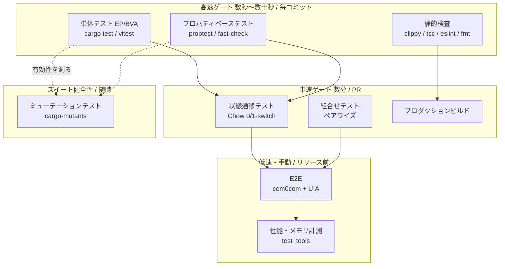

# 検証・妥当性確認計画 (Verification & Validation Plan)

## 目的

[21_system_requirements.md](21_system_requirements.md) の各要求を、**どの技法で、どの合否基準で確認するか**を定める。
[23_traceability.md §4](23_traceability.md#4-gap-一覧) の GAP 一覧が本計画の入力であり、
本計画の実施結果がトレーサビリティ表の検証列を埋めていく。

**Verification（検証）**= 要求どおりに作られているか。**Validation（妥当性確認）**= 作ったものが実際の作業に役立つか。
1人開発では後者を形式的な受入試験にする意味が薄いため、Validation は §8 の実利用シナリオ確認として扱う。

## スコープ

| 含む | 含まない |
|------|----------|
| テスト技法の選定と適用対象、合否基準、実施状況 | 個々のテストケースの本文 |
| 回帰ゲート（CI で必ず通すもの） | パフォーマンスチューニングの手順 |
| テスト環境（com0com、test_tools） | 手動探索テストの手順書 |

## 関連文書

- [05_testing.md](05_testing.md) — 現行のテスト実行コマンド
- [23_traceability.md](23_traceability.md) — GAP 一覧（本計画の入力）
- [22_architecture_description.md](22_architecture_description.md) — 状態機械の定義（状態遷移テストの元）
- `test_tools/README.md` — 実機・仮想 COM の手順

---

## 1. 検証戦略の全体像



### 技法の選定方針

| 対象の性質 | 選ぶ技法 | 理由 |
|-----------|----------|------|
| 入出力が純粋な関数（変換、量子化、集約） | 単体（EP/BVA）+ プロパティ | 境界値でバグが出る。かつ不変量が言語化できる |
| 入力の分割位置が偶然で決まる（パーサ） | プロパティ | 例示テストでは分割パターンを覆いきれない |
| 状態を持つ（ポート、ストア世代、スレッド、ウィンドウ、ビュー） | 状態遷移テスト | 過去の重大バグはすべて状態の組み合わせで発生した |
| 直交する表示オプションが多い | 組合せ（ペアワイズ） | 全組合せは 9,000 通り超。2 因子間の相互作用に絞る |
| 実 OS・実ドライバに依存する | E2E | モックでは再現しない（COM ハンドルの排他、DPI、ウィンドウ破棄） |
| テストスイート自体の品質 | ミューテーション | 「テストが通る」と「テストが守っている」は別 |

---

## 2. 単体テスト（同値分割 / 境界値分析）

### 2.1 対象要求クラス

純粋関数、および単一オブジェクト内で完結するロジック。

| 対象 | 要求 | 現在のテスト |
|------|------|--------------|
| バイト → 表示文字変換 | SYS-F-301, 302 | `test_byte_to_ascii_*`, `test_bytes_to_hex`, `test_bytes_to_ascii` |
| Chunk の充填・境界 | SYS-F-201 | `test_chunk_*`（6 件） |
| 行索引の記録 | SYS-F-208 | `test_record_line_offsets_*`（8 件） |
| 2 記憶域をまたぐ読み出し | SYS-F-203 | `test_get_data_*`（11 件） |
| 時刻索引の二分探索 | SYS-F-207 | `test_get_timestamp_for_offset_*`（4 件） |
| Logger のフラッシュ閾値 | SYS-F-202 | `test_process_buffer_*`（4 件） |
| パース規則 | SYS-F-701〜709 | `test_parse_*`（17 件） |
| 集約・LTTB・ペイロード形式 | SYS-F-511〜516, SYS-NF-601 | aggregator の 36 件 |
| スクロール座標変換 | SYS-F-303, 305 | `src/test/scrollUtils.test.ts` |
| Hex 入力検証・改行付加 | SYS-F-402, 403 | `src/components/SendPanel.test.ts` |

### 2.2 境界値の指針

以下は「必ず境界値ケースを持つ」と定める。

| 対象 | 境界 |
|------|------|
| `get_data(offset, length)` | `length=0` / `offset=total_bytes` / チャンク境界ちょうど / archived と finished の継ぎ目 |
| `quantize_bucket_width_125` | 各 1-2-5 の境界の直前・直後（`0,1,2,3,5,6,10,11,20,21,50,51,...`）。既存テストが 22 ケースで網羅済 |
| `aggregate_buckets_aligned` | セル境界ちょうどの ts / 空データ / 1 点のみ |
| LTTB | `target_points < 3` / `n <= target_points` / 端点保存 |
| スクロールスケーリング | `MAX_SCROLL_HEIGHT` の直下・直上 / `totalBytes=0` |
| ボーレート検証 | `0` / 負 / 小数 / 空文字 / 12_000_000 |

### 2.3 合否基準

- `cargo test --lib` が全件パスすること。
- 新規の純粋関数は、**同値クラス代表値 + 全境界値** のケースを持つこと。
- 失敗テストのスキップ（`#[ignore]`）を残さないこと。

### 2.4 実施状況

**実施済み**。Rust の例示テスト 118 件 + プロパティテスト 8 件 = `cargo test --lib` で 126 passed、vitest 93 passed。
ただし GAP-13（ポート設定検証）、GAP-18（export / clipboard）、GAP-22（Y レンジ計算）は未カバー。

---

## 3. プロパティベーステスト

### 3.1 位置づけ

「特定の入力でこうなる」ではなく「**どんな入力でもこの性質が保たれる**」を検査する。
本システムでは、入力の切れ目（読み出し境界）と時間の進み方が**利用者から見て偶然の値**であるため、
例示テストでは網羅できない領域がある。

### 3.2 導入するツール

| 層 | ツール | 状態 | 備考 |
|----|--------|------|------|
| Rust | `proptest = "1"` | **導入済**（`src-tauri/Cargo.toml` の `[dev-dependencies]`） | シュリンク（最小反例への縮小）が強力。失敗時に原因が読める |
| TypeScript | `fast-check` | 未導入 | まずは Rust 側を優先。フロントの純粋ロジックは少ない |

### 3.3 検査するプロパティ

#### P-1: パーサのチャンク分割不変性 （SYS-NF-603）— **実装済: `prop_chunking_invariance`**

> 任意のバイト列 `B` を、任意の位置で任意個に分割して順に `parse()` へ与えたとき、
> 得られるデータ点列は、`B` を一括で与えたときと**同一**である。

- 生成戦略: 行指向のテキスト（CSV / ラベル付き / 状態値 / 不正行 / 空行の混合）を生成し、
  分割位置を `0..len` からランダムに選ぶ。**UTF-8 マルチバイト文字の途中・CRLF の途中で分割するケースを必ず含める**。
- 根拠: 2026-09-03 に「読み取り境界での UTF-8 分割破損」が実在した。
- 実装: `plotter/parser.rs` の `prop_chunking_invariance`（256 ケース）。
  併せて `prop_parser_never_panics_on_arbitrary_bytes`（任意バイト列での panic 耐性と構造整合）と
  `prop_numeric_roundtrip`（数値のビット単位往復）が実装されている。
  なお非 UTF-8 入力については、`from_utf8_lossy` の U+FFFD 生成数が分割位置に依存し得るため、
  分割不変性の比較対象から意図的に除外されている（影響は `State` テキストのみで、数値解釈には及ばない）。

#### P-2: パーサの単調性・非増殖 （SYS-NF-602）— **未実装**

> 出力されるデータ点の `timestamp_ms` は単調非減少であり、
> 出力の点数は入力に含まれる完全な行の数を超えない。

集約器側の `prop_timestamps_sorted` が出力側の単調性を担保しているため優先度は低い。

#### P-3: 集約バケットの統計不変量 （SYS-NF-601 / INV-8）— **実装済: `prop_invariant_min_le_avg_le_max`**

> 任意のバケットについて `min ≤ avg ≤ max`。
> 再集約（レベルアップ）の前後で、`count` の総和と、全体の `min` / `max` が保存される。

- 反例が出やすい箇所: 加重平均の実装、空バケットの扱い、`f64::INFINITY` 初期値の残留。
- 実装: `prop_invariant_min_le_avg_le_max`（`min ≤ avg ≤ max` と ts のレンジ内収束）、
  および `prop_minmax_envelope_preserved`（**極値の完全一致**。誤差許容を設けていない点が要）。

#### P-4: 点数保存 （SYS-NF-601）— **実装済: `prop_count_conservation` + `test_count_conservation_across_level_ups`**

> 集約前後で、表現している生データ点の総数（`count` の総和）が変化しない。

`count` は現状 `AggregatedPoint` に載らないため、内部 API での検証が必要。
例示テスト `test_level_up_preserves_data_range` が範囲の保存のみを見ている。

#### P-5: 整列バケットの安定性 （INV-7 / SYS-NF-205）— **実装済: `prop_aligned_realtime_stability`**

> 幅 `w` の任意の 2 つのウィンドウ `W1`, `W2` について、
> **両方に完全に含まれるセル**の `(ts, min, max, avg)` は一致する。

- 例示テスト `test_aligned_buckets_are_stable_across_sliding_windows` が 1 組の固定ウィンドウで
  確認していたものを、ずらし量・データ密度・span・ピクセル幅・値分布を生成してプロパティ化済み。
- 除外条件（意図的）: 片方のウィンドウだけが集約閾値を超える場合は、整列グリッドと素通しの
  2 表現が混在するため比較対象から外している。境界セル（先頭・末尾）もクリップされ得るため除外。

#### P-6: 量子化の性質 （SYS-F-512）— **未実装（例示テストで代替中）**

> `quantize_bucket_width_125(x) >= max(x, 1)` かつ、出力は必ず 1-2-5 系列であり、
> `x <= y` ならば `q(x) <= q(y)`（単調性）。

`test_quantize_bucket_width_125` が 22 の境界ケースを網羅しており、優先度は低い。

#### P-7: バッチ等価性 （SYS-NF-604）— **実装済（弱化あり）: `prop_batch_equivalence`**

> N 点を 1 回のバッチで投入した結果と、1 点ずつ N 回投入した結果が一致する。

- 実装で判明した本質的差異: `add_data_point` は毎点 `maybe_aggregate` を呼ぶが、
  バッチは末尾で 1 回だけ呼ぶ。level-up が起きない領域では表示出力は完全一致
  （プロパティは aligned_data / channel_names / band_data の完全等価を検査）。
  level-up が起きる領域では刻みの違いからバケット境界が正当に異なるため、
  「チャンネル集合・x レンジ・表現点数の保存・min/max 包絡の完全一致」という
  最強の真である性質に弱化して検査する（テスト内コメントに機構を記載）。

#### P-8: 読み出しの一貫性 （SYS-F-203）— **実装済: `prop_get_data_split_read_consistency`**

> 任意の `(offset, length)` について、`get_data` の結果は、
> 同じ範囲を複数回に分けて読んで連結したものと一致する。

128 ケースの生成レイアウト（archived への実ファイル退避＋junk オフセット、finished との混成）で
全読み・分割読み・任意窓・範囲外 Err・length=0 を検査。実装の副産物として
**順序契約 INV-13**（archived は要求範囲の連続プレフィックス）を発見し docs/22 に昇格、
契約違反レイアウトの挙動は特性化テストで固定した。

#### P-9: バージョン単調性 （SYS-NF-106）— **実装済: `prop_version_monotonic`**

> `clear` を含む任意の操作列に対して、`check_version().version` は後退しない。

フロントエンドは version の変化のみを再取得の契機にしているため、
後退（特に `clear` でのリセット）は「古いデータに取り残される」形で表面化する。

### 3.4 合否基準

- 各プロパティについて、反例が出ないこと。実行ケース数は
  パーサ 256（`ProptestConfig { cases: 256 }`）、集約器 128（同 128）。
- 反例が見つかった場合は、**シュリンク後の最小反例を通常の `#[test]` として固定**してから修正すること
  （プロパティテストは回帰テストの代わりにはならない）。

### 3.5 実施状況

**部分実施済**。`proptest` を導入し、8 件が実装・パス済み。

| プロパティ | 実装 | 状態 |
|-----------|------|------|
| P-1 チャンク分割不変性 | `prop_chunking_invariance`, `prop_parser_never_panics_on_arbitrary_bytes`, `prop_numeric_roundtrip` | **実装済** |
| P-3 統計不変量 | `prop_invariant_min_le_avg_le_max`, `prop_minmax_envelope_preserved` | **実装済** |
| P-5 整列バケットの安定性 | `prop_aligned_realtime_stability` | **実装済** |
| P-7 バッチ等価性 | `prop_batch_equivalence` | **実装済**（level-up 領域は弱化、機構文書化） |
| P-8 読み出し一貫性 | `prop_get_data_split_read_consistency` | **実装済**（INV-13 を発見） |
| P-9 バージョン単調性 | `prop_version_monotonic` | **実装済** |
| P-2 パーサの単調性 | — | 未実装（低優先。集約器側で担保） |
| P-4 点数保存 | `prop_count_conservation`, `test_count_conservation_across_level_ups` | **実装済** |
| P-6 量子化の性質 | — | 未実装（例示テスト 22 ケースで代替） |
| P-7 バッチ等価性 | — | **未実装**（GAP-12 残件） |
| P-8 読み出しの一貫性 | — | **未実装**（GAP-12 残件、最優先） |

残りの着手順: P-8 → P-7 → P-4 → P-6/P-2。

---

## 4. 状態遷移テスト

### 4.1 位置づけ

[22_architecture_description.md §5](22_architecture_description.md#5-状態機械) で定義した状態機械に対し、
**Chow の W 法に基づく switch カバレッジ**を適用する。

| カバレッジ | 意味 | 本計画での扱い |
|-----------|------|----------------|
| **0-switch**（遷移網羅） | すべての遷移を最低 1 回実行する | **必須** |
| **1-switch**（遷移対網羅） | 連続する 2 遷移のすべての組を実行する | **主要な状態機械で必須** |
| 2-switch 以上 | 3 連続以上 | 実施しない（費用対効果が合わない） |

2026-09-03 の重大バグは、いずれも **1-switch でしか現れない**ものだった:

- `PlotterOpen` → `Connect`（プロッタを先に開いてから接続すると動かない）
- `Connect` → `Clear`（Clear 後に永久フリーズ）
- `Connect` → `Reopen`（再接続後に永久フリーズ）
- `PlotterOpen` → `PlotterClose(X)`（スレッド残留）

つまり、**0-switch だけでは今回の不具合は 1 つも見つからなかった**。1-switch を必須とする根拠。

### 4.2 対象と規模

| 機械 | 状態数 | 遷移数 | 0-switch | 1-switch（概算） | 実施層 |
|------|--------|--------|----------|------------------|--------|
| SM-1 ポート | 3 | 8 | 8 | 約 20 | 統合（Tauri コマンド層） |
| SM-2 ストア世代 | 2 | 6 | 6 | 約 14 | 統合 |
| **SM-2 × SM-3**（ストア × プロッタスレッド） | 2×3 | — | — | **最重点** | Rust 統合テスト |
| SM-3 PlotterThread | 3 | 8 | 8 | 約 18 | Rust 単体（既存 `test_thread_survives_store_swap` が 1 遷移対を覆う） |
| SM-4 プロッタウィンドウ | 2 | 4 | 4 | 8 | E2E |
| SM-5 ビュー状態 | 3 | 9 | 9 | 約 24 | vitest（コンポーネント）+ E2E |
| SM-6 ビューア | 2（+直交オプション） | 4 | 4 | 8 | vitest |

### 4.3 重点シナリオ（SM-2 × SM-3 の 1-switch）

複合状態での遷移対のうち、**不変条件 INV-1 / INV-2 を直接検査するもの**を必須ケースとする。

| # | 遷移対 | 期待 |
|---|--------|------|
| S-1 | `PlotterOpen` → `Connect` | スレッドが `Detached` から `Attached(1)` になり、集約器は clear されない |
| S-2 | `Connect` → `PlotterOpen` | `Attached(1)`。既存データが取り込まれる |
| S-3 | `Connect` → `Clear` | `Attached(2)`、集約器 clear、10 ms 以内に追従（INV-1, INV-2） |
| S-4 | `Connect` → `Reopen` | `Attached(2)`、集約器 clear |
| S-5 | `Clear` → `Clear` | `Attached(3)`。連続 clear で停止しない |
| S-6 | `Disconnect` → `Clear` | `Detached`。ストアが `None` になっても停止しない |
| S-7 | `Disconnect` → `Connect` | `Attached(k+1)` |
| S-8 | `Clear` → `Connect` | `Attached(k+1)` |
| S-9 | `Connect` → `PlotterClose` | `Stopped`、収集無効（INV-5） |
| S-10 | `PlotterClose` → `PlotterOpen` | 再度 `Attached`。ウィンドウ再オープンで復帰 |
| S-11 | `MainClose`（プロッタ開状態） | 両ウィンドウ破棄、プロセス exit 0（INV-6） |
| S-12 | 旧世代 Drop → 新世代 `get_data` | 新世代の temp ファイルが削除されていない（INV-10） |

### 4.4 実装方式

- **Rust 統合テスト**: `SerialState` / `PlotterState` 相当（共有ストアハンドル + 集約器 + スレッド）を直接構築し、
  コマンド関数相当のロジックを順に呼ぶ。実ポートは使わず、`DataStore` へ直接データを注入する。
  → GAP-14 / GAP-11 の主要部分を埋める。
  **実装場所は `src-tauri/tests/` ではなく `src-tauri/src/state_transition_tests.rs`**（`#[cfg(test)] mod`）。
  データ注入に使う `DataStore::push_test_data` が `#[cfg(test)]` でクレート外からは見えないため。
- **vitest**: SM-5 / SM-6 を、コンポーネントの状態遷移として検査する。
- **E2E**: SM-4 と、実 OS が絡む S-9〜S-12。

### 4.5 合否基準

- 対象 6 機械について **0-switch 100%**。
- SM-2 × SM-3、SM-5 について **1-switch 100%**（到達不能な組は理由を明記して除外する）。
- 各遷移後に、その複合状態で成立すべき**不変条件（INV-1〜INV-12）をアサートする**こと。
  「例外が出ない」だけでは合格としない。

### 4.6 実施状況

**0-switch / 1-switch とも実施済（2026-09-03）**。GAP-11 は解消、残るのは GAP-14（Tauri コマンド層）。

| 層 | 成果物 | 内容 |
|----|--------|------|
| バックエンド（SM-2 × SM-3 × 集約有効） | `src-tauri/src/state_transition_tests.rs::zero_switch_all_events` | 7 イベント（AttachStore / SwapStore / DetachStore / StartPlotter / StopPlotter / Data / Clear）を live 状態から一巡。各イベント後に不変条件を判定 |
| 同上 | `src-tauri/src/state_transition_tests.rs::one_switch_all_event_pairs` | 全 **49 順序対**。対ごとに正準前置状態から実行し、最後に「復帰プローブ」（再接続 + 再開始 + データが再び流れる）で wedge していないことを確認 |
| フロント（SM-5 ビュー状態） | `src/test/PlotterViewFsm.test.tsx` | `isRunning × isFollowing` の到達 4 状態（LIVE / Inspect / Paused-from-LIVE / Paused-from-Inspect）に対する 0-switch 走査と、7 イベントの全 **49 順序対**。判定はフッター表示・▶LIVE ボタンの有無・要求の形（`is_realtime` と窓幅） |

判定（オラクル）は「例外が出ない」ではなく、各イベント後に次を検査している:
version 単調性（SYS-NF-106）、INV-5（スレッド Running ⟺ 集約有効）、
INV-follow（追従条件下でその行が必ず届く）、INV-halt（停止・未接続下で届かない）、
INV-2（世代差し替えで旧世代が消える）、S-2（既存バックログの再生）。

> 実行時間: 1-switch 49 対で約 3〜9 秒（同時実行の負荷による）、0-switch は約 0.3〜0.5 秒。

---

## 5. 組合せテスト（ペアワイズ）

### 5.1 位置づけ

表示に関わる設定は互いに直交しており、全組合せは現実的でない。
一方、実際の不具合は「Hex モード × Timestamp ON」「Paused × モード切替」のような
**2 因子の相互作用**で起きている。よって **2-way（ペアワイズ）** を採用する。

### 5.2 因子と水準

| 因子 | 水準 | 数 |
|------|------|---|
| ビューアモード | Hex / ASCII | 2 |
| Line Wrap | ON / OFF | 2 |
| Timestamp | ON / OFF | 2 |
| Timestamp 区切り | Space / Comma / Tab | 3 |
| Auto Scroll | ON / OFF | 2 |
| プロッタビュー状態 | LIVE / Inspect / Paused | 3 |
| 間引きモード | LTTB / Average | 2 |
| LIVE ウィンドウ幅 | 1 / 2 / 5 / 10 / 30 / 60 / 120 / 300 秒 | 8 |
| ストリーム | 受信中 / 停止中 | 2 |
| チャンネル表示 | 全表示 / 一部非表示 | 2 |

全組合せ = **9,216 通り**。ペアワイズなら **概ね 40〜60 ケース**に収まる。

### 5.3 制約（無効な組合せ）

| 制約 | 内容 |
|------|------|
| C-1 | `ビューアモード = Hex` のとき、Line Wrap / Timestamp / 区切りは無効（disabled）。この場合は水準を固定して 1 ケースにまとめる |
| C-2 | `Timestamp = OFF` のとき、区切りは無効 |
| C-3 | `プロッタビュー状態 = Inspect` のとき、LIVE ウィンドウ幅は表示範囲に影響しない |
| C-4 | `ストリーム = 停止中` かつ `プロッタビュー状態 = LIVE` は有効（右端が空白になる挙動の確認対象。SYS-F-503） |

### 5.4 ツール

- 生成器は自前のグリーディ法 `test_tools/e2e/pairwise_gen.py`（決定的・依存なし・被覆自己検証付き）。
  PICT（Microsoft）は因子を拡張して制約付き生成が必要になった段階で導入してよい。
- 生成結果は `pairwise_run.ps1` の `$rows` に反映してコミットする
  （再生成のたびにケースが変わると回帰が追えないため）。

### 5.5 合否基準

- 生成された全ケースについて、UI がクラッシュせず、各因子の設定が表示に正しく反映されること。
- 特に **C-4 のケース（受信停止中の LIVE）** で、ウィンドウが進み右端に空白が生じること（SYS-F-503）。

### 5.6 実施状況

**第 1 ラウンド実施済（2026-09-03）**: §5.2 のうち 2 水準の 8 因子
（接続 / ビューアモード / Line Wrap / Timestamp / Auto Scroll / プロッタ開閉 /
間引きモード / LIVE・Paused）を対象に、全 112 ペアを 7 行に圧縮した被覆配列を
`pairwise_run.ps1` で実行し **7/7 行 PASS**（オラクル: プロセス生存・ログ無パニック・
ウィンドウ状態・フッターステータス）。
**第 2 ラウンド実施済（2026-09-03）**: §5.2 のフルモデル 12 因子
（第 1 ラウンドの 8 因子 ＋ ストリーム on/off / Timestamp 区切り 3 水準 /
ビュー状態 LIVE・Inspect・Paused / ウィンドウ幅 1s・10s・300s（8 水準から
EP で min・default・max に縮約）/ チャンネル非表示）。
`pairwise_gen2.py` で **333 ペアを 14 行**に圧縮し `pairwise_run2.ps1` で実行、
**製品としては 14/14 相当で PASS**（初回実行は 13/14。Row 4 の Inspect 遷移失敗は
SetForegroundWindow が効かずホイールが別窓に飛んだ自動化フレークで、
前面化検証つき単独再現では PASS。ランナーの Activate に検証リトライを追加済み）。

既知の限界（定量化済み）: 333 ペア中 **112 ペアは不活性文脈でのみ被覆**
（例: Hex モード行に載った区切り文字ペア、プロッタ閉の行に載ったビュー状態ペア。
`pairwise_gen2.py` が算出・出力する）。これらの実効被覆には
**制約付き被覆配列（PICT の IF-THEN 制約）**が必要で、次の拡張として残す。

---

## 6. E2E テスト

### 6.1 環境

| 項目 | 内容 |
|------|------|
| 仮想 COM ペア | com0com（COM15 ⇔ COM16）。実機不要で双方向を再現できる。**セットアップ手順（インストール・ペア作成・確認・仮想ペアの制約）は [`test_tools/e2e/README.md`](../test_tools/e2e/README.md) が正** |
| 実機 | Raspberry Pi Pico（`test_tools/pico_serial_tx_test`）、Arduino 系 |
| 送信スクリプト | `test_tools/serial_test.py`（各種フォーマットの生成） |
| 受信検証 | `test_tools/verify_received_data.py`（欠落・順序の検査） |
| メモリ計測 | `test_tools/monitor_memory.py`, `test_tools/analyze_memory.py` |
| UI 自動操作 | Windows UI Automation (UIA) + スクリーンショット検証 |
| AI Bridge E2E | `test_tools/e2e/run_bridge_e2e.ps1`（一括: 起動→UIA 設定→`pong_bot.py`→`mcp_bridge_live.py`）。GUI 不要の `mcp_stdio_smoke.py` は **CI（Tier 1、両 OS）でも実行** |

#### 6.1.1 ハーネスの言語方針（2026-09-04 決定）

外部テストハーネスが Python + PowerShell であるのは歴史的偶然ではなく、**方針として固定する**。

| 層 | 言語 | 理由 |
|----|------|------|
| ホワイトボックス（単体・プロパティ・状態遷移・ミューテーション） | **製品と同言語**（Rust in-crate / TS in vitest） | 内部構造への到達性。private な純関数・不変条件を直接検証する |
| ブラックボックス（実 OS シリアルスタック越しの E2E、検証オラクル） | **Python**（pyserial / hashlib / stdlib） | **実装の独立性（多様性）**。下記参照 |
| OS 自動化（UIA、プロセス・ウィンドウ制御） | **PowerShell** | Windows ネイティブの UIA / Win32 API に最短距離 |

**独立性の原理**: 被試験体は Rust の `serialport` / `sha2` / `serde_json` スタックで
できている。ハーネスが同じクレート群を使うと、**共通のバグが自己整合して見えなくなる**
（例: `serialport` の列挙・タイミングのバグはアプリとテストの双方に同じ形で現れ、
突き合わせでは検出できない）。pyserial は完全に別実装の COM/CDC 経路、
hashlib(OpenSSL) は別実装の SHA-256 であり、一致はクロス実装の証拠になる。
これは検証ツールの独立性という V&V の一般原則の適用である。

副次的な利点: CI ランナー・開発機に Python は既在（`mcp_stdio_smoke.py` は stdlib のみ）、
コンパイル不要で探索的テストの回転が速い、ハーネスは I/O バウンドで言語性能が効かない
（pyserial は T2-5 実績で実効 ~2Mbps の USB-CDC 受信を 60 秒・15.4MB 取りこぼしゼロで処理）。

**帰結**: 「リポジトリを Rust に統一する」ためにハーネスを Rust 化する提案は、
独立性を壊すため**採らない**。再考するのはハーネス側の性能限界（受信取りこぼし）が
実測された場合のみ。なお Pico ファームウェア（`pico_serial_tx_test`）は被試験体側の
治具であってオラクルではないため、この原則の対象外（2026-09-04 に組み込み Rust 化済み。
検証オラクルはあくまで Python 側にある）。

### 6.2 実施済みのシナリオ（2026-09-03）

[07_plotter_spec.md 検証節](07_plotter_spec.md#検証)より。**これらは今後の回帰の基準線**である。

| # | シナリオ | 確認内容 |
|---|----------|----------|
| E-1 | ラベル付きデータ `time:x,sin:x,cos:x,random:x,motor:ON,pump:OFF` | ライン 4ch + state 2ch の同時描画 |
| E-2 | 状態のみのストリーム | State Timeline が描画される（旧: No data yet のまま） |
| E-3 | Clear 後の継続 | プロットがリセットされ、更新が継続する（旧: 永久フリーズ） |
| E-4 | 切断 → 再接続 | 同上 |
| E-5 | プロッタを先に開いてから接続 | データが流れる（旧: 動かない） |
| E-6 | プロッタウィンドウの X 閉じ | スレッド停止・収集停止をログで確認 |
| E-7 | temp ディレクトリ | `<pid>/<n>` 単位で安全に削除される |
| E-8 | 間引きモード切替（受信中・停止中） | LTTB ↔ Average、Average の min/max バンド描画 |
| E-9 | Pause ↔ Resume、凡例クリック | Y 軸の再スケール |
| E-10 | Hex ↔ ASCII、Line Wrap / Timestamp / Auto Scroll / DTR / RTS | 各トグルの反映 |
| E-11 | 複合連続操作 | Clear×3 + Pause/Resume + モード切替×2 + 切断/再接続の連打後に正常回復 |
| E-12 | メインウィンドウ閉 | プロッタ連動クローズ、プロセス exit 0、vite ポート 1420 解放 |

### 6.3 追加すべきシナリオ（LIVE 表示リワーク後）

| # | シナリオ | 対応要求 |
|---|----------|----------|
| E-13 | ウィンドウ幅を 1/2/5/10/30/60/120/300 秒に切り替える | SYS-F-501 |
| E-14 | 受信を止めた状態で 30 秒放置し、右端に空白が伸びることをスクリーンショットで確認 | SYS-F-503, UN-02 |
| E-15 | 連続する 2 フレームのスクリーンショットを比較し、右端以外のピクセルが一致することを確認 | SYS-F-504, INV-7 |
| E-16 | LIVE 中にホイールズーム → Inspect へ自動遷移し、フッター表示が変わることを確認 | SYS-F-602, 607 |
| E-17 | Inspect で過去へスクロールバックし、新規データで表示範囲が動かないことを確認 | SYS-F-603, 604 |
| E-18 | ▶LIVE ボタンとダブルクリックの両方で LIVE へ戻る | SYS-F-605 |
| E-19 | レンジ外へ飛ぶ値を注入し、Y 軸が即座に拡大することを確認。その後 3 秒以上経ってから縮小することを確認 | SYS-F-521, 522 |
| E-20 | 125% / 150% DPI での State Timeline 描画 | SYS-NF-304 |
| E-21 | **AI Bridge 実往復**（`run_bridge_e2e.ps1` で自動化済）: 内蔵 MCP アダプタ経由の status → send "PING" → wait_for "PONG \d+" MATCH → read_tail、`serial_wait_for` ブロック中の ping 即応答（<2s）、`notifications/cancelled` による即中断と応答抑止、GUI への送信表示 | SYS-F-1103, 1107 |

### 6.4 合否基準

- 実施済みシナリオ E-1〜E-12 が**すべて再現できること**（回帰なし）。
- 追加シナリオは、対応要求の受入基準を満たすこと。
- E-15 は「一致」の判定に許容差を設けない（**完全一致**）。定常性は近似では意味がない。

### 6.5 実施状況

**E-1〜E-12 は実施済み**（手動、2026-09-03）。個別の UIA 操作は
`test_tools/e2e/ui.ps1` で再現可能だが、E-1〜E-12 のシナリオ単位の
一括スクリプトは未整備（GAP-30 の残り。ペアワイズ実行 `pairwise_run*.ps1` が
主要な操作組合せを機械実行できる状態にはなっている）。
E-13〜E-20 は**一部実施済み**（2026-09-03、[07 検証節](07_plotter_spec.md#検証)に記録:
E-13 は 10s/30s の 2 幅のみ、E-14・E-16・E-18 は実施済み。
E-15（ピクセル完全一致）・E-17・E-19・E-20 は未実施）。
**E-21（AI Bridge）は `run_bridge_e2e.ps1` としてスクリプト化済み**で、
ワンコマンドで再実行できる（2026-09-03 実施・全 PASS）。

**T2-1/T2-2 ペアワイズ E2E 回帰（2026-09-04 実施・7/7 PASS）**: AI Bridge/MCP/
ガイド追加後の回帰確認として `pairwise_run.ps1` を dev モード（com0com COM15→COM16、
連続プロッタデータ）で実行。被覆配列 7 行（connected/viewMode/lineWrap/timestamp/
autoScroll/plotterOpen/aggMode/plotView の 8 因子・全 112 ペア）が**全行 PASS**
（オラクル: メインウィンドウ生存・プロッタ開閉・集約モード切替・LIVE/Paused
フッター状態・ログに panic/ERROR なし）。
- **ハーネス修正**: プロセス生存オラクルが `Get-Process -Name` / `-eq` / `-match` の
  いずれでも、連続ハイフンを含む 24 文字名 `serial-monitor-essential` に対して
  この PS 実行コンテキストでのみ偽を返す癖があり「app process died」を誤検出していた
  （独立監視ではアプリ pid は全行生存を確認）。**UIA のメインウィンドウ存在で生存
  判定する**方式に変更（ウィンドウがある = プロセス生存。より強い liveness 信号）。
  併せて Cargo リネーム後の旧プロセス名 + `-ErrorAction Stop` 一括問い合わせによる
  誤検出も解消。

**T2-3 ミューテーション差分（2026-09-04 実施）**: 今サイクルの新規・外部公開コード
`mcp_stdio.rs` と `bridge.rs` を対象（他ファイルは 9/3 の基線あり）。
- **`mcp_stdio.rs`: missed 0（全ミュータント caught）**。内蔵 MCP アダプタは完全被覆。
- **`bridge.rs`**: 初回 missed 8 → うち 6 をテスト追加で kill（`test_size_constants`
  で定数 `*→+` 4 件、`test_is_ok_reflects_outcome` で `is_ok→true`、`record_send`
  の at_ms アサーション強化で `now_ms→1`）。残 2（`port_handle→None`・
  `is_timeout→true`）は **IO 層で単体テストでは等価**（実ポート／実ソケット read
  エラー経路は E2E でのみ検証可能）とし、コードにコメントで明記。

**T2-5 実機データ完全性（2026-09-04 実施・PASS）**: 組み込み Rust 版ファーム
（`test_tools/pico_serial_tx_test`）を Raspberry Pi Pico に書き込み、実機で検証した。
- **トランスポート層**: pyserial 受信オラクルで 60 秒 = **15,451,179 バイトを取りこぼし
  ゼロ・SHA-256 一致**（別実装オラクルによるクロス検証）。
- **アプリ受信パス**: アプリが COM8 を 12Mbps 設定で開き、`serial_test.py --source pico`
  で 10 秒送信 → アプリの `data.bin` が **2,577,396 バイト・SHA-256 一致**
  （アプリ UI の合計表示も同値。100% 完全性）。受信パス（worker/logger/data_store）が
  実機 USB-CDC ストリームを欠落なく捕捉することを確認。
- **honest な限界**: RP2040 の **USB Full Speed CDC は実効 ~2.06 Mbps が物理上限**で、
  この治具では**名目 12Mbps 設定でも真の 12Mbps 線速度は出せない**（スループットは
  USB 側で決まる）。真の 12Mbps 検証には High Speed USB-serial（FT2232H 等）が要る。
  本 T2-5 は「実機 USB-CDC・持続スループットでの欠落ゼロ・破損ゼロ」を保証するが、
  12Mbps 線速度そのものの受入は将来の別治具に委ねる（SYS-NF-101 の残課題）。
- 実機デバッグで見つけた治具側バグ（すべて修正済・[07 変更履歴]相当を firmware
  README に記録）: (1) USB エニュメレーション失敗 = usb-device の EP0 既定 8B と
  コントロール転送バッファ 128B にデュアル CDC の構成記述子 141B が収まらない
  → `max_packet_size_0(64)` + feature `control-buffer-256`。(2) 送信ゼロ = 主ループ
  先頭で取得した now_us がコマンド処理より前で、START 直後に u64 減算アンダーフロー
  → テスト実行ブロックで now_us 再取得。(3) `write()` は write_buf に積むだけ →
  各送信後 `flush()`。
- **`data.bin` のテール**: アプリは最後の 64KB 未満チャンクをメモリに保持するため、
  送信直後の検証は最大 1 チャンク（<64KB）過小になる。**アプリを Disconnect すると
  最終チャンクがディスクへ flush** され `data.bin` が完全一致する（検証手順に明記）。

**T2-4 メモリソーク（2026-09-04 実施・部分的、リークは検出されず）**: 上記 Pico を
~2.06 Mbps で 600 秒連続送信し、`monitor_memory.py`（5 秒間隔）で計測。アプリは
154,411,464 バイト（603,171 行）を受信し、計測後も正常動作。
- **合計ワーキングセット**: 537MB → ピーク ~685MB（送信中）→ 送信停止で **46.5MB へ解放**
  （プロセス数 7→1）。**保持され続けるリークの兆候はなし**（解放される = 一過性バッファ）。
- **注意 1**: `analyze_memory.py` の素朴なヒューリスティック（前半/後半平均差 >10MB）は
  「leak 疑い（+99MB）」を出すが、これは**送信中の一過性上昇を検出しているだけ**で、
  停止後に解放される軌跡（プラトー→急減）はリークではないことを示す。
- **注意 2**: ピーク時 ~685MB は **154MB の受信に対して大きい**。内訳は主に WebView2
  フロントエンド（受信ペインのライブ描画・7 プロセス）。バックエンド（チャンクの
  ディスクスピル）は解放後の 46.5MB が示すとおり定常。**フロントエンドの高レート
  描画時のピーク・フットプリントは footprint 上の課題**として記録（リークではない）。
- **残**: これは 10 分・~2Mbps の 1 サイクルであり、正式ゲート（60 分）でも、
  **複数サイクルでベースラインが漸増しないか**（真のリーク signature）でもない。
  真の 12Mbps + 60 分は FT2232H 治具（[SYS-NF-101 残課題]）で行う。

---

## 7. ミューテーションテスト

### 7.1 位置づけ

テストが「通る」ことと「守っている」ことは別である。
コードに意図的な変異（比較演算子の反転、定数の変更、分岐の削除）を注入し、
**テストがそれを検出できるか**を測る。カバレッジ率では測れない「アサーションの弱さ」が見える。

具体的な懸念: aggregator には 36 件のテストがあるが、その多くは
「点数が期待範囲に入っているか」を見ており、**統計値の正確さを検査していない可能性**がある。
実際、`(min+max)/2` を加重平均と取り違えたバグは既存テストをすり抜けた（2026-09-03 修正）。

### 7.2 ツールと対象

| 項目 | 内容 |
|------|------|
| ツール | `cargo-mutants` |
| 第 1 対象 | `src-tauri/src/plotter/aggregator.rs`（ロジック密度が最も高い） |
| 第 2 対象 | `src-tauri/src/plotter/parser.rs` |
| 第 3 対象 | `src-tauri/src/serial/data_store.rs`（`get_data` の範囲計算） |
| 対象外 | スレッドループ本体（`worker_thread.rs` / `thread.rs` の `run`）。タイムアウトが多発し実行時間が破綻するため |

### 7.3 合否基準

| 段階 | 基準 |
|------|------|
| 基線測定 | まず現状のミューテーションスコアを測り、**数値を記録する**（目標は設けない） |
| 改善目標 | 対象 3 ファイルで **生存ミュータント（missed）を基線から半減**させる |
| 継続 | 新規に追加するロジックは、ミューテーションが生存しないアサーションを持つこと |

生存ミュータントは、そのまま**アサーション強化の TODO リスト**として扱う。

### 7.4 実施状況

**基線測定 第 1 弾 実施済（2026-09-03）** — 対象: `parser.rs` + `thread.rs`

```
cd src-tauri && cargo mutants --file src/plotter/parser.rs --file src/plotter/thread.rs \
  -j 2 --timeout 120 -o <リポジトリ外の出力先>
```
（注意: 出力先を src-tauri 配下にすると `tauri dev` のファイル監視が反応して
アプリが再起動ループに入る。必ずリポジトリ外を指定する）

| 指標 | 値 |
|------|-----|
| 総ミュータント | 103（実行時間 29 分, -j 2） |
| 検出 (caught) | 61 |
| 生存 (missed) | 31 |
| 非成立 (unviable) | 6 |
| タイムアウト | 5 |
| **スコア** | **61 / 92 = 66.3%** |

参考: プロパティテスト導入**前**の部分測定（57 件時点）は 34/51 = 67% で、
スコアはほぼ不変。プロパティテストは正しさ経路（パース結果・統計値）を固めたが、
生存ミュータントは**タイミング・障害経路**に集中しており、そこはプロパティの守備範囲外。

生存ミュータントの分布（= アサーション強化 TODO、優先順）:

| 箇所 | 件数 | 意味 |
|------|-----|------|
| `parser.rs::parse_line` L186（2 秒ギャップでのヘッダー再武装） | 6 | **この機能のテストが存在しない**。ギャップ有無 × ヘッダー採否の例示テストを追加すべき |
| `thread.rs::run` 読み取り失敗パス（L171〜184: read_failures カウント・スキップアヘッド） | 7 | フォールト注入（get_data を失敗させるテストダブル）が必要 |
| `thread.rs::run` タイムスタンプ分散式（L156〜161）ほかループ条件 | 7 | 現テストは「重複しない」ことのみ検証。位置の厳密検証を追加 |
| `parser.rs::parse` 行スキャン境界（L96/118/129/145-146: CRLF 対・64KB キャップ境界） | 10 | 境界値（BVA）ケースの追加 |
| `PlotterThread::drop` | 1 | drop 経由の停止テスト |

**改善測定（2026-09-03 第 2 回）** — 生存ミュータントを標的にテストを追加した後の再測定:

| 対象 | 第 1 回 | 第 2 回（テスト追加後） |
|------|--------|------------------------|
| parser + thread | 66.3%（92 中 61 検出） | **95.9%（98 中 94 検出）** |

残存 4 件はすべて**等価ミュータント**（CRLF ペア分岐の冗長性等、外部から観測不能）と
個別に論証済み — 実質的な検出率は 100%。「生存ミュータント = アサーション強化 TODO」の
運用が機能することを定量的に実証した。

**第 2 弾: aggregator.rs 基線（2026-09-03）**: 317 ミュータント（実行 2 時間, -j 2）、
検出 170 / 生存 136 / 非成立 11 → **スコア 55.6%**。生存 136 件の分布が次の
アサーション強化 TODO（`mutants-aggregator/mutants.out/missed.txt` 参照。
LTTB の添字計算・キャッシュ判定・レベルアップ閾値に集中）。改善目標（missed 半減）は未実施。

7.2 の対象外方針（スレッドループ除外）は、実測でタイムアウトが十分少なかったため撤回し、
thread.rs を対象に含めた。

---

## 8. 妥当性確認 (Validation)

要求を満たしていても、実際の作業で役に立たなければ意味がない。
リリース前に、[20_user_needs.md §3](20_user_needs.md#3-利用シナリオ) の利用シナリオを**実作業として通す**。

| シナリオ | 確認する問い |
|----------|--------------|
| US-01 接続してセンサ値を眺める | 波形の形で「想定どおりか」を判断できたか。表示の揺れが気になったか |
| US-02 再書き込みを挟んで再接続 | セッションが切り替わったことが自明だったか |
| US-03 異常スパイクの調査 | スパイクを見逃さなかったか。止めて拡大するまでの操作が滞りなかったか |
| US-04 Hex 確認 | バイト位置を見失わずに Hex/ASCII を往復できたか |
| US-05 コマンド送信 | 履歴の呼び戻しが編集の邪魔をしなかったか |
| US-06 長時間ログとエクスポート | 途中で重くならなかったか。エクスポートしたファイルが外部ツールで読めたか |

**合否基準**: 上記の問いに「いいえ」が出た場合、その体験を新しいニーズ（UN）として
[20_user_needs.md](20_user_needs.md) に追加してから要求へ変換する。実装の場当たり修正で済ませない。

---

## 9. 回帰方針（全テストゲート）

### 9.1 必須ゲート

以下**すべて**が通ることを、コミット前およびマージ前の条件とする。1 つでも落ちたら先へ進まない。

| # | コマンド | 対象 |
|---|----------|------|
| 1 | `cd src-tauri && cargo test --lib` | Rust 単体・プロパティ・統合 |
| 2 | `cd src-tauri && cargo clippy --lib -- -D warnings` | Rust の静的検査（警告をエラー扱い） |
| 3 | `cd src-tauri && cargo fmt -- --check` | Rust の書式 |
| 4 | `npm run type-check` | TypeScript の型（`tsc --noEmit`） |
| 5 | `npm run lint` | ESLint |
| 6 | `npm run test` | vitest |
| 7 | `npm run tauri build` | プロダクションビルド |

### 9.2 CI で追加実行されるもの

`.github/workflows/` に定義済み。

| ジョブ | 内容 |
|--------|------|
| `rust-ci.yml` / Test | `cargo test --lib`（ubuntu / windows マトリクス） |
| `rust-ci.yml` / Clippy | `-D warnings` |
| `rust-ci.yml` / Format | `cargo fmt --check` |
| `rust-ci.yml` / Coverage | `cargo llvm-cov --lib --no-fail-fast` |
| `rust-ci.yml` / Unused Dependencies | `cargo machete` |
| `frontend-ci.yml` / ESLint, Prettier, Unused CSS | `npm run lint`, `format:check`, `lint:css-unused` |
| `license-check.yml`, `security-audit.yml` | 依存の監査 |

### 9.3 挙動変更を伴う修正のルール（SYS-NF-402）

1. 修正前に、**壊れている挙動を再現する失敗テスト**を書く。
2. 修正する。
3. テストが通ることを確認する。
4. [07_plotter_spec.md](07_plotter_spec.md) の変更履歴、または本ドキュメント群の該当箇所を更新する。
5. 不変条件（INV-x）に触れる修正の場合は、[22_architecture_description.md §5.8](22_architecture_description.md#58-不変条件) を確認・更新する。

### 9.4 テストを消してよい条件

- 対応する要求が削除されたとき（[21_system_requirements.md](21_system_requirements.md) から消えたとき）のみ。
- 「落ちるようになったから」は理由にならない。落ちる理由を特定してから判断する。

---

## 10. 実施状況サマリと着手順

| # | 技法 | 状況 | 主な GAP |
|---|------|------|----------|
| 1 | 単体（EP/BVA） | **実施済**（Rust 120 / vitest 93） | GAP-13, 18, 22 |
| 2 | プロパティベース | **部分実施済**（`proptest` 導入、8 件パス）。残: P-8, P-7, P-4 | GAP-12（残件のみ） |
| 3 | 状態遷移（0/1-switch） | **実施済**（2026-09-03）。`state_transition_tests.rs`（0-switch + 49 順序対）と `src/test/PlotterViewFsm.test.tsx`（SM-5 の 0-switch + 49 順序対）。GAP-11 解消 | GAP-14（コマンド層のみ） |
| 4 | 組合せ（ペアワイズ） | **第 1・第 2 ラウンド実施済（2026-09-03）**: 8 因子 112 ペア / 7 行、12 因子 333 ペア / 14 行、全 PASS。残: 不活性文脈 112 ペアの実効被覆（PICT の制約付き生成） | GAP-28（解消。制約付き拡張のみ残） |
| 5 | E2E | 一部実施済（E-1〜E-12、手動） | GAP-30、E-13〜E-20 |
| 6 | 性能・メモリ計測 | 一部実施済（手動 + `test_tools`） | GAP-10, 26 |
| 7 | ミューテーション | **基線測定済（2026-09-03）**: parser+thread 103 件・スコア 66.3%。aggregator と改善ループが残 | GAP-29 |
| 8 | 妥当性確認 | 都度実施（記録なし） | 記録の様式が未定 |

### 着手順の根拠

1. ~~**状態遷移テスト（Rust 統合）**~~ — **実施済**（§4.6）。2026-09-03 の重大バグはすべてここだったため最優先で着手した。
   残るのは Tauri コマンド層そのもの（GAP-14）。
2. ~~**プロパティテスト（P-1, P-3〜P-5）**~~ — **実施済**。LIVE 表示リワークで aggregator を触る前に
   不変量が固定された。残る P-8（`get_data` の一貫性）を次に着手する。
3. **E2E の追加シナリオ（E-13〜E-20）** — リワークの完了確認として。特に E-15（定常性の完全一致）。
4. **ペアワイズ** — 第 1 ラウンド実施済。フルモデル拡張は PICT 導入とセットで。
5. **ミューテーション** — 上記が揃った時点で、スイート全体の有効性の基線を取る。

---

## 11. TBD

| # | 未確定事項 |
|---|------------|
| TBD-V1 | E2E の自動化方式。UIA スクリプトを Python で書くか、別のドライバ（WinAppDriver 等）を導入するか未定 |
| TBD-V2 | E-15（フレーム間のピクセル完全一致）の判定方法。スクリーンショット比較か、uPlot の内部座標を直接検査するか |
| TBD-V3 | プロパティテストの実行時間の上限。CI の高速ゲートに含めるか、別ジョブにするか |
| TBD-V4 | 妥当性確認（§8）の記録様式。所見をどこに残すか（本ドキュメント群か、Issue か） |
| TBD-V5 | SYS-NF-107（1 kHz 表示遅延）の測定方法。送信側のタイムスタンプと画面表示の対応をどう取るか |

---

## 関連ドキュメント

- [20_user_needs.md](20_user_needs.md)
- [21_system_requirements.md](21_system_requirements.md)
- [22_architecture_description.md](22_architecture_description.md)
- [23_traceability.md](23_traceability.md)
- [05_testing.md](05_testing.md)
