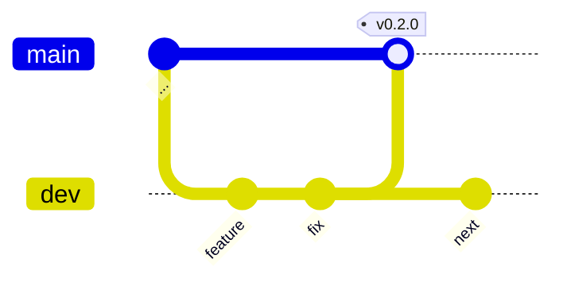
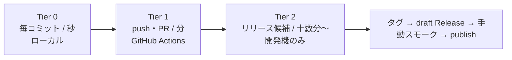

# リリース戦略 (Release Strategy)

## 目的

**いつ、何を満たしたら、どうやって外に出すか**を定める。
[24_vv_plan.md](24_vv_plan.md) が「どう確かめるか」を定めるのに対し、本書は
その確認結果を**リリースの可否判断**に接続し、タグ・成果物・配布までの手順を固定する。

1人開発であるため、「誰かのレビューを通す」形のゲートは置けない。
代わりに**自動ゲートと明文化されたチェックリスト**で、判断の抜けを防ぐ。

## スコープ

| 含む | 含まない |
|------|----------|
| バージョン番号の意味と単一情報源、1.0 の定義 | 個々の機能の実装計画（→ [06_roadmap.md](06_roadmap.md)） |
| ブランチ・タグ運用、リリース手順 | テストケースの内容と合否基準の詳細（→ [24_vv_plan.md](24_vv_plan.md)） |
| リリースゲート（3 段）と CI ワークフローの責務分担 | 個々の GAP の解消計画（→ [23_traceability.md §4](23_traceability.md#4-gap-一覧)） |
| 配布チャネル、更新、ロールバック | マーケティング・ドキュメントサイト |

## 関連文書

- [24_vv_plan.md](24_vv_plan.md) — 検証技法と合否基準。§9 が回帰ゲートの原典
- [23_traceability.md](23_traceability.md) — GAP 一覧。1.0 の定義とリリース記録の入力
- [21_system_requirements.md](21_system_requirements.md) — SYS-NF 性能・品質要求（受入の根拠）
- [07_plotter_spec.md](07_plotter_spec.md) — 変更履歴の書き方の原型（→ CHANGELOG.md へ昇格）
- `test_tools/e2e/README.md` — E2E ハーネスの前提（com0com、対話デスクトップ）

---

## 1. バージョニング

### 1.1 SemVer の適用

[SemVer 2.0.0](https://semver.org/lang/ja/) に従う。ただし **1.0 に到達するまでは `0.MINOR.PATCH`** とし、
次のように読む。

| 位置 | 上げる条件 | 例 |
|------|-----------|-----|
| `MINOR` | 機能追加、UI の意味が変わる変更、要求（SYS-F/SYS-NF）の追加・変更 | 検索機能の実装、プロッタの表示状態モデル変更 |
| `PATCH` | 不具合修正、性能改善、リファクタリング、ドキュメントのみの変更 | メモリリーク修正、パーサの境界値修正 |
| `MAJOR` | 1.0 到達まで上げない（§1.3） | — |

0.x の期間は **MINOR の変更で破壊的変更を許す**。SemVer 上も 0.x は互換性保証の対象外であり、
本ツールは外部から利用される API を持たない（プロセス境界の Tauri コマンドは内部インターフェース）。
ただし**破壊的変更は CHANGELOG に必ず `Changed` / `Removed` として明記する**。

プレリリースが必要になった場合は `0.3.0-rc.1` の形を使う（タグは `v0.3.0-rc.1`）。
現時点では 1 人での検証しかないため、rc を切る運用は行わない（§6 TBD-RS3）。

### 1.2 バージョンの単一情報源

**正は `src-tauri/tauri.conf.json` の `version`** とする。
理由: インストーラ（NSIS / MSI）のバージョン、実行ファイルのプロパティ、
将来の updater のマニフェストが、いずれもこの値から生成されるため。
ここがずれると**利用者から見えるバージョンがずれる**。

| ファイル | フィールド | 役割 | 同期 |
|----------|-----------|------|------|
| `src-tauri/tauri.conf.json` | `version` | **単一情報源**。バンドル成果物のバージョン | — |
| `src-tauri/Cargo.toml` | `[package] version` | クレートのバージョン。ログ・パニックメッセージに現れる | 必須 |
| `package.json` | `version` | フロントエンドのパッケージ表記 | 必須 |

現在の値は 3 ファイルとも `0.1.0`。

**同期はリリースチェックリストの項目（§4 手順 4）として人手で行う。**
`tauri.conf.json` の `version` を省略すると Tauri は `Cargo.toml` を参照するが、
**その暗黙のフォールバックには依存しない**（どちらが効いているか読んで分からなくなるため）。

> **TBD-RS1**: 3 ファイルを 1 コマンドで書き換える bump スクリプト（`scripts/bump-version.mjs` 等）と、
> CI での不一致検出（`tauri.conf.json` と他 2 ファイルの突き合わせ）。
> 手順を 2 回以上踏んで手順が固まってから作る。

### 1.3 1.0 の定義

1.0 は「機能が出揃った」ではなく、**「未解決の穴を把握し終えた」**時点とする。
具体的には次の 2 つを満たしたときに 1.0 とする。

#### 条件 A: 「機能未実装」GAP の扱いが全件判断済であること

[23_traceability.md §4.1](23_traceability.md#41-機能そのものが未実装要求はあるが実装がない) の GAP について、
**実装する**か**明示的にスコープ外にする**（= 対応する SYS 要求を削除または「対象外」と記す）かを
決めた状態にする。「保留」を残したまま 1.0 にはしない。

| GAP | 内容 | 関連要求 | 1.0 での扱い |
|-----|------|----------|--------------|
| GAP-01 | 検索・フィルタ未実装（UI のみ存在） | SYS-F-309 | **実装**（v0.2 予定。[06_roadmap.md](06_roadmap.md) Phase 8）。UI が存在して動かない状態は誤解を招く（動かないなら UI ごと外す） |
| GAP-04 | min/max バンドが Y オートレンジに含まれない | SYS-F-525 | **実装済（2026-09-03）**。`LineChart.tsx::calculateYRange` + `src/test/calculateYRange.test.ts`（10 件） |
| GAP-06 | プロッタのドッキング / フロート切替 | SYS-F-905 | **実装予定（時期未定）。オーナー決定 2026-09-03: スコープ外化しない。** 暫定案の「スコープ外化の候補」は撤回。1.0 の条件 A は「判断済であること」なので、**時期未定のまま条件 A は満たす**（要求は 21 に残し、GAP-06 も残す） |
| GAP-07 | ホットプラグの能動検知 | SYS-F-107, DEBT-2 | **実装済（2026-09-03）。オーナー決定: 実装する。** `App.tsx` の 2 秒ポーリング（列挙更新のみ。切断の権威は read エラー経路に残す） |
| GAP-08 | 切断検知後もポートハンドルを保持（UI と不一致） | SYS-F-107 | **実装済（2026-09-03）**。`serial-status(false)` → `close_port` による再同期 |
| GAP-09 | `log-error` イベントの発火経路が未実装 | SYS-F-205 | **実装済（2026-09-03）**。Logger の `on_error`（5 秒レート制限）→ `log-error` emit → UI 提示 |

**2026-09-03 時点で条件 A は全件判断済**（保留ゼロ）。残る未実装は GAP-01（v0.2 で実装）と
GAP-06（実装予定・時期未定）で、いずれも「保留」ではなく決定された状態にある。

判断した結果は [23_traceability.md](23_traceability.md) に反映する（実装したら検証列を埋め、
スコープ外にしたら [21_system_requirements.md](21_system_requirements.md) から要求を落とす）。

#### 条件 B: 実機での性能受入に合格していること

Raspberry Pi Pico（`test_tools/pico_serial_tx_test`）と 12 Mbps の実回線で、
SYS-NF の性能系を測定して合格していること。com0com のみでの合格は 1.0 の根拠にしない
（仮想 COM はドライバのオーバーヘッドが実機と異なる）。

| 要求 | 受入基準 | 測定手段 |
|------|----------|----------|
| SYS-NF-101 | 12 Mbps 60 秒で欠落 0 | `test_tools/serial_test.py` + `verify_received_data.py` |
| SYS-NF-102 | 受信中も UI が固まらない（操作が返る） | 手動操作 + スクリーンショット |
| SYS-NF-103 | フロントのメモリ増加 0 MB/s | `test_tools/monitor_memory.py` + `analyze_memory.py` |
| SYS-NF-104 | バックエンドのメモリが定常 | 同上 |
| SYS-NF-107 | 1 kHz で表示遅延 200 ms 以下 | **測定方法が未確定（GAP-10 / TBD-V5 / TBD-R5）**。1.0 の前に測定方法を確定し、実測値を記録する |

SYS-NF-107 については、**閾値に達しないこと自体は 1.0 を止めない**が、
**測定していない状態では 1.0 にしない**。数値を記録し、届かなければ既知の制限として CHANGELOG に書く。

### 1.4 製品名・発行元・識別子（2026-09-03 確定）

配布物に現れる名前を確定した。**バージョン（§1.2）と同じく `tauri.conf.json` が正**である。

| 項目 | 値 | 現れる場所 |
|------|-----|-----------|
| `productName` | `serial-monitor-essential` | インストーラのファイル名、インストール先、アンインストール一覧の表示名 |
| `bundle.publisher` | `771-8bit` | インストーラの発行元、アンインストール一覧の発行元 |
| `identifier` | `io.github.771-8bit.serial-monitor-essential` | Tauri のバンドル ID。逆ドメイン形式 |
| winget `PackageIdentifier` | `771-8bit.serial-monitor-essential` | winget-pkgs 上のパッケージ ID（§5.5） |

**変更前は `tauri-appserial-monitor-essential` / `com.kazuki.tauri-appserial-monitor-essential`** だった
（雛形の `tauri-app` が置換されずに連結して残っていた）。これがインストーラのファイル名にも出るため、
最初のリリース前に直した。**リリース後は `productName` を変えない** —
NSIS のアンインストールキーと winget の照合キー（`AppsAndFeaturesEntries.DisplayName`）が
名前に依存しており、変えると「更新が検出されない・二重にインストールされる」形で壊れる。

#### C# 版（Serial Monitor Essential 0.0.9）との関係

**共存する。同名化はしない。**（2026-09-03 判断）

| | C# 版 | 本アプリ（Tauri 版） |
|---|-------|---------------------|
| 表示名 | `Serial Monitor Essential` | `serial-monitor-essential` |
| インストール範囲 | per-machine（HKLM WOW6432Node = 32 bit MSI） | per-user（HKCU / NSIS）※ MSI は per-machine |
| アンインストール識別子 | MSI ProductCode `{43E2479D-1D6E-44BC-8C6C-966923E18607}` | NSIS のアンインストールキー（別系統） |

**実測済み**: 両者はレジストリのハイブも識別子も異なり、UpgradeCode を共有しないため、
一方が他方をアップグレード扱いで上書きすることはない。同時に導入しても衝突しない。

名前を C# 版に揃えない理由は 2 つ。
(a) 揃えても UpgradeCode が異なる以上「置き換え」にはならず、**同名の別項目が 2 つ並ぶ**だけで
かえって紛らわしい。(b) MSI から NSIS への移行を安全に行うには C# 版側の UpgradeCode を
引き継ぐ必要があるが、それはインストーラ種別をまたぐため成立しない。
利用者に C# 版を手動でアンインストールしてもらう方が、状態が読める。

---

## 2. ブランチ・タグ運用

### 2.1 ブランチ

| ブランチ | 位置づけ | 直接コミット |
|----------|----------|--------------|
| `dev` | **統合ブランチ**。日常の作業はここに入る。Tier 0 / Tier 1 が緑であること | 可（1 人開発のため PR を必須にしない） |
| `master` | **リリース可能状態のみ**。ここに入ったものは Tier 2 まで通っている | 不可（`dev` からのマージのみ） |
| `feature/*`, `fix/*` | 大きい変更や中断のある作業。`dev` から切り、`dev` へ戻す | 可 |

`master` は「いつでもタグを打てる状態」を意味する。**リリース以外の理由で `master` を進めない。**
`dev` が壊れたまま放置されないよう、Tier 1 が赤の状態で次の作業を積まない（[24 §9.1](24_vv_plan.md#91-必須ゲート) と同じ原則）。

### 2.2 タグ

- リリースは `dev` → `master` のマージ後、**`master` 上で** `vX.Y.Z` の注釈付きタグを打つ。
- タグ名は `v` プレフィックス付き（`v0.2.0`）。`release.yml` は `v*` にのみ反応する。
- タグは**動かさない**。間違えたら削除せず、次のパッチ版を出す（配布済みの成果物と紐づくため）。



（図の `main` は本リポジトリの `master` を指す。mermaid の既定名のため表記のみ異なる）

### 2.3 hotfix

リリース済みバージョンに緊急の修正が必要になった場合。

1. 対象タグ（例 `v0.2.0`）から `hotfix/0.2.1` を切る。
2. 修正と、[24 §9.3](24_vv_plan.md#93-挙動変更を伴う修正のルールsys-nf-402) に従い**先に失敗する回帰テスト**を書く。
3. Tier 0 / Tier 1 を通す。影響範囲に応じて Tier 2 の一部を実施する（判断は §3.4 の表）。
4. `master` へマージし、`v0.2.1` タグを打つ。
5. **`dev` へも必ず逆マージする**。ここを忘れると次のリリースで修正が消える（最も起きやすい事故）。

---

## 3. リリースゲート（3 段）

[24_vv_plan.md](24_vv_plan.md) の技法を、**実行の頻度と実行場所**で 3 段に割り当てる。
段が上がるほど遅く、実行環境の要求が厳しくなる。



### 3.1 Tier 0 — 毎コミット（数秒〜数十秒、ローカル）

| 検査 | コマンド | docs/24 の対応 |
|------|----------|----------------|
| Rust 書式 | `cd src-tauri && cargo fmt -- --check` | §9.1-3 |
| Rust 静的検査 | `cd src-tauri && cargo clippy --lib -- -D warnings` | §9.1-2 |
| TypeScript 型 | `npm run type-check` | §9.1-4 |
| ESLint | `npm run lint` | §9.1-5 |
| 影響範囲の単体テスト | `cargo test --lib <filter>` / `npx vitest run <path>` | §2（EP/BVA） |

**全件でなく影響範囲に絞る**のが Tier 0 の要点。ここで数十秒を超えると人は回さなくなる。
全件は Tier 1 が受け持つ。

### 3.2 Tier 1 — push / PR（数分、GitHub Actions = `ci.yml`）

`.github/workflows/ci.yml` の 2 ジョブ（`test` = `windows-latest`、
`test-linux` = `ubuntu-22.04`。並列・依存なし）。
**[24 §9.1 の必須ゲート 7 項目をすべて含む**ことを設計の条件とする。
フロントエンド検査は OS 非依存のため windows ジョブのみで実行し、
Rust 検査と MCP stdio smoke は両 OS で実行する。

| 検査 | コマンド | docs/24 の対応 |
|------|----------|----------------|
| TypeScript 型 | `npx tsc --noEmit` | §9.1-4 |
| ESLint | `npx eslint .` | §9.1-5 |
| Prettier | `npx prettier --check ...` | §9.2（frontend-ci） |
| vitest 全件 | `npx vitest run` | §9.1-6、§4.6（SM-5 の FSM テスト） |
| フロントのプロダクションビルド | `npm run build` | §9.1-7 の一部 |
| Rust 書式 | `cargo fmt -- --check` | §9.1-3 |
| Rust 静的検査 | `cargo clippy --all-targets -- -D warnings` | §9.1-2（テストコードまで対象を広げている） |
| Rust テスト全件 | `cargo test` | §9.1-1、§3（プロパティ）、§4.6（状態遷移 0/1-switch） |
| MCP smoke (Node) | `node mcp/smoke.mjs` | §6.1（偽ブリッジ結合。windows のみ） |
| MCP stdio smoke | `cargo build --bin` + `test_tools/e2e/mcp_stdio_smoke.py` | §6.1（実バイナリ `--mcp` を実パイプで検証。**両 OS**） |

`cargo test`（`--lib` ではなく全件）に、プロパティテスト 8 件と
状態遷移テスト（0-switch + 49 順序対）が含まれる。1-switch は 3〜9 秒かかるが、
**この時間を Tier 1 に置くこと自体が [24 §4.1](24_vv_plan.md#41-位置づけ) の結論**である
（2026-09-03 の重大バグは 1-switch でしか現れなかった）。

ステップは**速く落ちるものから順**に並べる（型 → lint → format → 単体 → ビルド → Rust）。
`npm run tauri build`（インストーラのバンドル）は Tier 1 では回さない。
[24 §9.1-7](24_vv_plan.md#91-必須ゲート) のプロダクションビルドは、フロントの `npm run build` と
`cargo test`（＝ Rust 側のコンパイル）で実質的に担保し、バンドルは Tier 2 / `release.yml` に任せる。

#### 既存ワークフローとの関係

既存の 4 ワークフローは役割を再定義した（2026-09-03）。
旧 `rust-ci.yml` / `frontend-ci.yml` は `main` ブランチ前提のトリガで
PR には実質発火していなかったため、push/PR トリガを外し
**手動（workflow_dispatch）＋ 週次スケジュール**の定点観測に変更した。
push/PR で落ちたらマージしない必須ゲートは `ci.yml` の 1 本のみ。

| ワークフロー | トリガ | 役割 | 位置づけ |
|--------------|--------|------|----------|
| `ci.yml` | push/PR（dev, master） | **Tier 1 の必須ゲート**。Windows + Linux の 2 ジョブ、fast-fail | 落ちたらマージしない |
| `rust-ci.yml` | 手動 + 週次 | 3 OS マトリクス、カバレッジ、未使用依存 | 移植性の定点観測（SYS-NF-501） |
| `frontend-ci.yml` | 手動 + 週次 | 未使用 CSS の検出ほか | 補助 |
| `license-check.yml` / `security-audit.yml` | （既存のまま） | 依存のライセンス・脆弱性 | リリース前に結果を確認する（§4 手順 1） |

### 3.3 Tier 2 — リリース候補（手動〜半自動、開発機のみ）

`master` へマージする前、またはタグを打つ前に開発機で実施する。

| # | 検査 | 手段 | 合否基準 | docs/24 |
|---|------|------|----------|---------|
| T2-1 | E2E シナリオ | `test_tools/e2e/ui.ps1` + com0com（COM15⇔COM16） | E-1〜E-12 が全再現（回帰なし）。リワーク後は E-13〜E-20 | §6.2 / §6.4 |
| T2-2 | ペアワイズ | `test_tools/e2e/pairwise_run.ps1` | 被覆配列の全行 PASS（プロセス生存・ログ無パニック・ウィンドウ状態・フッター） | §5.5 / §5.6 |
| T2-3 | ミューテーション差分 | `cargo mutants --file <変更したファイル>`（出力先はリポジトリ外） | **今回の変更で新規の survived を出さない**。全ファイルの再測定はしない | §7.3 |
| T2-4 | メモリソーク | `test_tools/monitor_memory.py` + `analyze_memory.py`、12 Mbps 60 秒 | フロント増加率 0 MB/s、バックエンド定常。**リーク 0** | §6.1 / SYS-NF-103, 104 |
| T2-5 | 実機 Pico データ完全性 | 組み込み Rust 版 `test_tools/pico_serial_tx_test` を Pico に書き込み、アプリで受信 → `serial_test.py --source pico` + `verify_received_data.py`（検証前にアプリを Disconnect して最終チャンクを flush） | **欠落 0・SHA-256 一致**。※RP2040 の USB Full Speed CDC は実効 ~2Mbps が上限で、真の 12Mbps 線速度はこの治具では出ない（[24 §6.5](24_vv_plan.md#65-実施状況)） | §6.1 / SYS-NF-101 |
| T2-6 | 妥当性確認 | [20_user_needs.md §3](20_user_needs.md#3-利用シナリオ) のシナリオを実作業として通す | §8 の問いに「いいえ」が出たらニーズへ差し戻す | §8 |

**T2-3 は差分のみ**である点が要点。ミューテーションは parser + thread の 103 件で 29 分かかっており
（[24 §7.4](24_vv_plan.md#74-実施状況)）、全体の再測定をリリースごとに回すのは成立しない。
「基線を取り直す」作業と「回帰を止める」作業を分け、リリースゲートは後者だけを担う。

hotfix で Tier 2 をどこまで回すかの判断:

| 変更した箇所 | 必須 |
|--------------|------|
| プロッタ描画・集約器 | T2-1, T2-3, T2-4 |
| 受信パス（worker / logger / data_store） | T2-3, T2-4, T2-5 |
| UI のみ（表示オプション、レイアウト） | T2-1, T2-2 |
| ドキュメント・CI 定義のみ | なし（Tier 1 のみ） |

### 3.4 ホスト CI で Tier 2 を回さない理由

| 検査 | 回せない理由 |
|------|--------------|
| E2E（T2-1, T2-2） | **com0com はカーネルモードドライバ**であり、GitHub ホストランナーには署名済みドライバをインストールできない。加えて UI Automation は**対話的なデスクトップセッション**を要求するが、ランナーはサービスとして動くセッションであり、ウィンドウの前面化・スクリーンショットが成立しない |
| ミューテーション（T2-3） | 103 ミュータントで 29 分（`-j 2`）。ホストランナーの時間枠と無料枠を食い潰す。しかも変異ごとに再ビルドするためキャッシュが効かない |
| メモリソーク（T2-4） | 12 Mbps を 60 秒流す相手（実ポートまたは com0com）が存在しない。共有ランナーの負荷変動でメモリ計測のノイズが大きい |
| 実機 Pico（T2-5） | 物理的に USB デバイスが接続できない |

**Tier 2 の実施記録は [24_vv_plan.md §10](24_vv_plan.md#10-実施状況サマリと着手順) の実施状況サマリに残す。**
「いつ、どのバージョンで、何を実施し、何が落ちたか」を書く。CI のログに残らない以上、
書かなければ実施した証拠がどこにも存在しない。GAP の解消・再発は
[23_traceability.md §4](23_traceability.md#4-gap-一覧) 側にも反映する。

---

## 4. リリース手順（チェックリスト）

`dev` が Tier 1 緑の状態から始める。上から順に実行し、**落ちたら戻る**。

1. **ゲートを緑にする** — Tier 0 / Tier 1 が緑。`security-audit.yml` と `license-check.yml`
   の直近実行を確認する。続けて §3.3 の Tier 2 を実施し、結果を [24 §10](24_vv_plan.md#10-実施状況サマリと着手順) に記録する。
2. **トレーサビリティを更新する** — [23_traceability.md](23_traceability.md) の検証列と §4 GAP 一覧を、
   今回の変更に合わせて更新する。解消した GAP は取り消し線＋解消日、新たに見つかった穴は新規 GAP として追加する。
3. **CHANGELOG を更新する** — §4.1 の方式に従い `CHANGELOG.md` に今回分を書く。
4. **バージョンを 3 ファイルで同期する** — `src-tauri/tauri.conf.json` を先に書き換え、
   `src-tauri/Cargo.toml` と `package.json` を合わせる。`Cargo.lock` / `package-lock.json` の
   自身のバージョン記載も更新される（`cargo check` と `npm install --package-lock-only` を 1 回走らせる）。
5. **`dev` → `master` の PR を出してマージする** — 1 人開発でも PR を経由するのは、
   **CI の実行と差分の一覧を残すため**。マージは squash せず merge commit（履歴を潰さない）。
6. **タグを打って push する** — `master` 上で `git tag -a v0.2.0 -m "v0.2.0"` → `git push origin v0.2.0`。
7. **`release.yml` の完了を待つ** — NSIS / MSI がビルドされ、**draft** の GitHub Release が作られる。
   ここは自動。draft である限り利用者には見えない。
8. **パッケージ版で手動スモークする** — draft からインストーラを落とし、
   **開発ツリーではなくインストール済みのアプリで**次を確認する。
   1. インストーラが完走する（SmartScreen の警告は「詳細情報 → 実行」で越える。§6）
   2. アプリが起動し、COM ポートが列挙される
   3. 実ポートまたは com0com に接続し、データが流れる
   4. プロッタを開き、波形が描画される
   5. 終了してプロセスが残らない（exit 0）
9. **Release を publish する** — 8 が全部通ったときだけ。落ちたら draft を削除し、
   タグを削除せずに次のパッチ版として出し直す。
10. **`dev` に `master` を戻す** — マージコミット分の差を解消し、次の作業に備える。
11. **（winget 登録後のみ）マニフェストを更新する** — **オーナーの許可を得たうえで手動 dispatch する。**
    Actions → `Winget Publish (manual, approval-gated)` → `version` に `0.2.0` 形式、
    `confirm` に `I-HAVE-OWNER-APPROVAL` を入力する。**9 が済んでいない状態では実行しない**
    （draft のアセット URL は winget の検証パイプラインから到達できない）。
    初回提出は手動 PR で行う（§5.5 / `packaging/winget/README.md`）。

> 8 を飛ばさないこと。`npm run tauri build` が通ることと、
> **インストーラが利用者の PC で動くこと**は別である（配置パス、WebView2 の有無、権限）。

### 4.1 CHANGELOG の方式

これまで変更の記録は [07_plotter_spec.md の変更履歴](07_plotter_spec.md#変更履歴) に、
日付 → 問題 → 根本原因 → 検討した解決策 → 実装内容 → 結果 の形で書いてきた。
**この文化をリポジトリ直下の `CHANGELOG.md` に昇格させる。今回のリリースから開始する。**

| 項目 | 決定 |
|------|------|
| 形式 | [Keep a Changelog](https://keepachangelog.com/ja/1.1.0/) 1.1.0。`Added` / `Changed` / `Deprecated` / `Removed` / `Fixed` / `Security` |
| 単位 | バージョン単位。未リリース分は `## [Unreleased]` に積む |
| 遡及 | **しない**。0.1.0 以前は 07 の変更履歴と git ログが記録である。空の過去を捏造しない |
| 07 との関係 | 07 の変更履歴は**残す**。CHANGELOG は「何が変わったか」、07 は「なぜそう直したか（根本原因と検討過程）」。深い分析は 07 に置き、CHANGELOG から参照する |
| 粒度 | 利用者から見える変化のみ。内部リファクタリングは「性能」「安定性」として結果を書くか、書かない |
| 参照 | 各項目に関連する SYS 要求 ID または GAP 番号を括弧で添える（例: `- min/max バンドを Y レンジに含めるようにした (SYS-F-525 / GAP-04)`） |

`release.yml` は `generate_release_notes: true` でコミットからの自動生成メモも付ける。
これは**補助**であり、`CHANGELOG.md` の代わりにはしない（コミットメッセージは利用者向けの言葉ではない）。

---

## 5. 配布と更新

### 5.1 配布チャネル

| チャネル | 状態 | 備考 |
|----------|------|------|
| **GitHub Releases** | **一次配布路。当面これが正** | Windows は NSIS（`.exe`）と MSI（`.msi`）、Linux は `.deb` と AppImage を添付する |
| winget | 準備済・未提出 | マニフェスト雛形とワークフローは用意した（§5.5）。**提出はオーナーの許可後**。コード署名がないと審査で不利（§6） |
| APT リポジトリ（自前） | 将来 | GPG 署名鍵の管理方法が未決（§5.6 / TBD-RS8） |
| Flathub | 検討のみ | Linux の需要が確認できてから（§5.6） |
| Microsoft Store | 予定なし | 署名・審査・パッケージ形式の制約に対して得るものが少ない |

`tauri.conf.json` の `bundle.targets` は `"all"`。Windows では NSIS と MSI、
Linux では `.deb` と AppImage が生成される。`release.yml` はこれらを glob で拾う。

**どのチャネルも GitHub Releases のアセットを指す。** winget も APT も配布物を複製せず、
URL とハッシュだけを持つ。これにより「Releases にあるものが正」の 1 点が保たれ、
チャネルごとに中身が食い違う事故が起きない。

### 5.2 更新

**自動更新は実装しない**（当面）。利用者は Releases から新しいインストーラを取得する。

> **TBD-RS2**: `tauri-plugin-updater` の導入。前提条件は**署名鍵の管理方法を決めること**。
> updater は成果物への署名（minisign）を要求し、秘密鍵が漏れると任意のコードを配れる。
> 鍵をどこに置き（GitHub Secrets / ローカルのみ）、失った場合にどう復旧するかを決めるまで着手しない。
> 「便利だから入れる」で始めると、鍵の紛失時に更新経路ごと死ぬ。

### 5.3 サポート範囲

- **サポートは最新リリースのみ**。1 人開発で複数系列を維持できない。
- 不具合報告は最新版で再現するかを最初に確認する。旧版のみで起きる問題は、最新版へ上げてもらう。
- 旧タグのブランチは維持しない（hotfix はその都度タグから切る。§2.3）。

### 5.4 ロールバック

**旧バージョンのインストーラを再実行する**だけでよい。

現時点で本アプリは**ユーザーの永続データを持たない**:

- 受信データは `std::env::temp_dir()` 配下のインスタンス単位ディレクトリに退避され、
  起動時のクリーンアップで削除される（SYS-F-209 / INV-10）。セッションを越えて残らない。
- 設定（ボーレート、表示オプション）はプロセス内のみ。ファイルに保存していない。

したがって**バージョン間のデータ互換性の問題が原理的に発生しない**。これは現在の性質であって
設計上の保証ではない。

> **TBD-RS3**: 設定の永続化（または受信ログの永続保存）を実装した時点で、
> 次を決めてから機能をリリースする。
> (a) 設定ファイルの形式とスキーマバージョンの持ち方、
> (b) 旧形式を読んだときの移行規則、
> (c) 新版が書いた設定を旧版が読んだときの挙動（無視して既定値か、起動拒否か）。
> **移行ポリシーのない永続化は入れない。**

### 5.5 winget

マニフェストの雛形は `packaging/winget/`、提出ワークフローは
`.github/workflows/winget-publish.yml`。**現時点で提出はしていない。**

#### 承認ゲート（3 重）

winget-pkgs への提出は、**本リポジトリでのリリース + リリース済みバイナリでの動作確認 +
オーナーの明示的な許可**の後に限る。自動提出はしない。
これを手順書だけでなく**ワークフローの構造として**強制する。

| # | ゲート | 実装 |
|---|--------|------|
| 1 | 人間による起動 | `on: workflow_dispatch` のみ。タグ push や Release publish では発火しない |
| 2 | 確認フレーズ | `confirm` 入力が `I-HAVE-OWNER-APPROVAL` と一致しなければ最初のステップで失敗する |
| 3 | シークレット | `WINGET_TOKEN`（winget-pkgs をフォークできる PAT）が未登録なら提出前に失敗する |

3 つが同時に揃わないと提出まで到達しない。`GITHUB_TOKEN` では他リポジトリへ PR を作れないため、
**ゲート 3 は「設定し忘れ」では抜けられない**（誰かが意図して PAT を登録する必要がある）。

#### 提出の順序と所要

1. Release を publish する（draft のままではアセット URL が外部から取れず、winget の検証が落ちる）
2. 公開済みバイナリでスモークする（§4 手順 8）
3. オーナーの許可を得る
4. ワークフローを dispatch する（§4 手順 11）

**初回はレビューに数日かかる。** 自動検証（スキーマ、URL 到達性、SHA-256 一致、インストール試験、
マルウェアスキャン）の後に人手のレビューが入る。また `wingetcreate update` は既存パッケージ専用のため、
**初回だけは手動 PR または `wingetcreate new` で行う**（`packaging/winget/README.md`）。

登録するのは **NSIS（per-user）のみ**。winget の既定インストールは非管理者で走り、
per-user なら昇格が要らない。MSI を同一パッケージに混ぜると更新判定が
ProductCode 単位で分岐し、二重インストールの原因になる。

### 5.6 Linux

`.deb` と AppImage を GitHub Releases に添付する（Linux CI ジョブを追加中）。

| 形式 | 位置づけ | 依存の扱い |
|------|----------|-----------|
| `.deb` | **推奨**。Ubuntu 22.04+ x64 | `webkit2gtk-4.1` 等の依存を **apt が解決する** |
| AppImage | 配布物 1 個で済ませたい場合 | ランタイムを同梱。`chmod +x` が要る |

#### シリアルポートの権限

Linux では `/dev/ttyUSB*` `/dev/ttyACM*` が `dialout` グループ所有であり、
**利用者をこのグループに入れないとポートを開けない**。

```sh
sudo usermod -aG dialout $USER
```

**再ログイン（または再起動）が必要**。これは Windows にはない導入ステップであり、
「ポートが列挙されない / 開けない」の最も多い原因になる。README に明記する。

#### 将来

- **自前 APT リポジトリ** — `apt install` で更新まで通せるが、**リポジトリ署名用の GPG 鍵**が要る。
  鍵の置き場所と紛失時の復旧を決めるまで着手しない（TBD-RS8）。updater の署名鍵（TBD-RS2）と
  同じ論点であり、**まとめて 1 回決める**。
- **Flathub** — サンドボックス内から `/dev/tty*` にアクセスするには `--device=all` 相当の
  ポータル権限が要り、審査で説明を求められる。Linux 側の需要が確認できてから検討する。

### 5.7 macOS（2026-09-03 計画。現状は配布なし）

macOS はコンパイル互換の週次監視のみで正式対応外（[20 §8.1](20_user_needs.md)）。
配布まで持っていく場合の段階と、それぞれの障壁は次のとおり。

| 段階 | 内容 | 前提・コスト | 状態 |
|------|------|-------------|------|
| **M-1 実験ビルド** | GitHub Actions の macOS ランナーで `--target universal-apple-darwin`（Intel + Apple Silicon のユニバーサル）の .dmg を生成し、**「experimental」ラベル付き**で Releases に添付。署名なしのため Gatekeeper に止められる — 利用手順（右クリック→開く、または `xattr -cr`）を README に明記 | 追加コスト 0（release.yml に macos ジョブ追加のみ） | 未実装（実装は即日可能） |
| **M-2 CI 上の自動スモーク** | macOS ランナーは GUI 実行可能な VM なので、ビルドした .app を起動し `screencapture` でスクリーンショットを取り、アーティファクトとして残す。**実機 Mac を持たずに「起動する」ことだけは機械的に検証できる** | M-1 と同じジョブに数ステップ追加 | 未実装 |
| **M-3 正式配布** | Apple Developer Program（$99/年）+ Developer ID Application 証明書で署名し、`notarytool` で公証。Tauri は環境変数（APPLE_CERTIFICATE / APPLE_ID 等）で CI 署名・公証に対応済み。これで Gatekeeper 警告なしの通常配布になる | **年 $99 + 証明書・API キーの秘密管理**（TBD-RS2/RS8 と同じ「鍵を 1 回で決める」論点に合流） | 未着手 |
| **M-4 チャネル** | Homebrew cask（`brew install --cask`）。公証済みが事実上の前提（未公証は `--no-quarantine` 案内が必要で体験が悪い） | M-3 の後 | 未着手 |

**方針**: シリアルポート実機での動作確認手段（実機 Mac）がない間は、
M-1/M-2 を実装しても**正式対応 OS には昇格させない**（「experimental・動作未保証」を明記）。
M-3 の投資判断は macOS 側の需要（Issue 等）が見えてから。実機 Mac が確保できた時点で
Tier 2 スモークを実施し、正式対応への昇格を判断する。

> **TBD-RS9**: M-1/M-2 を実装するか（オーナー判断待ち）。実装する場合、
> 成果物名は `serial-monitor-essential_<VERSION>_universal-experimental.dmg` とし、
> リリースノートに Gatekeeper 回避手順と「動作未保証」を自動挿入する。

### 5.8 AI Bridge / MCP アダプタ（2026-09-03）

AI ブリッジ本体（SYS-F-1101〜1104、1106）も MCP アダプタ（SYS-F-1107）も
**アプリ本体の実行ファイルに同梱**される。追加の配布物はない。

| 対象 | 配布 | 理由 |
|------|------|------|
| AI Bridge（`bridge.rs`） | アプリ本体に同梱。既定 OFF | Rust バイナリの一部。有効化は設定画面から |
| MCP アダプタ（`mcp_stdio.rs`） | アプリ本体に同梱（`--mcp` フラグで同一 exe が MCP stdio サーバとして起動） | インストール済み環境にはリポジトリも Node.js も無い（UN-25）。exe 1 つで完結させる（[22 ADR-13](22_architecture_description.md)）。セットアップ手順はアプリ内の Setup Guide（SYS-F-1108）が実 exe パス入りで表示する |
| Node 版アダプタ（`mcp/`） | **リリース資産には含めない。**開発用リファレンス実装としてリポジトリに残る | ツール変更時は Rust 版と同時更新（DEBT-6）。旧 ADR-12 時代の配布経路だが、インストール後のユーザー向けには `--mcp` が正 |

**リリースノートに毎回書くセキュリティ 3 点**（利用者が判断するために必要な情報であり、省略しない）:

1. 待ち受けは **`127.0.0.1` のみ**。外部ネットワークからは接続できない。
2. **既定は OFF**。設定画面で明示的に有効化したときだけ待ち受ける。
3. **AI からの送信は必ず GUI に表示される**（`bridge-activity`）。人間に見えない送信経路は作らない。

> **TBD-RS10**: MCP アダプタのバージョニング。現状はアプリと同じリポジトリ・同じタグに含まれ、
> `mcp/package.json` の `version` もたまたま `0.1.0` で一致しているが、
> **§1.2 の同期対象 3 ファイルには入っていない**（bump 時にずれる）。
> ブリッジの protocol v1 が v2 になる時点で、「アダプタが古いアプリに繋いだ場合」の
> 互換規則（`status` の `protocol` を見て拒否するか、機能を落として続けるか）と併せて決める。

---

## 6. リスクと未決事項

| # | リスク | 影響 | 現在の対応 |
|---|--------|------|-----------|
| R-1 | **コード署名がない** | インストーラ実行時に SmartScreen の警告（「WindowsによってPCが保護されました」）が出る。利用者が「実行しない」を選ぶと導入できない。ダウンロード数が少ないうちは評判スコアが貯まらず、警告は消えない | Release の説明に警告の回避手順（詳細情報 → 実行）と、成果物の SHA-256 を記載する。証明書の取得は未定 |
| R-2 | **単一開発者（バス係数 1）** | 開発が止まると誰も引き継げない。暗黙知が失われる | docs/20〜25 で「なぜそうしたか」を残す。テストを実行可能な仕様として維持する。ビルドに秘密情報を要さない（署名鍵がない副次的な利点） |
| R-3 | **Tier 2 が開発機に依存** | 開発機が使えないとリリースできない。E2E の実施は他人が再現できない | ハーネスを `test_tools/e2e/` にコミット済み。前提（com0com、COM15⇔COM16）を README に明記。実施記録を [24 §10](24_vv_plan.md#10-実施状況サマリと着手順) に残す |
| R-4 | Tier 2 の実施記録が人手 | 「実施したつもり」で抜ける | チェックリスト（§4）の 1 項目として固定。記録がなければ未実施とみなす |
| R-5 | ホスト CI が Windows 単一（`ci.yml`） | 他 OS の破損に気づくのが遅れる | `rust-ci.yml` の 3 OS マトリクスを定点観測として残す（§3.2） |

### 未決事項

| # | 未確定事項 |
|---|------------|
| TBD-RS1 | バージョン同期の bump スクリプトと、CI での不一致検出（§1.2） |
| TBD-RS2 | `tauri-plugin-updater` の導入。前提は署名鍵の管理方法の決定（§5.2） |
| TBD-RS3 | 永続データを導入した際の移行ポリシー（§5.4） |
| TBD-RS4 | コード署名証明書の取得（OV / Azure Trusted Signing）。費用と更新の手間に見合うかの判断（§6 R-1） |
| TBD-RS5 | rc（プレリリース）を切る運用を始めるかどうか。1 人で検証している間は不要と判断している（§1.1） |
| TBD-RS6 | winget への**初回提出を実行するかどうか**（§5.5）。雛形とワークフローは用意済み。実行はオーナーの許可待ち。署名の有無が審査に影響する |
| TBD-RS7 | `WINGET_TOKEN`（winget-pkgs をフォークできる PAT）の管理。**誰の PAT を使うか、有効期限をどうするか、失効・漏洩時にどう再発行するか**を決めるまで登録しない。登録した時点で承認ゲート 3（§5.5）が「PAT がある」状態になるため、**登録自体を提出の意思表示として扱う** |
| TBD-RS8 | 自前 APT リポジトリの GPG 署名鍵の管理（§5.6）。updater の署名鍵（TBD-RS2）と同じ論点のため、まとめて 1 回決める |

---

## 7. テスト戦略との対応表

[24_vv_plan.md](24_vv_plan.md) の各技法が、どの段でいつ実行され、どこに記録されるか。

| Tier | 実行トリガ | 含む技法（docs/24 の節） | 実行場所 | 所要時間 | 合否基準 | 記録先 |
|------|-----------|--------------------------|----------|---------|----------|--------|
| **Tier 0** | 毎コミット（手元） | 静的検査（§1 図の LINT）／影響範囲の単体 EP・BVA（§2） | ローカル | 数秒〜数十秒 | 全項目パス。`#[ignore]` を残さない（§2.3） | 残さない（通って当然） |
| **Tier 1** | `push`（dev / master）・PR | 単体 EP/BVA（§2）／プロパティ（§3、8 件）／状態遷移 0-switch・1-switch（§4.6、49 順序対）／静的検査・書式／フロントのプロダクションビルド | GitHub Actions `ci.yml`（windows-latest） | 数分 | [§9.1 の必須ゲート 7 項目](24_vv_plan.md#91-必須ゲート)が全通過。プロパティは反例 0（§3.4） | Actions のログ（保持期間内） |
| **Tier 2** | リリース候補（`master` マージ前 / タグ前） | E2E シナリオ（§6.2）／ペアワイズ（§5）／ミューテーション差分（§7）／性能・メモリ計測（§6.1）／妥当性確認（§8） | 開発機（com0com + 実機 Pico + 対話デスクトップ） | 十数分〜1 時間 | E-1〜E-12 全再現（§6.4）／被覆配列 全行 PASS（§5.5）／**新規 survived 0**（§7.3）／メモリ増加 0 MB/s・欠落 0 | **[24 §10 の実施状況サマリ](24_vv_plan.md#10-実施状況サマリと着手順)**（必須）＋ [23 §4 の GAP 更新](23_traceability.md#4-gap-一覧) |
| **リリース後** | タグ push 後（draft） | パッケージ版の手動スモーク（§4 手順 8） | 開発機（インストール済みアプリ） | 数分 | インストール → 起動 → COM 接続 → プロッタ描画 → exit 0 | CHANGELOG のリリース項目／Release 本文 |

技法ごとの逆引き:

| docs/24 の技法 | 実行される段 | 備考 |
|----------------|--------------|------|
| §2 単体（EP / BVA） | Tier 0（影響範囲）＋ Tier 1（全件） | Rust 120 件 + vitest 144 件 |
| §3 プロパティベース | Tier 1 | 8 件。実行時間が伸びたら別ジョブへ（TBD-V3） |
| §4 状態遷移（0/1-switch） | Tier 1 | 1-switch 49 対で 3〜9 秒。Tier 1 に置くことが §4.1 の結論 |
| §5 組合せ（ペアワイズ） | Tier 2 | UIA が対話セッションを要するため CI 不可 |
| §6 E2E | Tier 2 | com0com ドライバが必要 |
| §6.1 性能・メモリ | Tier 2（＋ 1.0 では実機必須。§1.3 条件 B） | — |
| §7 ミューテーション | Tier 2（**変更ファイルの差分のみ**） | 基線の再測定はリリースゲートに含めない |
| §8 妥当性確認 | Tier 2 | 記録様式は TBD-V4 |

---

## 関連ドキュメント

- [20_user_needs.md](20_user_needs.md)
- [21_system_requirements.md](21_system_requirements.md)
- [22_architecture_description.md](22_architecture_description.md)
- [23_traceability.md](23_traceability.md)
- [24_vv_plan.md](24_vv_plan.md)
- [06_roadmap.md](06_roadmap.md)
